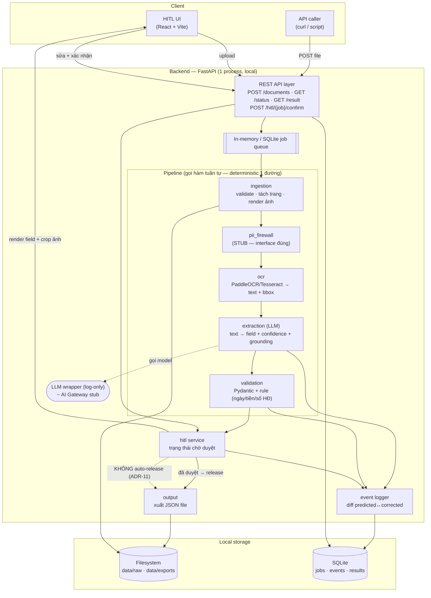
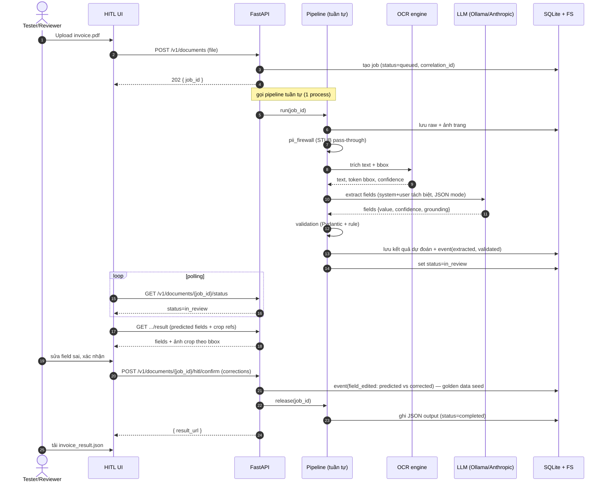
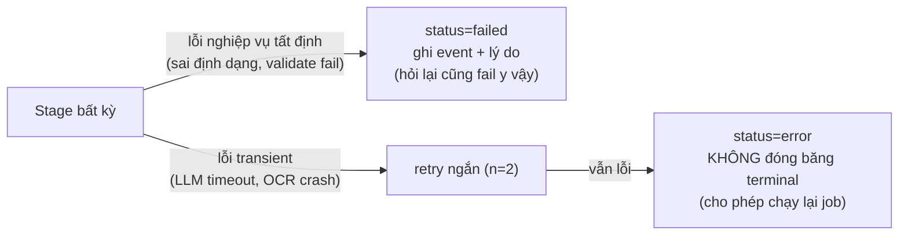

# MVP1 Demo — Architecture / Proposed Solution

> **Phạm vi:** Kiến trúc cho **`v0.1 Walking Skeleton`** — lát cắt dọc mỏng nhất chạy toàn trình cho hóa đơn/AP, **local + free/open-source**. Đây là **tập con tối giản, tiến hóa-tương thích** của [`../research/Architecture_design.md`](../research/Architecture_design.md) (SAD — chuẩn cuối cùng) và [`../research/workflow.md`](../research/workflow.md).
> **Nguyên tắc nền:** giữ đúng hình dạng kiến trúc SAD ở quy mô nhỏ để version sau "dày" lên, **không phải đập đi xây lại**. Mọi quyết định ở đây hoặc **giữ nguyên** một ADR của SAD, hoặc **stub có chủ đích** (ghi rõ ADR sẽ bật ở version nào).
> **Business context:** [`business-context.md`](business-context.md).

---

## 1. Key Design Concerns (mối quan tâm thiết kế cốt lõi)

Bốn câu hỏi quyết định hình dạng MVP1:

### 1.1. "Demo nhanh" vs "không đập đi xây lại"
Walking skeleton phải chạy nhanh **nhưng** không được đẻ ra kiến trúc chết. **Giải pháp:** giữ đúng **ranh giới thành phần (component boundaries)** và **contract dữ liệu/sự kiện** của SAD; chỉ thay *hiện thực* bằng bản tối giản (in-memory queue thay message bus, filesystem thay 4-zone, gọi hàm tuần tự thay workflow engine). Đổi hiện thực sau ⇒ không đổi contract.

### 1.2. Cái gì được stub, cái gì TUYỆT ĐỐI không (demo cut-line)
| Được stub ở MVP1 | KHÔNG được bỏ kể cả ở demo |
|---|---|
| PII firewall (chỉ dùng dữ liệu tổng hợp) | **Full-HITL** — không auto-release (ADR-11) |
| Tier enforcement (giả định Tier 1) | **Tài liệu là dữ liệu, không phải chỉ thị** (P9): tách system prompt, không exec lệnh suy ra từ nội dung |
| Message bus bền / DLQ / saga | **Claim-check tư duy**: contract dữ liệu tách reference khỏi payload (dù demo lưu local) |
| Cost guardrail / AI Gateway | **Grounding bbox per field** — không có grounding thì không có HITL đối chiếu & không có golden data |
| 4-zone storage / audit WORM | **Correlation_id xuyên pipeline** — không truy vết được thì không debug được |

> Đây chính là "hợp đồng giữa tốc độ demo và an toàn" — chi tiết ở [`../research/roadmap.md` §"Lằn cắt demo"](../research/roadmap.md).

### 1.3. Tính tất định (determinism)
Giữ **ADR-10**: một luồng xử lý cố định, **không** chọn model động theo confidence/tải. MVP1 chỉ có 1 đường: `OCR → LLM extract`. Confidence chỉ để **highlight** trong UI, **không** để gate. Cùng input ⇒ cùng đường xử lý ⇒ dễ test & demo lặp lại.

### 1.4. Bảo vệ chống prompt injection qua tài liệu (rẻ nhưng bắt buộc)
Hóa đơn là **nội dung không tin cậy**. Khi đưa text OCR vào LLM để trích field: tách rõ **system prompt** (chỉ thị của ta) khỏi **user content** (text tài liệu); ra lệnh model coi nội dung là *dữ liệu cần trích*, **không** thực thi bất kỳ chỉ thị nào nhúng trong tài liệu; strip ký tự ẩn/zero-width trước khi đưa vào prompt. (Giữ P9 + ADR-10 ở mức tối thiểu khả thi.)

---

## 2. Infrastructure (hạ tầng — mức demo)

**Triết lý:** *local-first, zero paid-cloud.* Mọi thứ chạy trên 1 máy dev.

| Hạng mục | MVP1 (`v0.1`) | Sẽ tiến hóa thành (SAD) |
|---|---|---|
| **Triển khai** | 1 process backend + 1 dev server frontend, chạy local (hoặc 1 `docker-compose`) | dev+prod microservice, hybrid theo tier (§9, §11) |
| **Compute** | CPU only | + autoscale theo queue depth; + GPU pool scale-to-zero cho VLM (`v2.0`) |
| **Messaging** | **In-memory queue** (hoặc bảng SQLite làm job queue) — gọi pipeline tuần tự | Managed queue → event bus Kafka/Kinesis + DLQ (`v1.0`) |
| **Orchestration** | **Gọi hàm tuần tự** trong 1 process (state ghi DB) | Saga tối giản → workflow engine Temporal/Step Functions (`v1.0`) |
| **Storage** | **Filesystem local** 1 thư mục: `./data/{raw,extracted,exports}` + SQLite cho state/event | 4-zone (raw/redacted/vault/extracted) + audit WORM + crypto-shred (`v0.5`/`v1.0`) |
| **DB** | **SQLite** (job, event log, kết quả) | PostgreSQL + Delta/Iceberg; vault tách biệt |
| **AI Gateway** | **Bỏ qua / wrapper mỏng** ghi log lời gọi LLM | Control plane đầy đủ: routing/rate-limit/budget/PII guardrail (`v1.0`) |
| **Secrets** | `.env` local (chỉ key LLM nếu dùng API) | External KMS, workload identity (`v1.0`) |
| **Mạng** | 1 mạng (localhost) | 3 zone (DMZ/Processing/Storage) + mTLS (`v1.0`) |

> Tất cả "stub" trên là **cố ý** và **không bao giờ lên production** — xem cột phải để biết mốc bật thật.

---

## 3. Software Tech Stack

Tiêu chí chọn: **free/open-source, self-host được, hệ sinh thái Python chín** (để liền mạch với `src/shared` Python của repo).

| Lớp | Lựa chọn MVP1 | Ghi chú |
|---|---|---|
| **Backend** | **Python 3.11 + FastAPI** + Uvicorn | Async-ready; OpenAPI tự sinh (chuẩn bị contract-first cho `v0.5`) |
| **Pipeline orchestration** | Hàm Python tuần tự + Pydantic cho contract | Mỗi stage = 1 hàm thuần, nhận/trả model Pydantic (dễ tách thành service sau) |
| **OCR** | **PaddleOCR** (hỗ trợ tiếng Việt + bbox tốt); **Tesseract** fallback | Self-host, free; cho text + bounding box per token |
| **Render PDF→ảnh** | `pdf2image` (poppler) / `PyMuPDF` | Để hiển thị crop nguồn trong HITL |
| **LLM trích field** | **Mặc định: model local qua [Ollama](https://ollama.com)** (vd `qwen2.5` / `llama3.1`) — zero-cost, offline.<br>**Tùy chọn chất lượng cao:** **Claude Haiku 4.5** (`claude-haiku-4-5-20251001`) qua Anthropic API — rẻ, nhanh, structured output tốt cho extraction | Chọn qua config (`LLM_PROVIDER=ollama\|anthropic`). Dùng **structured output / JSON mode** để LLM trả đúng schema field. **Tách system/user prompt** (xem §1.4) |
| **Validation** | **Pydantic** + vài rule regex (ngày/tiền/số HĐ) | Schema-as-code; field fail → gắn cờ, không chặn |
| **PII (stub demo)** | Wrapper rỗng có interface đúng; (tùy chọn) **Presidio** bật sớm nếu rảnh | Giữ đúng *vị trí* PII firewall trong pipeline để `v0.5` cắm bản thật |
| **State / Event store** | **SQLite** (+ SQLAlchemy) hoặc JSONL append cho event log | 1 file, không cần server DB |
| **Frontend (HITL UI)** | **React + Vite + TypeScript**; tái dùng `Markdown.tsx`, `FileDropzone.tsx`, `GovernanceBanner.tsx` từ `src/shared/frontend/components` | Hiển thị ảnh gốc cạnh field, highlight low-confidence, sửa & xác nhận |
| **Notify** | Polling `GET /status` (đơn giản) | WebSocket/SSE để `v0.5`+ |
| **Đóng gói** | `docker-compose` (tùy chọn) + README | Tiêu chí NFR-2 reproducible |
| **Test** | `pytest` (unit cho từng stage + 1 e2e happy-path) | Mầm của eval harness `v2.0` |

> **Lưu ý model:** Nếu dùng Anthropic API, model phù hợp cho extraction giá rẻ là **Claude Haiku 4.5** (`claude-haiku-4-5-20251001`); cần chất lượng suy luận cao hơn dùng **Sonnet 4.6** (`claude-sonnet-4-6`). Để tuân thủ ràng buộc "không cloud trả phí" của `v0.1`, **mặc định là Ollama local**; Anthropic chỉ là tùy chọn khi chấp nhận chi phí nhỏ để nâng chất lượng demo.

---

## 4. High-Level Architecture

### 4.1. Ánh xạ thành phần: MVP1 ↔ SAD

MVP1 giữ đúng các thành phần lõi của SAD §4, gộp/stub phần chưa cần:

| Thành phần SAD (§4) | MVP1 | Trạng thái |
|---|---|---|
| §4.1 Ingestion | `ingestion` (nhận file, validate, tách trang) | ✅ tối giản |
| §4.2 PII firewall | `pii_firewall` (stub, interface đúng) | ⚠ stub (dữ liệu tổng hợp) |
| §4.3 Region segmentation | — (coi cả trang là 1 vùng "text") | ⏸ hoãn → `v2.0` |
| §4.4 Dispatcher | — (cố định 1 đường: text→OCR) | ⏸ hoãn → `v2.0` |
| §4.5 OCR | `ocr` (PaddleOCR/Tesseract) | ✅ |
| §4.6 VLM | — | ⏸ hoãn → `v2.0` |
| §4.7 Sub-extractors | — | ⏸ hoãn → `v2.0` |
| §4.8 Merge/Aggregation | — (1 trang/1 vùng, không cần fan-in) | ⏸ hoãn → `v2.0` |
| §4.9 Extraction & Validation | `extraction` (LLM) + `validation` (Pydantic+rule) | ✅ |
| §4.10 Full HITL | `hitl` (UI + API duyệt) | ✅ giữ ADR-11 |
| §4.11 Output & Integration | `output` (xuất JSON file) | ✅ tối giản (chưa ERP push) |
| §4.12 Orchestration (agentic) | — (gọi hàm tuần tự) | ⏸ hoãn → `v1.0`/`v4.0` |
| §8.5 AI Gateway | wrapper log mỏng | ⚠ stub → `v1.0` |

### 4.2. Sơ đồ kiến trúc MVP1



### 4.3. Trách nhiệm từng module (contract tóm tắt)

| Module | Input | Output | Bất biến giữ |
|---|---|---|---|
| `ingestion` | file PDF + metadata | `raw_ref` + ảnh trang + `correlation_id` | claim-check (truyền ref, không truyền nội dung nặng giữa các stage qua DB) |
| `pii_firewall` (stub) | text/ảnh | (demo) pass-through; interface trả `redacted_ref` | vị trí trong pipeline cố định |
| `ocr` | ảnh trang | text + token bbox + confidence | bbox để grounding |
| `extraction` | text + bbox | list field {value, confidence, grounding_region} | tách system/user prompt (P9); structured output |
| `validation` | list field | list field + cờ `validation.passed` | không gate, chỉ gắn cờ |
| `hitl` | list field + ảnh crop | quyết định duyệt + corrections | **không auto-release**; sinh diff |
| `output` | field đã duyệt | JSON file đúng schema `mvp1-result@0.1.0` | schema tiến hóa-tương thích |
| `event_logger` | mọi sự kiện | bản ghi event (SQLite/JSONL) | `correlation_id` + diff predicted↔corrected |

---

## 5. Sequence Diagram

### 5.1. Happy-path end-to-end



### 5.2. Nhánh lỗi (tối giản ở demo)



> Phân biệt **lỗi nghiệp vụ tất định** (cache được) vs **lỗi transient** (không đóng băng) là tinh thần **ADR-13** ở mức tối giản — giữ để `v1.0` nâng thành idempotency state machine đầy đủ.

---

## 6. Suggested Code Structure

**Code đặt trực tiếp trong `src/`** — không tách theo agent/version. File meta dự án (`pyproject.toml`, `docker-compose.yml`, `README.md`, `.env.example`) và `config/`, `data/`, `samples/`, `tests/` ở **repo root**. `CLAUDE.md` + `CHANGELOG.md` đã có sẵn ở root.

> **Không tách thư mục theo version (mvp1/mvp2…) cũng không theo agent.** Code là **một codebase sống** dưới `src/`, tiến hóa `v0.1 → v4.0` ngay tại chỗ; **lịch sử version do git quản lý** (branch/tag/commit), không phải bằng cách nhân bản thư mục. Mỗi version của roadmap là một lằn ranh giao được trong cùng cây code này, không phải một folder riêng.

```text
(repo root)
├── CLAUDE.md                     # (đã có) quy tắc dự án — source of truth
├── CHANGELOG.md                  # (đã có)
├── README.md                     # cách chạy local (NFR-2 reproducible)
├── pyproject.toml                # deps backend
├── docker-compose.yml            # tùy chọn: backend + (ollama)
├── .env.example                  # LLM_PROVIDER, OCR_ENGINE, paths...
│
├── src/                          # ← TOÀN BỘ code ở đây
│   ├── backend/
│   │   ├── main.py               # FastAPI app, đăng ký router
│   │   ├── config.py             # đọc env (provider/engine/paths) — NFR-7
│   │   ├── api/
│   │   │   ├── documents.py      # POST /documents, GET /status, GET /result
│   │   │   └── hitl.py           # GET fields+crop, POST /hitl/{job}/confirm
│   │   ├── pipeline/
│   │   │   ├── runner.py         # gọi tuần tự các stage (orchestration stub)
│   │   │   ├── ingestion.py      # §4.1 validate · tách trang · render ảnh
│   │   │   ├── pii_firewall.py   # §4.2 STUB (interface đúng) — TODO v0.5: Presidio
│   │   │   ├── ocr.py            # §4.5 PaddleOCR/Tesseract adapter
│   │   │   ├── extraction.py     # §4.9 LLM extract (system/user tách biệt)
│   │   │   └── validation.py     # §4.9 Pydantic + rule ngày/tiền/số HĐ
│   │   ├── llm/
│   │   │   ├── client.py         # interface chung (~AI Gateway stub, log-only)
│   │   │   ├── ollama_provider.py    # mặc định local, zero-cost
│   │   │   └── anthropic_provider.py # tùy chọn: Claude Haiku 4.5
│   │   ├── hitl/
│   │   │   └── service.py        # trạng thái duyệt, KHÔNG auto-release (ADR-11)
│   │   ├── output/
│   │   │   └── exporter.py       # xuất JSON mvp1-result@0.1.0
│   │   ├── store/
│   │   │   ├── db.py             # SQLite (jobs/results) + SQLAlchemy
│   │   │   ├── event_log.py      # event schema + diff predicted↔corrected
│   │   │   └── files.py          # File Proxy tối giản: data/{raw,exports}
│   │   └── schemas/
│   │       ├── events.py         # Pydantic: event schema (xem governance.md)
│   │       ├── invoice.py        # 5–8 field cốt lõi + validation rule
│   │       └── result.py         # contract output mvp1-result@0.1.0
│   │
│   └── frontend/                 # React + Vite + TS
│       ├── src/
│       │   ├── App.tsx
│       │   ├── pages/ReviewPage.tsx  # ảnh gốc cạnh field, highlight low-conf, sửa
│       │   ├── components/
│       │   │   ├── FieldList.tsx
│       │   │   └── DocumentViewer.tsx   # render ảnh + vẽ bbox crop
│       │   └── api/client.ts     # gọi REST backend
│       └── package.json
│
├── config/
│   ├── invoice_schema.json       # định nghĩa field (chuẩn bị schema mgmt v2.0)
│   └── business_rules.yaml       # rule validate tối giản
│
├── data/                         # (gitignore) raw/ · exports/ · idp.sqlite
├── samples/                      # hóa đơn mẫu tổng hợp (an toàn để demo)
└── tests/
    ├── unit/                     # mỗi stage
    └── e2e/test_happy_path.py    # 1 luồng end-to-end (mầm eval harness v2.0)
```

**Quy ước giữ để dễ tiến hóa:**
- Mỗi stage pipeline là **hàm thuần** nhận/trả **Pydantic model** ⇒ tách thành microservice + event ở `v1.0` chỉ là đổi transport, không đổi logic.
- `src/backend/llm/client.py` là **một điểm vào duy nhất** cho mọi lời gọi model ⇒ chính là chỗ `v1.0` nâng thành **AI Gateway** thật (routing/rate-limit/budget/PII guardrail).
- `src/backend/store/files.py` đóng vai **File Proxy** tối giản ⇒ `v0.5` mở thành 4-zone + presigned.
- `src/backend/schemas/events.py` dùng đúng event schema của [`governance.md`](governance.md) ⇒ golden data bắt từ MVP1 dùng lại được ở `v3.0`.

---

## 7. Tóm tắt ADR áp dụng ở MVP1

| ADR (SAD §14) | MVP1 | 
|---|---|
| **ADR-10** Luồng deterministic, không chọn model động | ✅ **Giữ** — 1 đường text→OCR→LLM |
| **ADR-11** Full-HITL duyệt 100% | ✅ **Giữ** — không auto-release |
| **P9** Tài liệu là dữ liệu, không phải chỉ thị | ✅ **Giữ** — tách system/user prompt |
| ADR-1 Hybrid OCR+VLM dispatch theo vùng | ⏸ chỉ OCR → `v2.0` thêm VLM/dispatch |
| ADR-2 PII firewall trước model | ⚠ stub (interface đúng) → `v0.5` bản thật |
| ADR-3 4-zone storage | ⏸ filesystem 1 thư mục → `v0.5` |
| ADR-5 AI Gateway tập trung | ⚠ wrapper log-only → `v1.0` |
| ADR-8 Event-driven + orchestration | ⏸ gọi tuần tự → `v1.0` workflow engine |
| ADR-12 Saga + checkpoint | ⏸ state DB đơn giản → `v1.0` |
| ADR-13 Idempotency record state machine | ⚠ phân biệt lỗi transient/terminal tối giản → `v1.0` |
| ADR-14 Integration contract-first | ⏸ xuất JSON file → `v0.5` API, `v1.0` ERP push |
| ADR-16 Cost guardrail | ⏸ giới hạn tay số doc demo → `v1.0` |

---

## Tài liệu liên quan

- [`business-context.md`](business-context.md) — goal, success criteria, scope, requirements, I/O format.
- [`governance.md`](governance.md) — data structure (event schema), monitoring & observation cho MVP1.
- [`../research/Architecture_design.md`](../research/Architecture_design.md) — SAD hợp nhất (chuẩn cuối cùng; §4 thành phần, §6 messaging, §14 ADR).
- [`../research/workflow.md`](../research/workflow.md) — pattern xử lý & messaging nền.
- [`../research/roadmap.md`](../research/roadmap.md) — `v0.1` walking skeleton & lằn cắt demo.
