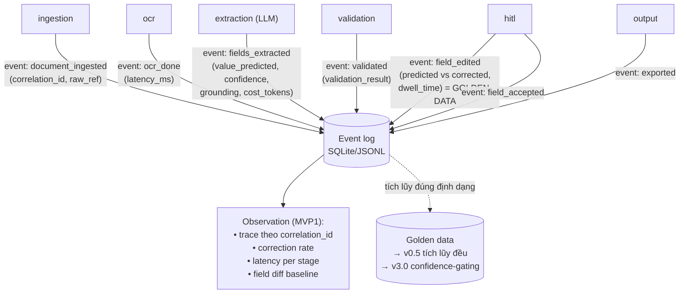

# MVP1 Demo — Governance: Data Structure, Monitoring & Observation

> **Altitude:** Đây là governance cho một **demo walking-skeleton chạy local trên dữ liệu tổng hợp** — KHÔNG phải chương trình data-governance cấp doanh nghiệp. Phần lớn lớp quản trị (lineage đầy đủ, feature store, retention provable, drift platform) **được hoãn có chủ đích**; tài liệu này chỉ chốt **mức tối thiểu khả thi** + những thứ **rẻ nhưng phải làm đúng từ đầu** vì sửa sau rất đắt.
> **Tài liệu nền (chuẩn):** [`../research/governance.md`](../research/governance.md) (vòng đời dữ liệu vận hành đầy đủ) và [`../research/Architecture_design.md` §5, §7](../research/Architecture_design.md) (storage zones, lineage).
> **Liên kết:** business → [`business-context.md`](business-context.md); kiến trúc → [`architecture.md`](architecture.md).

---

## 0. Hai nguyên tắc chi phối MVP1

1. **Cái gì rẻ-nhưng-đúng-từ-đầu thì làm ngay:** event schema chuẩn hóa + có version, bắt diff predicted-vs-corrected, correlation_id xuyên pipeline, PII-by-design *interface*. Bỏ những thứ này ở demo ⇒ golden data thu được vô giá trị, làm lại từ đầu ở `v0.5`.
2. **Cái gì đắt-và-chưa-cần thì hoãn (chống over-engineering):** feature store, lineage tự động, drift platform (Arize/WhyLabs), retention tiering provable, machine unlearning → hoãn tới đúng version cần (xem [`../research/governance.md` §8](../research/governance.md)).

> **Cấm tuyệt đối:** đưa dữ liệu thật/PII vào MVP1 khi PII firewall còn stub. Demo chỉ dùng **dữ liệu tổng hợp/không nhạy cảm, Tier 1**. Khoảnh khắc có PII ⇒ phải bật PII firewall thật (`v0.5`) — không ngoại lệ.

---

## 1. Phần A — Data Structure (cấu trúc dữ liệu)

MVP1 sinh và lưu **bốn nhóm dữ liệu**: (1) **Event log** (mạch máu cải tiến), (2) **Job/Result** (output nghiệp vụ), (3) **Field-level golden data** (diff predicted↔corrected), (4) **Artifact file** (raw/exports). Tất cả lưu local (SQLite + filesystem).

### 1.1. Event schema — chuẩn hóa + có version (điều kiện tiên quyết)

Dùng đúng event schema của [`../research/governance.md` §4.1](../research/governance.md), **cắt xuống tập tối thiểu** cho demo nhưng **giữ nguyên tên trường** để tiến hóa-tương thích. Mỗi mũi tên trong pipeline phát 1 event.

```jsonc
{
  "event_id": "evt_01HXY...",                 // ULID
  "event_type": "document_ingested | ocr_done | fields_extracted | validated | field_edited | field_accepted | document_reviewed | exported | job_failed",
  "timestamp": "2026-06-05T08:13:58Z",        // ISO-8601 UTC
  "schema_version": "evt-schema@0.1.0",       // version CHÍNH schema — bắt buộc

  "correlation_id": "corr_8f3a...",           // 1 giá trị / tài liệu — xuyên suốt pipeline
  "session_id": "ses_demo_01",
  "job_id": "job_01HXY...",
  "document_id": "doc_01HXY...",
  "document_type": "invoice",                 // cố định ở MVP1

  "pipeline_version": "pipe@0.1.0",
  "model_version": "ollama:qwen2.5@... | anthropic:claude-haiku-4-5-20251001",
  "stage": "ingestion | ocr | extraction | validation | hitl | output",

  // --- field-level (khi event_type liên quan field) ---
  "field_name": "total_amount",
  "value_predicted": "13500000",              // SANITIZE — không log PII thô
  "value_corrected": "13750000",              // tín hiệu vàng (golden data)
  "confidence_score": 0.91,
  "grounding_region": { "page": 1, "bbox": [380, 540, 200, 24] },
  "dwell_time_ms": 4200,                       // implicit signal (nếu UI đo được)
  "validation_result": { "passed": true, "rules_failed": [] },

  // --- governance metadata (đặt đúng chỗ ngay, dù demo) ---
  "sensitivity_label": "synthetic",           // MVP1 chỉ "synthetic"; v0.5+: pii/financial...
  "user_id": "demo-reviewer",                 // pseudonymized
  "role": "reviewer",

  // --- chuẩn bị cho version sau (có thể null ở MVP1) ---
  "tenant_id": null,                          // v1.0 multi-tenant
  "cost_tokens": 1234,                        // v1.0 FinOps
  "latency_ms": 5000,
  "downstream_status": null,                  // v0.5 integration
  "data_retention_class": "demo-ephemeral"
}
```

**Quy tắc bắt buộc ngay từ MVP1:**
- **`schema_version` có version cho chính schema** — vì nó sẽ tiến hóa (governance §4.1).
- **`correlation_id` duy nhất/tài liệu, xuất hiện trong MỌI event** — để replay & truy vết (P8, NFR-3).
- **`value_predicted` + `value_corrected` luôn ghi đủ cặp khi `field_edited`** — đây là *tín hiệu vàng*, là toàn bộ lý do tồn tại của event log.
- **Sanitize trước khi log** — kể cả dữ liệu tổng hợp, giữ thói quen redact-by-design: không log nội dung thô ngoài giá trị field cần thiết.

### 1.2. Tín hiệu thu thập ở MVP1 (theo phân loại governance §3)

| Loại | Tín hiệu | Bắt ở MVP1? |
|---|---|---|
| **Explicit** | Chỉnh sửa cấp trường (predicted vs corrected) | ✅ **Bắt buộc** — golden data |
| Explicit | Accept không sửa (xác nhận đúng) | ✅ event `field_accepted` |
| Explicit | Reject / chạy lại | ✅ (nếu reviewer reject) |
| **Implicit** | Dwell time trên field | ☑ nice-to-have (nếu UI đo) |
| Implicit | Vùng người dùng click/zoom (visual grounding) | ☑ nice-to-have |
| Implicit | Thứ tự sửa, abandonment | ⏸ hoãn → `v3.0`+ (IGL/online learning) |

> Implicit signal **dồi dào nhưng nhiễu** — MVP1 chỉ *ghi lại* nếu rẻ, **chưa học từ chúng**. Làm sạch & học từ implicit là `v3.0`+ ([`../research/governance.md` §7.3](../research/governance.md)).

### 1.3. Result/Job schema

Output nghiệp vụ — xem contract `mvp1-result@0.1.0` ở [`business-context.md` §6.2](business-context.md). Lưu trong SQLite (`results`) + xuất file JSON (`data/exports/`).

### 1.4. Golden data — bắt đúng cách từ đầu

MVP1 là điểm bắt đầu của **vòng đức hạnh**: xác nhận của con người ở giai đoạn full-HITL → golden data → (về sau) đánh giá & nới confidence-gating ở `v3.0`.

- **Bắt diff kèm ngữ cảnh, không chỉ kết quả cuối:** mỗi `field_edited` lưu `value_predicted`, `value_corrected`, `confidence_score`, `grounding_region`, `model_version`, `pipeline_version` → đủ để *replay* sau này.
- **Lưu cả "accept không sửa"** (tín hiệu dương) — không chỉ lưu khi có lỗi.
- **Chưa retrain/active-learning ở MVP1** — chỉ *tích lũy đúng định dạng* để `v0.5` bắt đầu tích lũy đều và `v3.0` khai thác.

### 1.5. Lưu trữ & vòng đời (mức demo)

| Nhóm dữ liệu | Nơi lưu (MVP1) | Vòng đời demo | Tiến hóa (SAD §5/§7) |
|---|---|---|---|
| Raw file (PDF/ảnh) | `data/raw/` | **Xóa sau demo** | Raw zone ephemeral + crypto-shred (`v0.5`) |
| Event log | SQLite `events` / JSONL | Giữ trong phiên demo | Hot/Warm/Cold tiering (`v0.5`+); audit WORM ≥1y (`v1.0`) |
| Result JSON | `data/exports/` + SQLite | Giữ trong phiên demo | Extracted store field-level enc + RLS (`v1.0`) |
| Golden data (diff) | SQLite `field_edits` | Giữ (xuất được) | Feature store + versioning (`v0.5`/`v1.0`) |
| Token vault | — (không có PII ở demo) | — | Vault cô lập (`v0.5` khi có PII) |

> **Provable deletion, lineage tự động, feature store, DVC/lakeFS** — **hoãn** (chống over-engineering). MVP1 chỉ cần "xóa thư mục `data/` sau demo" vì dữ liệu là tổng hợp.

---

## 2. Phần B — Data Monitoring & Observation

Mục tiêu ở MVP1: **đủ để debug 1 tài liệu và chứng minh giá trị**, không phải observability production. Nhưng đặt **đúng nền** (correlation_id, metrics cơ bản, log có cấu trúc) để `v1.0` nâng lên OpenTelemetry span-level mà không phải sửa lại.

### 2.1. Cái gì quan sát ở MVP1 (tối thiểu khả thi)

| Hạng mục | MVP1 | Công cụ demo |
|---|---|---|
| **Trace 1 tài liệu xuyên pipeline** | ✅ qua `correlation_id` trên mọi event | Query SQLite theo `correlation_id` |
| **Structured logging** (redact-by-design) | ✅ dùng `src/shared/.../logging_config.py` | Log không chứa nội dung thô |
| **Metrics vận hành cơ bản** | ✅ ghi vào event: `latency_ms` mỗi stage, `cost_tokens` (nếu LLM API), `confidence_score` | Tính tay từ event log |
| **Pipeline status / health** | ✅ `GET /status` per job; trạng thái stage | API |
| **Chất lượng trích xuất (thô)** | ☑ field-level accuracy thô trên bộ mẫu (baseline tham khảo) | Script so corrected vs predicted |

### 2.2. Metrics nền tảng (ghi từ MVP1, dùng dài hạn)

Ghi ngay các metric này vào event để `v0.5`+ dựng dashboard KPI thật (không phải KPI nghiệm thu — chỉ baseline):

| Metric | Nguồn | Dùng cho |
|---|---|---|
| `latency_ms` per stage + tổng | event mỗi stage | Tìm nút thắt (OCR vs LLM) |
| `confidence_score` distribution | event `fields_extracted` | Hiệu chỉnh ngưỡng highlight HITL |
| **Correction rate** (% field bị sửa) | đếm `field_edited` / tổng field | Mầm của *intervention rate* (governance §9) |
| **Field-level diff** | `value_predicted` vs `value_corrected` | Baseline accuracy thô per field |
| `cost_tokens` (nếu dùng API) | LLM wrapper | Chuẩn bị FinOps `v1.0` |

> Bản đồ KPI đầy đủ (intervention rate, time-to-correct, repeat-error, calibration, drift score) ở [`../research/governance.md` §9](../research/governance.md) — MVP1 chỉ gieo các metric **đo được rẻ nhất** ở trên.

### 2.3. Cái gì KHÔNG làm ở MVP1 (hoãn có chủ đích)

| Hoãn | Bật từ | Lý do |
|---|---|---|
| **Drift detection** (phân phối input đổi → accuracy tụt) | `v3.0` | Cần volume + golden data đủ sâu |
| **Anomaly detection** (tỷ lệ sửa của 1 vendor tăng đột biến) | `v3.0` | Cần nhiều vendor/volume |
| **Observability platform** (Arize/WhyLabs/Fiddler) | `v3.0` | Over-engineering ở demo |
| **OpenTelemetry span-level + distributed tracing** | `v1.0` | Chưa có microservice |
| **Alert threshold + runbook** | `v1.0`/`v3.0` | Chưa vận hành production |
| **Confidence calibration** (độ tin cậy khớp accuracy thực) | `v0.5`+ | Cần đủ mẫu |

### 2.4. Sơ đồ: dữ liệu nào sinh ra ở đâu



---

## 3. Phần C — Quản trị, phân quyền, riêng tư (mức demo)

Giữ ở mức tối thiểu vì demo dùng dữ liệu tổng hợp, nhưng đặt **interface đúng**:

| Khía cạnh | MVP1 | Tiến hóa |
|---|---|---|
| **PII sanitization trước khi log** | Interface có sẵn (`pii_firewall` stub); log đã redact-by-design | `v0.5`: Presidio + recognizer VN (CCCD/MST/STK) |
| **Sensitivity label** | Mọi event = `"synthetic"` | `v0.5`: pii/financial + tag propagation theo lineage |
| **Phân quyền / RBAC** | 1 vai trò demo (`reviewer`); không auth thật | `v1.0`: RBAC + MFA cho HITL (§8.3) |
| **Audit trail** | Event log thường (không WORM) | `v1.0`: audit WORM ≥1 năm |
| **Right-to-deletion / consent** | N/A (dữ liệu tổng hợp) | `v0.5`+ khi có dữ liệu thật (GDPR/PDPA) |
| **Lineage** | Ngầm qua `correlation_id` + `model_version`/`pipeline_version` | `v1.0`: lineage data→feature→model |

> Trách nhiệm compliance cho các phần out-of-scope (lineage tổ chức, unlearning, multi-tenancy) thuộc **client** sau bàn giao — nhất quán altitude outsource ([`../research/scope-implementation.md` §3.2, §8](../research/scope-implementation.md)).

---

## 4. Cạm bẫy cần canh ngay ở MVP1

| Cạm bẫy ([`../research/governance.md` §10](../research/governance.md)) | Cách tránh ở MVP1 |
|---|---|
| **Schema log không có version** → golden data vô dụng khi schema đổi | `schema_version` bắt buộc trên mọi event ngay từ đầu |
| **Mất grounding** → không đối chiếu được, golden data yếu | `grounding_region` bắt buộc trên mỗi field |
| **Quên correlation_id** → không trace/replay được | NFR-3: mọi event có `correlation_id` |
| **Attribution sai** ("accept" vì đúng hay vì lười kiểm tra?) | Ghi cả `dwell_time` (nếu có) để diễn giải sau; không vội tin "accept = đúng" |
| **Lỡ log dữ liệu thật/PII** | Cấm dữ liệu thật ở demo; sanitize-by-design kể cả với dữ liệu tổng hợp |
| **Over-engineering** (dựng feature store/lineage/drift sớm) | Hoãn đúng theo §2.3 — chỉ làm tối thiểu khả thi |

---

## 5. Checklist governance cho MVP1 (Definition of Done)

- [ ] Event schema có `schema_version`, `correlation_id` trên mọi event.
- [ ] Mọi `field_edited` ghi đủ cặp `value_predicted` + `value_corrected` + `grounding_region`.
- [ ] Log đã sanitize (redact-by-design); chỉ dùng dữ liệu tổng hợp.
- [ ] Trace được 1 tài liệu xuyên pipeline qua `correlation_id`.
- [ ] Ghi `latency_ms` per stage + `confidence_score` + correction rate.
- [ ] Golden data (diff) xuất được ra file để chuyển sang `v0.5`.
- [ ] `data/` xóa được sạch sau demo.
- [ ] KHÔNG bật: drift/anomaly platform, OTel span, feature store, audit WORM (hoãn đúng version).

---

## Tài liệu liên quan

- [`../research/governance.md`](../research/governance.md) — vòng đời dữ liệu vận hành đầy đủ, KPI, công cụ (chuẩn nền).
- [`business-context.md`](business-context.md) — success criteria S7 (bắt diff), I/O format.
- [`architecture.md`](architecture.md) — `src/backend/store/event_log.py`, `src/backend/schemas/events.py`, AI Gateway/PII stub.
- [`../research/Architecture_design.md`](../research/Architecture_design.md) §5, §7 — storage zones, lineage, security.
