# Architecture Design — Hệ thống IDP (Intelligent Document Processing)

> **Phiên bản:** v1.0 (tài liệu kiến trúc hợp nhất — Software Architecture Document)
> **Loại tài liệu:** Reference Architecture cho developer xây dựng hệ thống.
> **Kiến trúc nền:** Dựa trên `workflow.md` (luồng deterministic đơn + full HITL + event-driven async), hợp nhất thêm quản trị dữ liệu, phạm vi giao hàng, ràng buộc chi phí (FinOps) và quản trị vận hành (LLMOps).
> **Altitude:** Dự án **outsource** — giao một hệ IDP chạy được cho 1–3 use case ROI cao, với cơ chế quản trị/chi phí/vận hành **cưỡng chế ở runtime**. Ranh giới in/out-of-scope nêu ở §1.6.

---

## Về tài liệu này

Đây là **tài liệu kiến trúc hợp nhất (SAD)** — điểm tham chiếu duy nhất để developer hiện thực hệ IDP. Tài liệu tổng hợp năm tài liệu nghiên cứu nền thành một bản thiết kế buildable:

| Tài liệu nghiên cứu nền | Đóng góp vào SAD |
|---|---|
| `workflow.md` | Kiến trúc lõi: thành phần (§4), dữ liệu/storage (§5), thực thi/messaging (§6), bảo mật (§7), triển khai (§11), ADR (§14) |
| `governance.md` | Quản trị dữ liệu: event schema, retention, lineage, feature store (§5) |
| `scope-implementation.md` | Phạm vi giao hàng, KPI, lộ trình use case (§1, §13) |
| `cost-finops.md` | Ràng buộc tài chính, cost-per-document, cost guardrails (§9) |
| `operations-llmops.md` | Quản trị vận hành runtime: gateway, observability, eval gates, change control (§8) |

**Cách đọc:** §1–§3 cho mọi đối tượng (định hướng, nguyên tắc, bức tranh tổng thể). §4–§12 là phần thiết kế chi tiết cho developer (thành phần, hợp đồng dữ liệu/API, bảo mật, vận hành, chi phí, triển khai, NFR). §13–§14 cho planning & tra cứu quyết định (lộ trình, ADR, thuật ngữ).

---

## Mục lục

- **§1 Giới thiệu & Phạm vi** — 1.1 Mục đích · 1.2 Đối tượng · 1.3 Cách dùng · 1.4 Altitude & bối cảnh · 1.5 Tóm tắt phạm vi · 1.6 In-scope/Out-of-scope
- **§2 Nguyên tắc Kiến trúc & Thuộc tính Chất lượng** — 2.1 Nguyên tắc P1–P10 · 2.2 Thứ tự ưu tiên chất lượng · 2.3 Ràng buộc tuân thủ
- **§3 Kiến trúc Khái niệm & Ngữ cảnh** — 3.1 Sơ đồ ngữ cảnh · 3.2 Sơ đồ pipeline tổng thể · 3.3 Bản đồ năng lực
- **§4 Kiến trúc logic — Thành phần & Hợp đồng giao tiếp** — 4.0 Bản đồ thành phần & danh mục sự kiện · 4.1 Ingestion · 4.2 PII firewall · 4.3 Phân đoạn vùng · 4.4 Dispatcher · 4.5 OCR · 4.6 VLM · 4.7 Sub-extractors · 4.8 Merge/Aggregation · 4.9 Trích xuất & Validation · 4.10 Full HITL · 4.11 Output & Integration · 4.12 Orchestration · 4.13 Bảng hợp đồng interface
- **§5 Kiến trúc Dữ liệu & Lưu trữ** — 5.1 Nguyên tắc tách kho · 5.2 Sơ đồ zone · 5.3 Đặc tả 5 zone · 5.4 Event schema chuẩn · 5.5 Retention/tiering · 5.6 Versioning/feature store/lineage · 5.7 Crypto-shredding
- **§6 Mô hình Thực thi & Messaging** — 6.1 Tổng quan event-driven · 6.2 Fan-out/fan-in/HITL · 6.3 Choreography vs Orchestration · 6.4 Pattern bắt buộc · 6.5 Hai lane · 6.6 Nút thắt VLM · 6.7 Saga/checkpoint · 6.8 Idempotency state machine
- **§7 Kiến trúc Bảo mật** — 7.1 Ánh xạ tuân thủ · 7.2 Mô hình tier · 7.3 Zero Trust · 7.4 Bảo vệ PII · 7.5 AI Gateway/Guardrails · 7.6 Đe dọa LLM/VLM · 7.7 Toàn vẹn output · 7.8 ZDR · 7.9 Confidential computing · 7.10 Audit redact-by-design · 7.11 Đe dọa→Biện pháp · 7.12 Least-Agency
- **§8 Vận hành & Quản trị runtime (LLMOps)** — 8.1 Compound system · 8.2 Control plane (Gateway) · 8.3 Observability cấp span · 8.4 Evaluation gates · 8.5 Reliability & change control · 8.6 Least-Agency/Guardian · 8.7 Registry + audit + chuẩn · 8.8 Sơ đồ vận hành · 8.9 SRE runbook
- **§9 Kiến trúc Chi phí (FinOps)** — 9.1 Ràng buộc C1–C8 · 9.2 Cost-per-document · 9.3 Pareto chính xác–chi phí · 9.4 Đòn bẩy chi phí · 9.5 Hòa giải ADR-10 · 9.6 Cost guardrails 3 lớp · 9.7 KPI chi phí
- **§10 Kiến trúc Tích hợp & Hợp đồng API** — 10.1 Nguyên tắc · 10.2 API inbound · 10.3 Xác thực API · 10.4 Idempotency-key · 10.5 Đẩy hạ nguồn ERP/CRM · 10.6 Kênh thông báo · 10.7 Error model & versioning
- **§11 Kiến trúc Triển khai** — 11.1 Hybrid theo tier · 11.2 Serverless/microservice · 11.3 Hai lane · 11.4 Tách mạng · 11.5 Autoscale · 11.6 Sơ đồ triển khai · 11.7 Tham chiếu các hãng
- **§12 Yêu cầu Phi chức năng (NFR)** — 12.1 Bảng NFR · 12.2 Thứ tự ưu tiên
- **§13 Lộ trình Triển khai** — 13.1 Bảng tổng hợp giai đoạn · 13.2 Đóng góp theo mục kiến trúc · 13.3 Nhấn mạnh GĐ0 & guardrail sớm
- **§14 Phụ lục — ADR & Thuật ngữ** — 14.1 Architecture Decision Records (ADR-1..16) · 14.2 Thuật ngữ

---

## §1 Giới thiệu & Phạm vi

### §1.1 Mục đích tài liệu

Tài liệu này là **Software Architecture Document (SAD) hợp nhất** cho hệ thống IDP (Intelligent Document Processing) — bản tham chiếu kiến trúc duy nhất mà đội phát triển, kiến trúc sư, kỹ sư bảo mật và lãnh đạo kỹ thuật dùng để ra quyết định xây dựng và vận hành hệ thống.

SAD này được biên soạn ở mức **buildable**: mỗi quyết định thiết kế đều đủ cụ thể để developer triển khai trực tiếp mà không cần đoán thêm. Tài liệu **hợp nhất 5 tài liệu nghiên cứu độc lập** thành một nguồn sự thật duy nhất:

| Tài liệu nguồn | Nội dung | Phản ánh ở SAD |
|---|---|---|
| Khung kiến trúc hệ thống IDP (workflow) | Luồng xử lý, thành phần, messaging, bảo mật, ADR | §3, §4, §5, §6, §7, §14 |
| Scope & kế hoạch triển khai | Phạm vi giao hàng, use case, KPI nghiệm thu | §1, §13 |
| Quản trị & vòng đời dữ liệu | Data governance, lineage, cải tiến mô hình | §5, §8 |
| Ràng buộc tài chính & FinOps | Cost guardrail, unit economics, đánh đổi chính xác–chi phí | §9 |
| Vận hành runtime & LLMOps | Control plane, observability, eval gate, change control | §8 |

> Khi có mâu thuẫn giữa các phần của SAD, §14 (ADR) là chuẩn cuối cùng.

### §1.2 Đối tượng độc giả

| Đối tượng | Phần ưu tiên |
|---|---|
| Kiến trúc sư hệ thống | Toàn bộ |
| Kỹ sư backend / pipeline | §4, §5, §6 |
| Kỹ sư bảo mật & tuân thủ | §2.3, §7 |
| Kỹ sư dữ liệu / ML | §5, §8 |
| Kỹ sư hạ tầng / DevOps | §6, §11 |
| FinOps / Tech Lead | §9, §12 |
| Lãnh đạo kỹ thuật / PM | §1, §2, §3, §13 |

### §1.3 Cách dùng tài liệu

- **Trước khi xây dựng một thành phần mới:** đọc §3 (bức tranh tổng thể) + §4 (hợp đồng thành phần liên quan) + §14 (ADR để hiểu lý do ra quyết định).
- **Khi có xung đột thiết kế:** tra §14 — nếu chưa có ADR, tạo mới và đưa vào §14 trước khi triển khai.
- **Trước khi thay đổi shared component:** xem §4 và kiểm tra tất cả thành phần phụ thuộc.
- **Khi đánh giá chi phí:** tham chiếu §9 (đường đánh đổi và guardrail), §6 (lane xử lý).
- **Khi chuẩn bị audit / review tuân thủ:** tham chiếu §7 (bảo mật) và §8 (vận hành).

### §1.4 Altitude và bối cảnh

Tài liệu này được viết ở **altitude dự án outsource**: mục tiêu là giao một hệ IDP chạy được cho 1–3 use case ROI cao, **không phải** dựng chương trình governance/AI hay hạ tầng enterprise toàn tổ chức. Ranh giới trách nhiệm giữa dự án và client được làm rõ ở §1.6 (out-of-scope) và §13.

### §1.5 Tóm tắt phạm vi hệ thống

Hệ IDP nhận tài liệu từ nhiều nguồn, xử lý qua pipeline lõi event-driven, trích xuất dữ liệu có cấu trúc, cho reviewer duyệt (HITL 100%), rồi đẩy kết quả vào hệ hạ nguồn (ERP/CRM) hoặc kho dữ liệu (RAG). Ba use case được triển khai tuần tự theo ROI:

| Thứ tự | Use case | Loại tài liệu | Ngôn ngữ |
|---|---|---|---|
| Giai đoạn 1 | **Hóa đơn / Accounts Payable (AP)** — ROI rõ nhất, tài liệu bán cấu trúc | Hóa đơn, PO, biên nhận | VI + EN |
| Giai đoạn 2 | **KYC onboarding** — nhu cầu BFSI cao, gắn tuân thủ SBV | CMND/CCCD/hộ chiếu, đăng ký kinh doanh, sao kê | VI + EN |
| Tùy chọn | **Claims bảo hiểm** — giá trị cao, phức tạp hơn | Biểu mẫu claim, hồ sơ y tế/sửa chữa | VI + EN |

> Use case 2 chỉ được mở khi use case 1 đạt KPI nghiệm thu. Ngôn ngữ ngoài VI/EN là out-of-scope giai đoạn đầu.

### §1.6 In-scope / Out-of-scope

| Hạng mục | In-scope (dự án giao) | Out-of-scope (client tự sở hữu) |
|---|---|---|
| **Xử lý tài liệu** | Ingestion đa nguồn, phân loại, OCR+LLM (GĐ1), VLM+sub-extractor (GĐ2), validation | Sửa đổi hệ hạ nguồn (ERP/CRM) |
| **Bảo mật & PII** | PII firewall, tier-aware routing, audit trail, mã hoá | Machine unlearning tầng model/embedding (chỉ bật nếu ràng buộc hợp đồng) |
| **HITL** | UI duyệt cạnh tài liệu, pre-fill/highlight/crop, hàng đợi ngoại lệ, công cụ + quy trình | Nhân sự reviewer (client bố trí); vận hành production 24/7 dài hạn |
| **Tích hợp** | Integration API (submit/status/result/webhook) + đẩy JSON/XML vào endpoint hạ nguồn | Endpoint nhận của ERP/CRM (client cung cấp) |
| **Governance** | Governance mức dự án: PII log, lineage cơ bản, retention, drift, audit | Chương trình governance tổ chức; RACI toàn doanh nghiệp |
| **FinOps** | Cost guardrail, KPI cost/page, mô hình unit economics | FinOps chargeback đa đơn vị; FinOps program toàn tổ chức |
| **Triển khai** | Deploy cloud/hybrid theo tier, autoscale theo queue, tách mạng | Multi-tenancy quy mô doanh nghiệp; data residency đa vùng |
| **Agentic** | Luồng tất định + full HITL (GĐ1–2) | Agentic orchestration đầy đủ (để giai đoạn 4 khi ROI rõ) |

---

## §2 Nguyên tắc Kiến trúc & Thuộc tính Chất lượng

### §2.1 Bảng nguyên tắc kiến trúc

| # | Nguyên tắc | Diễn giải | Hệ quả thực thi cho dev |
|---|---|---|---|
| P1 | **Hybrid OCR + VLM + sub-extractor** | OCR cho text sạch (rẻ, nhanh, audit tốt); VLM cho tài liệu khó (scan mờ, chữ tay, layout phức tạp); sub-extractor chuyên biệt cho bảng/biểu đồ/công thức/chữ ký | Không được gọi VLM cho text mà OCR xử lý được; phải implement đủ 4 sub-extractor trước khi lên GĐ2 |
| P2 | **Dispatch cố định theo loại vùng** | Mỗi loại vùng (text / bảng / biểu đồ / công thức / chữ ký) đi tới một extractor cố định, tất định theo nội dung — KHÔNG chọn model động theo confidence/tải | Router phải đọc `region_type` từ segment event, ánh xạ tới extractor cố định trong config; cấm if-confidence-then-switch-model |
| P3 | **Composable / modular** | Mỗi tầng là khối thay thế độc lập, đổi được lúc runtime | Mỗi extractor là plugin đăng ký qua config; không hard-code dependency giữa tầng |
| P4 | **Full HITL trước khi release** | Mọi output phải người duyệt xác nhận trước khi save & trả file — không auto-release | Không được implement auto-release ở giai đoạn đầu; confidence chỉ dùng để highlight, không dùng làm gate |
| P5 | **Tier-aware** | Mức nhạy cảm dữ liệu chi phối định tuyến, lưu trữ và vị trí triển khai | Mọi event phải mang `tier` field; router phải kiểm tra tier trước khi dispatch VLM-API; Tier 0/3/4 cấm cứng VLM public |
| P6 | **Defense in depth + Zero Trust** | Bảo mật nhiều lớp; không tin mặc định giữa các thành phần | Không thành phần nào giữ storage credentials ngoài File Proxy; mTLS giữa tầng; workload identity |
| P7 | **Data minimization** | Lưu ít nhất có thể, xoá sớm nhất có thể | Raw zone phải có TTL ngắn + auto-purge sau extract; không lưu CVV; mask PAN trước khi persist |
| P8 | **Auditable & traceable** | Mọi event truy vết được; log không chứa dữ liệu thô | Log chỉ được chứa hash/reference, không chứa nội dung tài liệu; mọi event phải có `correlation_id` |
| P9 | **Tài liệu là dữ liệu, không phải chỉ thị** | Nội dung tài liệu không bao giờ được diễn giải thành lệnh cho model | System prompt và content tài liệu phải ở hai context tách biệt; cấm tự động thực thi tool từ nội dung tài liệu |
| P10 | **Event-driven async + idempotent** | Tách rời các tầng qua messaging; mọi consumer có side-effect phải idempotent | Mọi handler VLM/detokenize phải dedup theo `event_id`; không bao giờ cache lỗi transient làm terminal result (xem §6) |

### §2.2 Thứ tự ưu tiên thuộc tính chất lượng

```
Bảo mật & Tuân thủ  >  Chính xác / Toàn vẹn  >  Khả năng Kiểm toán  >  Chi phí  >  Độ trễ
```

Thứ tự này là mặc định. **Điều chỉnh theo use case:**

| Use case | Điều chỉnh ưu tiên |
|---|---|
| **KYC onboarding (BFSI)** | Tuân thủ SBV (liveness, log ≥ 1 năm) ngang hàng hoặc cao hơn Bảo mật thuần. Độ trễ được nâng ưu tiên (người dùng chờ real-time) nhưng không vượt Tuân thủ. |
| **Hóa đơn / AP (số hoá hàng loạt)** | Chi phí và Throughput được nâng tầm quan trọng hơn Độ trễ. STP (straight-through processing) là KPI dẫn dắt. |
| **Claims bảo hiểm** | Chính xác/Toàn vẹn đặc biệt cao (sai → tổn thất tài chính lớn). Throughput thấp hơn. |

> Khi có trade-off giữa hai thuộc tính trong một tình huống cụ thể, escalate lên Tech Lead và ghi vào ADR — không tự quyết ở cấp component.

### §2.3 Ràng buộc tuân thủ

| Khung | Yêu cầu cốt lõi | Biện pháp kiến trúc |
|---|---|---|
| **ISO/IEC 27001** | ISMS, đánh giá rủi ro định kỳ, kiểm soát truy cập, mã hoá, quản lý sự cố | Tier model (§7.2), KMS external, RBAC/Zero Trust (§7.3), audit log WORM (§5) |
| **PCI DSS** | Không lưu CVV; mask PAN; kiểm soát môi trường cardholder | Field-level masking; PII firewall (§4.2); không persist CVV trong bất kỳ zone nào |
| **GDPR / PDPA** | Data minimization; quyền được lãng quên (right to erasure); đồng ý; thông báo vi phạm | Raw auto-purge (TTL); crypto-shredding (§5); consent capture ở ingestion; DPA với cloud provider |
| **SBV Thông tư 16/2020/TT-NHNN** | eKYC: liveness detection; mã hoá dữ liệu sinh trắc học; log truy cập ≥ 1 năm; không lưu ảnh khuôn mặt raw lâu dài | Liveness ở ingestion eKYC; AES-256 biometric data; audit log WORM ≥ 1 năm; raw zone TTL ngắn + auto-purge |

> Khung tuân thủ áp dụng cụ thể phải được client xác nhận ở Giai đoạn 0 (Discovery) trước khi cấu hình tier và storage policy.

---

## §3 Kiến trúc Khái niệm & Ngữ cảnh Hệ thống

### §3.1 Sơ đồ ngữ cảnh hệ thống

Sơ đồ dưới mô tả hệ IDP trong ngữ cảnh đầy đủ của các tác nhân bên ngoài — ai gửi tài liệu vào, ai tương tác với hệ, và hệ giao tiếp với gì.

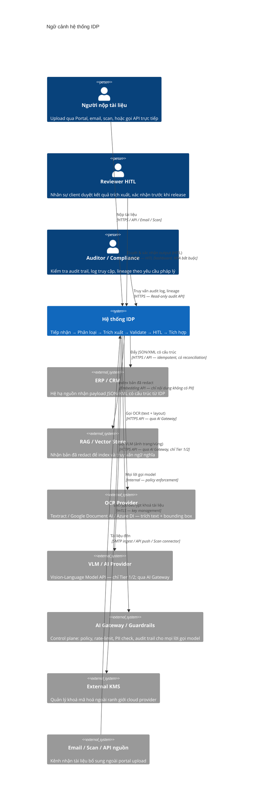

### §3.2 Sơ đồ pipeline tổng thể

Pipeline lõi chạy theo mô hình event-driven asynchronous. Sơ đồ dưới thể hiện toàn bộ các chặng từ tiếp nhận đến tích hợp hạ nguồn, bao gồm fan-out/fan-in mức vùng và vòng duyệt HITL (chi tiết messaging và saga ở §6).

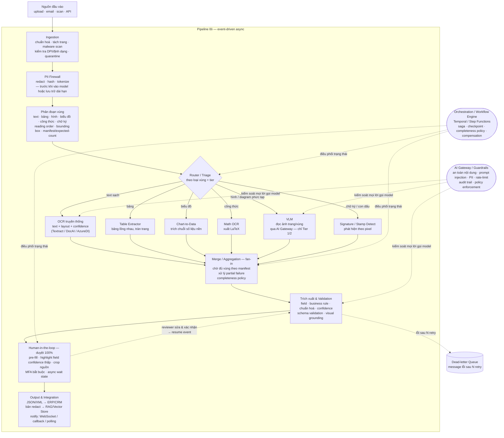

**Các chặng chính và đặc tính quan trọng:**

| Chặng | Chức năng cốt lõi | Đặc tính thiết kế |
|---|---|---|
| Ingestion | Chuẩn hoá, tách trang, malware scan, quarantine, kiểm DPI | Output: claim-check event (reference + metadata, không mang payload raw) |
| PII Firewall | Redact/hash/tokenize PII **trước** model và lưu trữ dài hạn | Bắt buộc trước mọi đường VLM/OCR; áp ảnh lẫn text |
| Phân đoạn vùng | Chia trang → danh sách vùng có type + bounding box | Phát manifest (expected-count) cho aggregator |
| Router | Dispatch vùng → extractor cố định theo `region_type` + `tier` | Tất định: cùng input → cùng đường; cấm dynamic model selection |
| Extractors (OCR/VLM/sub) | Trích text/cấu trúc theo loại vùng | Fan-out song song; VLM chỉ Tier 1/2; cấm Tier 0/3/4 gọi VLM public |
| Aggregation / Fan-in | Ráp kết quả vùng → trang → tài liệu | Chờ đủ manifest; flag continue nếu partial; completeness policy gate |
| Trích xuất & Validation | Business rule, chuẩn hoá, confidence, schema | Visual grounding giữ bounding box để audit |
| HITL | Duyệt 100% output trước release | Async wait state; confidence dùng để highlight, không gate; tạo golden data |
| Output & Integration | Đẩy hạ nguồn, notify caller | Idempotent push; xử lý downstream reject + reconciliation |

### §3.3 Bản đồ năng lực (Capability Map)

Hệ IDP được phân thành 5 nhóm năng lực, mỗi nhóm tương ứng các thành phần ở §4:

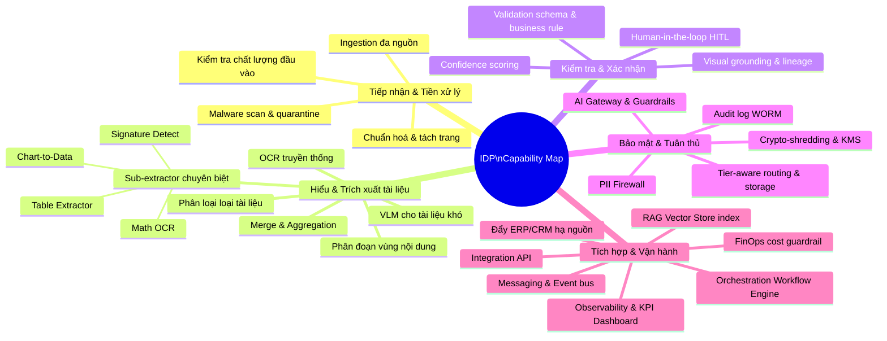

**Giai đoạn triển khai theo nhóm năng lực:**

| Nhóm năng lực | Giai đoạn 1 | Giai đoạn 2 | Giai đoạn 3+ |
|---|---|---|---|
| Tiếp nhận & Tiền xử lý | Đầy đủ | Thêm kiểm DPI nâng cao | — |
| Hiểu & Trích xuất | OCR + LLM, phân loại cơ bản | VLM + phân đoạn vùng + sub-extractor | Agentic self-correction |
| Kiểm tra & Xác nhận | Full HITL 100% + schema | Schema management plane; exception-queue ops | Confidence-gating (sau golden data) |
| Bảo mật & Tuân thủ | PII firewall + tier + audit | ZDR + tokenization vault + confidential computing | OWASP/NIST full mapping |
| Tích hợp & Vận hành | Integration API + ERP push + KPI dashboard | Two-lane (real-time/bulk) + workflow engine | Agentic tool-calling + MCP |


---

## §4 Kiến trúc logic — thành phần & hợp đồng giao tiếp

---

### §4.0 Bản đồ thành phần & danh mục sự kiện chuẩn

#### §4.0.1 Sơ đồ tổng thể thành phần

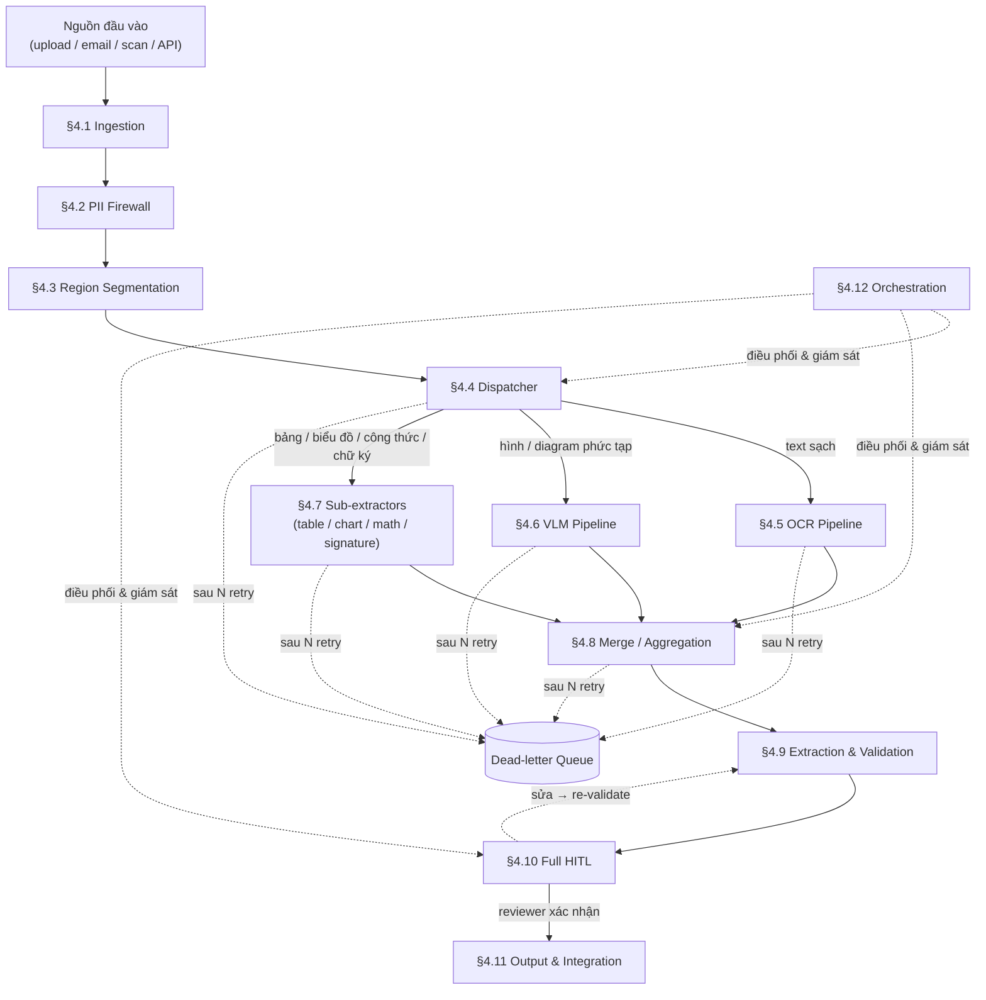

#### §4.0.2 Danh mục sự kiện chuẩn

Mọi sự kiện trong hệ thống đều tuân thủ **nguyên tắc claim-check**: event chỉ mang `reference` tới vật lưu trữ (object storage, vault), `metadata` điều hướng (tier, loại vùng, correlation_id) và thông tin trạng thái — **không mang nội dung thô, ảnh hay PII** trong payload event. Phần nặng/nhạy cảm nằm ở storage và chỉ được truy cập qua File Proxy (xem §6). Điều này khớp với yêu cầu ZDR (§7) — bus chỉ thấy con trỏ.

| Tên sự kiện | Nguồn phát | Ý nghĩa | Consumer chính |
|---|---|---|---|
| `document.submitted` | Nguồn bên ngoài / API | Tài liệu được đẩy vào hệ thống | Ingestion |
| `document.ingested` | §4.1 Ingestion | Tài liệu đã chuẩn hóa, tách trang, qua malware scan và gate chất lượng | PII Firewall |
| `document.quarantined` | §4.1 Ingestion | Tài liệu bị giữ lại (malware / chất lượng thấp / định dạng lạ) | Ops / Dead-letter |
| `pii.redacted` | §4.2 PII Firewall | Hoàn thành redact/tokenize; tài liệu sẵn sàng đi phân đoạn | Region Segmentation |
| `region.detected` | §4.3 Segmentation | Một vùng nội dung được phát hiện kèm bounding box và loại | Dispatcher |
| `regions.manifest` | §4.3 Segmentation | Toàn bộ manifest vùng của tài liệu (expected-count) | Aggregation / Orchestration |
| `region.dispatched` | §4.4 Dispatcher | Vùng đã được giao cho extractor cụ thể | OCR / VLM / Sub-extractor |
| `region.extracted` | §4.5 / §4.6 / §4.7 | Vùng đã được trích xuất xong, có kết quả + confidence | Aggregation |
| `region.failed` | §4.5 / §4.6 / §4.7 | Trích xuất vùng thất bại sau N retry | Aggregation / DLQ |
| `regions.aggregated` | §4.8 Aggregation | Toàn bộ (hoặc đủ theo completeness policy) vùng đã được ráp | Extraction & Validation |
| `document.extraction_complete` | §4.9 Validation | Tất cả field đã trích xuất và validate | HITL / Output |
| `document.validated` | §4.9 Validation | Tài liệu qua đủ business rule, sẵn sàng release | HITL (full HITL GĐ1–2) |
| `hitl.requested` | §4.9 / §4.10 | Tài liệu cần reviewer duyệt (full HITL hoặc confidence thấp) | HITL UI / Queue |
| `hitl.completed` | §4.10 HITL | Reviewer đã xác nhận / sửa và ký duyệt | Output & Integration |
| `hitl.correction_logged` | §4.10 HITL | Ghi nhận diff predicted-vs-corrected làm golden data | Governance / ML pipeline |
| `document.exported` | §4.11 Output | Dữ liệu đã đẩy thành công vào hệ hạ nguồn (ERP/CRM/RAG) | Audit / Orchestration |
| `document.export_failed` | §4.11 Output | Đẩy hạ nguồn thất bại; chờ reconciliation | Orchestration / Ops |
| `document.deadletter` | Orchestration / DLQ | Tài liệu không thể xử lý sau toàn bộ retry; cần can thiệp thủ công | Ops |
| `document.continue_flagged` | Aggregation / Orchestration | Tài liệu bị gián đoạn giữa chừng; đánh dấu flag continue để resume | Orchestration |

> **Quy ước đặt tên:** `<domain>.<verb_past>` theo kebab-case, domain là `document` / `region` / `regions` / `pii` / `hitl`. Mọi event đều có `schema_version` để backward-compatible khi tiến hóa. Schema đầy đủ các trường được định nghĩa tại §5.

---

### §4.1 Ingestion

#### Trách nhiệm

Tiếp nhận tài liệu từ đa nguồn (upload trực tiếp, email attachment, máy scan vật lý, API từ hệ ngoài), chuẩn hóa về định dạng xử lý nội bộ, phát hiện và loại bỏ yếu tố ảnh hưởng chất lượng, tách trang, cô lập file nguy hiểm. Đây là lớp biên duy nhất nhận tài liệu từ bên ngoài — mọi thứ qua được Ingestion mới được coi là dữ liệu tin cậy để xử lý.

#### Input

- File thô từ nguồn bên ngoài (PDF, JPG, PNG, TIFF, DOCX…) kèm metadata nguồn (loại nguồn, người gửi, timestamp).
- Sự kiện `document.submitted` từ API gateway hoặc connector nguồn.

#### Output (event/contract)

Sự kiện `document.ingested` sau khi tài liệu qua toàn bộ gate. Sự kiện `document.quarantined` nếu tài liệu bị giữ lại.

**Ví dụ JSON — `document.ingested`:**

```json
{
  "event_id": "evt_01J3KX8P2QR5VTND6WBHCM4Y7Z",
  "event_type": "document.ingested",
  "schema_version": "evt-schema@1.3",
  "timestamp": "2026-06-05T08:14:32.105Z",
  "correlation_id": "corr_7f3a1b2c-4d5e-6f7a-8b9c-0d1e2f3a4b5c",
  "document_id": "doc_INV2026060500123",
  "document_type": "invoice",
  "tenant_id": "tenant_acme_vn",
  "tier": 1,
  "source_channel": "email",
  "page_count": 3,
  "storage_ref": {
    "zone": "raw",
    "bucket": "idp-raw-tier1",
    "key": "2026/06/05/doc_INV2026060500123/original.pdf",
    "content_hash_sha256": "e3b0c44298fc1c149afbf4c8996fb92427ae41e4649b934ca495991b7852b855"
  },
  "quality_gate": {
    "dpi": 300,
    "format": "PDF",
    "passed": true,
    "warnings": []
  },
  "malware_scan": {
    "passed": true,
    "engine": "clamav@1.3.1",
    "scanned_at": "2026-06-05T08:14:31.890Z"
  },
  "sensitivity_label": "internal",
  "pipeline_version": "pipe@2.1.0"
}
```

#### Kỹ thuật/công nghệ

- **Định dạng hỗ trợ:** PDF (kể cả PDF/A), JPG, PNG, TIFF, DOCX — chuyển về ảnh trang (PNG 300 DPI) hoặc giữ nguyên PDF vector cho OCR engine.
- **Kiểm tra định dạng an toàn:** magic bytes validation (không chỉ dựa tên file), kiểm tra embedded script, hạn chế kích thước (≤ 50 MB mặc định, cấu hình được).
- **Khử nghiêng (deskew):** phát hiện và xoay lại trang bị nghiêng (thường ảnh từ máy scan cầm tay). Dùng OpenCV Hough transform hoặc tích hợp vào OCR engine (PaddleOCR, Tesseract).
- **Khử nhiễu (denoising):** lọc salt-and-pepper noise, tăng tương phản cho scan mờ.
- **Tách trang:** mỗi trang thành một đơn vị xử lý độc lập; lưu reference trang vào raw zone.
- **Malware scan:** ClamAV hoặc cloud API (theo tier); file chờ scan nằm trong quarantine zone tách biệt mạng.
- **Gate chất lượng đầu vào:** DPI < 150 → đánh dấu `low_quality` và đẩy hàng đợi ngoại lệ ngay (không dừng pipeline nhưng cảnh báo reviewer); định dạng không hỗ trợ → `document.quarantined`.
- **Idempotency:** dedup theo `content_hash_sha256`; nếu cùng hash đã ingested thành công → trả reference cũ (không xử lý lại).

#### Xử lý lỗi & edge case

| Tình huống | Xử lý |
|---|---|
| Malware phát hiện | Quarantine ngay; emit `document.quarantined`; alert ops; không giữ file trong raw zone |
| DPI < 150 / scan quá mờ | `quality_gate.passed = false`; warnings ghi rõ; vẫn emit `document.ingested` nhưng `quality_gate.passed = false`; dispatcher sau đó ưu tiên đường VLM và flag HITL |
| Định dạng không hỗ trợ | `document.quarantined` với `reason: unsupported_format` |
| File quá lớn (> giới hạn) | Từ chối ngay ở API gateway; trả 413 |
| PDF encrypted / password protected | `document.quarantined` với `reason: encrypted_pdf`; thông báo người gửi |
| Tài liệu trùng lặp (same hash) | Idempotent return; không emit event mới; log dedup hit |
| Timeout malware scan | Retry 2 lần; sau đó quarantine tạm; alert ops |

#### Giai đoạn

Giai đoạn 1.

---

### §4.2 PII Firewall

#### Trách nhiệm

Phát hiện và xử lý (redact / hash / tokenize) mọi thông tin nhận dạng cá nhân (PII) và thông tin nhạy cảm **trước khi** tài liệu đi vào bất kỳ model AI nào (OCR engine cloud, VLM API bên thứ ba) hoặc trước khi dữ liệu được lưu vào storage dài hạn. Đây là lớp bảo vệ **bắt buộc** để thực thi nguyên tắc data minimization và ZDR (xem §7). Không có ngoại lệ theo tier: tier cao hơn → chặt hơn (Tier 0/3/4 không ra model API ngoài, mọi xử lý self-hosted).

#### Input

- Sự kiện `document.ingested`; truy cập tài liệu đã chuẩn hóa qua `storage_ref` (thông qua File Proxy).
- Cấu hình PII theo `tier` và `document_type` (ví dụ: invoice chứa tên người mua, số tài khoản → pattern khác với CCCD).

#### Output (event/contract)

- Sự kiện `pii.redacted` với reference tới bản đã redact (trong redacted store) và mapping token → vault (trong token vault).
- Tài liệu gốc vẫn trong raw zone (chưa xóa ở bước này); xóa theo TTL auto-purge sau extraction thành công (§7).

**Ví dụ JSON — `pii.redacted`:**

```json
{
  "event_id": "evt_01J3KX9M5ST8WXQE7YCIFN6P0A",
  "event_type": "pii.redacted",
  "schema_version": "evt-schema@1.3",
  "timestamp": "2026-06-05T08:14:35.441Z",
  "correlation_id": "corr_7f3a1b2c-4d5e-6f7a-8b9c-0d1e2f3a4b5c",
  "document_id": "doc_INV2026060500123",
  "tier": 1,
  "redacted_ref": {
    "zone": "redacted",
    "bucket": "idp-redacted-tier1",
    "key": "2026/06/05/doc_INV2026060500123/redacted.pdf"
  },
  "token_vault_ref": {
    "vault": "idp-token-vault",
    "token_map_key": "2026/06/05/doc_INV2026060500123/token_map.enc"
  },
  "pii_summary": {
    "entities_found": ["PERSON_NAME", "BANK_ACCOUNT", "TAX_ID"],
    "entity_count": 7,
    "technique": "redact_image_bbox + tokenize_text"
  },
  "engine": "presidio@2.2.354",
  "model_version": "pii-detector@1.4.0",
  "pipeline_version": "pipe@2.1.0"
}
```

#### Kỹ thuật/công nghệ

- **Text PII:** Microsoft Presidio (open-source) với custom recognizer cho CCCD, mã số thuế VN, số tài khoản ngân hàng VN.
- **Image PII:** Presidio Image Redactor (che vùng ảnh chứa PII theo bounding box); với document scan dùng kết hợp OCR layer nhẹ để định vị PII trước khi redact pixel.
- **Tokenization:** PII thực được thay bằng token dạng `TOK_PERSON_a1b2c3`; mapping token → giá trị thật lưu trong token vault cô lập (§7), khoá riêng, access chặt nhất.
- **Cấu hình theo loại tài liệu:** mỗi `document_type` có danh sách entity cần redact khác nhau (invoice: tên/tax_id/bank; CCCD: full face, số CMND/CCCD, địa chỉ, ngày sinh).
- **Tier-aware routing:** Tier 0/3/4 → model self-hosted (Presidio local); Tier 1/2 → có thể dùng cloud PII detection API với BAA/DPA ký kết.

#### Xử lý lỗi & edge case

| Tình huống | Xử lý |
|---|---|
| PII engine lỗi / timeout | Retry 3 lần với exponential backoff; sau đó emit `document.deadletter` — không được bỏ qua bước PII, vì đây là gate bảo mật |
| PII có false negative (sót PII) | Chấp nhận rủi ro tồn dư; log entity_count để monitor; HITL là lớp kiểm tra thứ hai |
| Tài liệu tier 0 yêu cầu VLM nhưng không có self-hosted VLM | Dispatcher chặn cứng, emit `region.failed` với `reason: tier_constraint`; không gọi VLM API ngoài |
| Token vault không available | Dừng pipeline, alert ops; không xử lý tiếp tài liệu tier cao khi vault không available |

#### Giai đoạn

Giai đoạn 1 (text PII); Giai đoạn 2 (image PII đầy đủ với bounding box).

---

### §4.3 Phân đoạn vùng (Region Segmentation)

#### Trách nhiệm

Thay vì coi toàn bộ trang là một khối đồng nhất, chia mỗi trang thành các **vùng nội dung** theo loại: text block, bảng (table), hình ảnh (image), biểu đồ (chart), công thức toán học (math), chữ ký / con dấu (signature/stamp). Xác định reading order và xử lý bố cục đa cột. Phát ra **manifest** với expected-count để Aggregation (§4.8) biết khi nào "đủ". Đây là bước quyết định dispatch đúng công cụ cho đúng vùng.

#### Input

- Sự kiện `pii.redacted`; truy cập bản đã redact qua `redacted_ref`.
- Mỗi trang là một đơn vị xử lý.

#### Output (event/contract)

- Một sự kiện `regions.manifest` per tài liệu (toàn bộ danh sách vùng với expected-count).
- Nhiều sự kiện `region.detected` (một per vùng), fan-out vào queue cho Dispatcher.

**Ví dụ JSON — `regions.manifest`:**

```json
{
  "event_id": "evt_01J3KXBQ7UV1YZRF9AGJKL8N2B",
  "event_type": "regions.manifest",
  "schema_version": "evt-schema@1.3",
  "timestamp": "2026-06-05T08:14:38.220Z",
  "correlation_id": "corr_7f3a1b2c-4d5e-6f7a-8b9c-0d1e2f3a4b5c",
  "document_id": "doc_INV2026060500123",
  "tier": 1,
  "page_count": 3,
  "total_regions": 11,
  "regions": [
    {
      "region_id": "reg_p1_001",
      "page": 1,
      "region_type": "text",
      "bbox": [42, 55, 580, 120],
      "reading_order": 1,
      "crop_ref": "2026/06/05/doc_INV2026060500123/crops/p1_001.png"
    },
    {
      "region_id": "reg_p1_002",
      "page": 1,
      "region_type": "table",
      "bbox": [42, 200, 580, 480],
      "reading_order": 3,
      "crop_ref": "2026/06/05/doc_INV2026060500123/crops/p1_002.png"
    },
    {
      "region_id": "reg_p3_001",
      "page": 3,
      "region_type": "signature",
      "bbox": [380, 650, 550, 720],
      "reading_order": 14,
      "crop_ref": "2026/06/05/doc_INV2026060500123/crops/p3_001.png"
    }
  ],
  "segmentation_model": "layout-detector@3.1.0",
  "pipeline_version": "pipe@2.1.0"
}
```

#### Kỹ thuật/công nghệ

- **Object detection cho layout:** DocLayout-YOLO, LayoutParser, hoặc tích hợp sẵn trong OCR platform (Azure Document Intelligence layout model, Google Document AI layout parser).
- **Phân loại loại vùng:** text / table / figure / chart / math / signature — dùng classifier nhẹ (fine-tuned ViT hoặc rule-based sau object detection).
- **Reading order:** Bi-directional reading order detection; hỗ trợ bố cục đa cột (phổ biến trong báo cáo tài chính, hóa đơn nhiều cột).
- **Crop lưu trữ:** mỗi vùng được crop ra và lưu reference (`crop_ref`) trong redacted store để sub-extractor / HITL truy cập trực tiếp — giảm kích thước input cho extractor.
- **Bounding box format:** `[x0, y0, x1, y1]` pixel trong coordinate space của trang (top-left origin); cùng format với grounding bbox ở §4.9 để nhất quán xuyên suốt.

#### Xử lý lỗi & edge case

| Tình huống | Xử lý |
|---|---|
| Không phát hiện được vùng nào (trang trắng / scan mờ hoàn toàn) | Phát một vùng `full_page` với `region_type: unknown`; đẩy sang VLM; flag HITL |
| Vùng chồng lặp (overlapping bbox) | Áp dụng Non-Maximum Suppression (NMS); trường hợp còn lại → merge hoặc giữ vùng lớn hơn; log warning |
| Bảng trải qua nhiều trang (cross-page table) | Phát nhiều vùng `table` liên tiếp với `cross_page_group_id` chung; Aggregation ráp lại trước khi gửi table extractor |
| Diagram / mind map không nhận dạng được loại | Gán `region_type: figure_complex`; confidence thấp mặc định; đường VLM; ưu tiên HITL |

#### Giai đoạn

Giai đoạn 2 (đầy đủ); Giai đoạn 1 dùng full-page segmentation đơn giản.

---

### §4.4 Dispatcher theo loại vùng + tier (luồng tất định)

#### Trách nhiệm

Nhận từng sự kiện `region.detected` và định tuyến tới extractor chính xác theo **bảng dispatch tĩnh** dựa trên `region_type` và `tier`. Đây là **dispatch tất định theo loại nội dung** — không load-aware, không chọn model động theo confidence hay độ bận của queue. Cùng một `region_type` + `tier` luôn cho cùng một extractor: dễ test, dễ audit, dễ chứng minh hành vi cho eKYC.

**Không** sử dụng cơ chế "khi queue VLM đầy thì hạ cấp sang OCR" — điều này vi phạm ADR-10. Nút thắt VLM được xử lý bằng queue depth + backpressure + autoscale (xem §6).

#### Input

- Sự kiện `region.detected` (từ §4.3).
- Bảng cấu hình dispatch (runtime-configurable, không cần rebuild).

#### Bảng dispatch tĩnh

| `region_type` | Tier 0/3/4 | Tier 1/2 |
|---|---|---|
| `text` | OCR self-hosted | OCR engine (Textract / Google DI / Azure DI) |
| `table` | Table extractor self-hosted | Table extractor (platform hoặc self-hosted) |
| `chart` | Chart-to-data self-hosted | Chart-to-data (self-hosted hoặc VLM) |
| `math` | Math OCR self-hosted (LaTeX) | Math OCR (self-hosted) |
| `figure_complex` / `diagram` | VLM self-hosted | VLM API qua AI Gateway |
| `signature` / `stamp` | Signature detector self-hosted | Signature detector |
| `unknown` / `full_page` | VLM self-hosted | VLM API qua AI Gateway |

#### Output (event/contract)

- Sự kiện `region.dispatched` với trường `assigned_extractor` và queue target.

#### Kỹ thuật/công nghệ

- Stateless routing service; bảng dispatch load từ config store (không hardcode).
- Publish message tới topic queue tương ứng (ví dụ: `idp.extract.ocr`, `idp.extract.vlm`, `idp.extract.table`).
- Tier validation: chặn cứng routing sang VLM API ngoài nếu `tier` ∈ {0, 3, 4}; emit `region.failed` với `reason: tier_constraint` nếu không có self-hosted alternative.

#### Xử lý lỗi & edge case

| Tình huống | Xử lý |
|---|---|
| `region_type` không có trong bảng dispatch | Default sang `full_page` → VLM; log unknown type |
| Extractor queue bị block / offline | Backpressure upstream; Ingestion nhận 202 Accepted ngay nhưng pipeline chờ; không hạ cấp extractor |
| Tier constraint không thể thỏa mãn (không có self-hosted) | `region.failed` với `reason: no_extractor_available`; tài liệu vào `document.deadletter` sau timeout |

#### Giai đoạn

Giai đoạn 1 (dispatch cơ bản text/full-page); Giai đoạn 2 (đầy đủ tất cả region_type).

---

### §4.5 Đường OCR

#### Trách nhiệm

Trích xuất text, layout cấu trúc và bounding box theo token từ vùng nội dung loại `text`. Cung cấp confidence per token/word cho bước Validation (§4.9). Là công cụ chính cho tài liệu scan sạch, in rõ ràng — rẻ, nhanh, audit tốt.

#### Input

- Sự kiện `region.dispatched` với `assigned_extractor: ocr`; truy cập `crop_ref` qua File Proxy.

#### Output (event/contract)

- Sự kiện `region.extracted` với kết quả text + confidence + bounding box theo token.

#### Kỹ thuật/công nghệ

- **Engine tùy chọn theo tier:** AWS Textract, Google Document AI, Azure Document Intelligence v4.0 (Tier 1/2); PaddleOCR, Tesseract (self-hosted Tier 0/3/4).
- **Output format chuẩn hóa:** normalize về internal schema bất kể OCR engine nào dùng (adapter pattern — đổi engine không ảnh hưởng downstream).
- **Bounding box:** `[x0, y0, x1, y1]` trong coordinate space trang (nhất quán với §4.3).
- **Ngôn ngữ:** Tiếng Việt (có dấu phụ) + tiếng Anh mặc định; thêm ngôn ngữ khác qua config.
- **Idempotency:** result cache theo `(region_id, model_version)` — gọi lại cùng vùng với cùng model version trả cache (xem §6, state machine idempotency).

#### Xử lý lỗi & edge case

| Tình huống | Xử lý |
|---|---|
| OCR engine trả confidence < ngưỡng tối thiểu (cấu hình, mặc định 0.5) | Emit `region.extracted` bình thường nhưng `overall_confidence` thấp; Validation (§4.9) flag field tương ứng → HITL highlight |
| Timeout gọi OCR engine cloud | Retry 3 lần với jitter; sau đó `region.failed`; Aggregation xử lý partial failure |
| Vùng text có chữ viết tay xen kẽ | OCR trả confidence thấp cho phần viết tay; Dispatcher GĐ2 có thể gửi vùng đó sang VLM nếu quality thấp |
| Rate limit OCR engine | AI Gateway / adapter bắt 429, exponential backoff; không emit lỗi cho đến khi hết số lần retry |

#### Giai đoạn

Giai đoạn 1.

---

### §4.6 Đường VLM

#### Trách nhiệm

Đọc thẳng ảnh trang / vùng và xuất kết quả có cấu trúc (JSON / Markdown). Xử lý các tình huống OCR thất bại: scan mờ, chữ viết tay, hình ảnh phức tạp, diagram, bảng lồng nhau. Với diagram / mind map, prompt VLM **phải** xuất biểu diễn có cấu trúc (node + edge / JSON phân cấp) — không phải plain text — để không mất quan hệ ngữ nghĩa. Mọi lời gọi bắt buộc qua AI Gateway (§7).

#### Input

- Sự kiện `region.dispatched` với `assigned_extractor: vlm`; ảnh crop vùng qua File Proxy.
- Prompt template theo `region_type` và `document_type` (cấu hình, không hardcode).

#### Output (event/contract)

- Sự kiện `region.extracted` với kết quả có cấu trúc; `extraction_path: vlm`.

#### Kỹ thuật/công nghệ

- **Model:** Claude Sonnet / Haiku (Tier 1/2 qua AI Gateway), Mistral / LLaVA / InternVL (self-hosted Tier 0/3/4).
- **AI Gateway bắt buộc:** rate limit, quota, PII guard thứ hai (kiểm tra lại trước khi gửi), log metadata (không log nội dung), audit trail, egress control.
- **Prompt engineering:**
  - System prompt tách biệt hoàn toàn với nội dung tài liệu (chống prompt injection — P9, ADR-10).
  - Nội dung tài liệu luôn được đưa vào như "dữ liệu đầu vào", không như "hướng dẫn".
  - Với diagram: `"Extract the structure as JSON with 'nodes' and 'edges' arrays. Do not summarize as text."`
- **Output schema enforcement:** enforce JSON schema tại AI Gateway response; nếu model trả plain text → retry với stricter prompt; sau đó `region.failed`.
- **Idempotency:** cache theo `(region_id, model_version, prompt_hash)` — cùng input + cùng prompt luôn trả cache để không tốn tiền gọi lại.
- **Cost control:** VLM chỉ được gọi cho vùng Dispatcher chỉ định; không tự leo thang sang VLM vì confidence thấp (điều đó thuộc GĐ3).

#### Xử lý lỗi & edge case

| Tình huống | Xử lý |
|---|---|
| Model từ chối (content filter) | Log refusal reason; `region.failed` với `reason: model_refused`; HITL manual |
| Model trả hallucination (JSON không khớp schema) | Schema validation tại gateway; retry 2 lần với stricter prompt; sau đó `region.failed` |
| Prompt injection qua nội dung tài liệu | Gateway guardrail phát hiện; block; log security event; `region.failed` |
| 429 rate limit | Exponential backoff; queue hấp thụ; không hạ cấp sang OCR |
| Tier constraint (Tier 0 không có self-hosted VLM) | `region.failed` với `reason: tier_constraint`; HITL manual |

#### Giai đoạn

Giai đoạn 2.

---

### §4.7 Sub-extractors chuyên biệt

#### Trách nhiệm

Bốn plugin chuyên biệt, mỗi cái tối ưu cho một loại vùng cụ thể. Được Dispatcher gọi theo `region_type`. Độ chính xác cao hơn so với OCR thuần hoặc VLM thuần trên domain của chúng, vì được thiết kế đặc thù cho cấu trúc đó.

#### Sub-extractor A: Table Extractor

- **Input:** vùng `table` (crop ảnh + metadata); sự kiện `region.dispatched` với `assigned_extractor: table_extractor`.
- **Trách nhiệm:** nhận dạng cấu trúc bảng bao gồm: header đa hàng, ô merged, bảng lồng nhau, bảng trải nhiều trang (dùng `cross_page_group_id` từ §4.3 để ráp).
- **Output:** danh sách hàng × cột dạng JSON có cấu trúc; mỗi ô kèm bounding box; confidence per ô.
- **Kỹ thuật:** Microsoft Table Transformer, PaddleOCR table recognition, hoặc platform built-in (Azure DI table extraction). Với bảng phức tạp → VLM fallback (chỉ GĐ3, sau khi có golden data để đánh giá).
- **Edge case:** bảng không có đường kẻ (borderless table) → áp heuristic cột theo khoảng trắng; nếu fail → `region_type` upgrade sang `figure_complex` → VLM.

#### Sub-extractor B: Chart-to-Data

- **Input:** vùng `chart` (biểu đồ cột, đường, tròn, v.v.).
- **Trách nhiệm:** trích xuất **chuỗi số liệu gốc** (data series), nhãn trục, tiêu đề — không phải đọc text trên biểu đồ mà là tái cấu trúc dữ liệu nền.
- **Output:** JSON với `chart_type`, `series[]` (mỗi series có `label`, `values[]`, `unit`), `x_axis`, `y_axis`.
- **Kỹ thuật:** ChartQA model, StructChart, hoặc VLM với prompt đặc thù `"Extract the underlying data series as JSON, not a description"`.
- **Edge case:** biểu đồ 3D, biểu đồ radar phức tạp → confidence thấp mặc định; ưu tiên HITL.

#### Sub-extractor C: Math OCR

- **Input:** vùng `math` (công thức toán học in hoặc viết tay).
- **Trách nhiệm:** xuất công thức dạng **LaTeX** để giữ nguyên ý nghĩa toán học (không xuất text plain).
- **Output:** `{ "latex": "\\frac{d}{dx}[f(x)g(x)] = ...", "confidence": 0.91 }`.
- **Kỹ thuật:** Pix2Tex, LaTeX-OCR, Mathpix API (Tier 1/2); self-hosted model (Tier 0/3/4).
- **Edge case:** công thức viết tay không rõ → confidence thấp; HITL reviewer xem crop nguồn để sửa LaTeX.

#### Sub-extractor D: Signature / Stamp Detection

- **Input:** vùng `signature` hoặc `stamp`.
- **Trách nhiệm:** phát hiện sự hiện diện của chữ ký / con dấu theo pixel (không phải đọc nội dung chữ ký), xác định bounding box chính xác, phân loại `signature` vs `company_stamp`.
- **Output:** `{ "detected": true, "type": "signature", "confidence": 0.97, "bbox": [380, 650, 550, 720] }`.
- **Kỹ thuật:** binary classifier fine-tuned trên chữ ký VN / con dấu tròn; thường dùng ResNet-50 / EfficientNet backbone.
- **Đặc điểm:** loại có độ bất định cao (chữ ký phức tạp, con dấu mờ) → confidence thấp mặc định; luôn ưu tiên HITL để reviewer xác nhận.

#### Output chung tất cả sub-extractors

Sự kiện `region.extracted`:

```json
{
  "event_id": "evt_01J3KXCP8VW2ZASG0BHLMN9O3C",
  "event_type": "region.extracted",
  "schema_version": "evt-schema@1.3",
  "timestamp": "2026-06-05T08:14:52.774Z",
  "correlation_id": "corr_7f3a1b2c-4d5e-6f7a-8b9c-0d1e2f3a4b5c",
  "document_id": "doc_INV2026060500123",
  "region_id": "reg_p1_002",
  "page": 1,
  "region_type": "table",
  "extraction_path": "table_extractor",
  "tier": 1,
  "model_version": "table-extractor@2.3.1",
  "result_ref": {
    "zone": "extracted",
    "key": "2026/06/05/doc_INV2026060500123/regions/reg_p1_002_result.json"
  },
  "overall_confidence": 0.94,
  "grounding_region": {
    "page": 1,
    "bbox": [42, 200, 580, 480]
  },
  "row_count": 8,
  "col_count": 5,
  "status": "succeeded",
  "pipeline_version": "pipe@2.1.0"
}
```

#### Giai đoạn

Giai đoạn 2 (Table Extractor + Signature/Stamp); Giai đoạn 2–3 (Chart-to-Data + Math OCR tùy use case).

---

### §4.8 Merge / Aggregation

#### Trách nhiệm

Điểm **fan-in** của pipeline: nhận kết quả từ tất cả vùng song song, ráp lại theo reading order thành cấu trúc trang → tài liệu hoàn chỉnh. Quản lý **manifest / expected-count** để biết khi nào "đủ". Xử lý partial failure (vùng lỗi không chặn cả tài liệu). Thực thi **completeness policy** trước khi release sang Validation.

#### Input

- Sự kiện `region.extracted` và `region.failed` (nhiều, từ nhiều extractor song song).
- Sự kiện `regions.manifest` (đã nhận từ §4.3, chứa expected-count = `total_regions`).

#### Cơ chế hoạt động

```
Khi nhận region.extracted / region.failed:
  1. Ghi vào result cache (chỉ khi succeeded — xem §6)
  2. Đánh dấu region_id trong trạng thái tài liệu
  3. Kiểm tra: received_count == expected_count ?
     → Nếu đủ: áp completeness policy → emit regions.aggregated
     → Nếu chưa đủ: chờ thêm (timeout per region: cấu hình, mặc định 5 phút)

Khi region timeout:
  → region.failed với reason: timeout
  → Áp completeness policy với partial results
```

**Completeness policy (release-gating):**

| Use case | Logic |
|---|---|
| eKYC (CCCD, hộ chiếu) | Thiếu vùng **bắt buộc** (mặt trước, mặt sau, chữ ký) → KHÔNG release; giữ `document.continue_flagged`; alert reviewer |
| Invoice / AP | Thiếu vùng không bắt buộc (ví dụ logo) → release với `incomplete_optional_regions`; thiếu line-item table → flag HITL |
| Scan nội bộ | Khoan dung hơn; partial OK với cảnh báo |

**Checkpointing / resumable:** kết quả vùng đã xong được persist trong result cache. Khi `document.continue_flagged` và retry sau đó, Aggregation đọc lại cache và chỉ yêu cầu xử lý lại các vùng còn thiếu/lỗi — không chạy lại từ đầu (xem §6).

#### Output (event/contract)

Sự kiện `regions.aggregated`:

```json
{
  "event_id": "evt_01J3KXDQ9XY3ABTH1CIMNO0P4D",
  "event_type": "regions.aggregated",
  "schema_version": "evt-schema@1.3",
  "timestamp": "2026-06-05T08:15:10.330Z",
  "correlation_id": "corr_7f3a1b2c-4d5e-6f7a-8b9c-0d1e2f3a4b5c",
  "document_id": "doc_INV2026060500123",
  "tier": 1,
  "total_regions_expected": 11,
  "total_regions_received": 11,
  "regions_succeeded": 10,
  "regions_failed": 1,
  "failed_region_ids": ["reg_p3_001"],
  "completeness_policy": "invoice",
  "completeness_check": {
    "passed": true,
    "reason": "All mandatory regions present; reg_p3_001 (signature) is optional for invoice"
  },
  "aggregated_doc_ref": {
    "zone": "extracted",
    "key": "2026/06/05/doc_INV2026060500123/aggregated_doc.json"
  },
  "pipeline_version": "pipe@2.1.0"
}
```

#### Kỹ thuật/công nghệ

- State machine per tài liệu, persist vào durable store (Redis + PostgreSQL hoặc workflow engine state).
- Out-of-order delivery: region kết quả đến không theo thứ tự → sắp xếp lại theo `reading_order` khi ráp.
- Cross-page table: nhận các vùng `table` có cùng `cross_page_group_id` → merge trước khi ghi aggregated doc.

#### Xử lý lỗi & edge case

| Tình huống | Xử lý |
|---|---|
| Một vùng không bắt buộc lỗi | `regions_failed++`; aggregated vẫn emit với partial; field tương ứng để trống + flag HITL |
| Vùng bắt buộc lỗi (eKYC) | Completeness check fail; `document.continue_flagged`; không emit `regions.aggregated`; alert ops |
| Tất cả vùng timeout | Tài liệu vào `document.deadletter` |
| Duplicate region result (at-least-once delivery) | Idempotent: dedup theo `(region_id, model_version)`; chỉ ghi kết quả đầu tiên vào cache |

#### Giai đoạn

Giai đoạn 1 (aggregation đơn giản); Giai đoạn 2 (manifest + completeness policy đầy đủ).

---

### §4.9 Trích xuất & Validation

#### Trách nhiệm

Ánh xạ nội dung đã aggregate thành **field có tên** theo schema nghiệp vụ (ví dụ: `invoice_number`, `total_amount`, `vendor_tax_id`), áp **business rule** (kiểm tra logic nghiệp vụ), **chuẩn hóa định dạng** (ngày, tiền tệ, mã số), **schema validation**, chấm **confidence per field**, và gắn **grounding bbox** (để reviewer/audit biết field đến từ vùng nào trên trang).

Với đường OCR, LLM được dùng để trích field từ text (LLM-as-extractor); bounding box từ OCR output được giữ và gắn vào field để grounding.

#### Input

- Sự kiện `regions.aggregated`; truy cập `aggregated_doc_ref`.
- Schema nghiệp vụ và business rule (từ Schema Management plane — §4 scope-implementation §D).

#### Output (event/contract)

- Sự kiện `document.extraction_complete` kèm reference tới extracted fields (dưới dạng JSON có cấu trúc).
- Sau đó (full HITL GĐ1–2) emit `hitl.requested`.

**Ví dụ JSON — payload trong `document.extraction_complete` (extracted fields):**

```json
{
  "event_id": "evt_01J3KXER0YZ4BCUI2DJNOP1Q5E",
  "event_type": "document.extraction_complete",
  "schema_version": "evt-schema@1.3",
  "timestamp": "2026-06-05T08:15:18.992Z",
  "correlation_id": "corr_7f3a1b2c-4d5e-6f7a-8b9c-0d1e2f3a4b5c",
  "document_id": "doc_INV2026060500123",
  "document_type": "invoice",
  "tier": 1,
  "model_version": "extractor@3.2.0",
  "pipeline_version": "pipe@2.1.0",
  "extracted_fields": [
    {
      "field_name": "invoice_number",
      "value": "INV-2026-00512",
      "confidence_score": 0.98,
      "extraction_path": "ocr+llm",
      "grounding_region": {
        "page": 1,
        "bbox": [42, 55, 280, 80]
      },
      "normalized_value": "INV-2026-00512",
      "validation": {
        "passed": true,
        "rules_applied": ["format_invoice_number", "not_null"],
        "failures": []
      }
    },
    {
      "field_name": "total_amount",
      "value": "15750000",
      "confidence_score": 0.96,
      "extraction_path": "ocr+llm",
      "grounding_region": {
        "page": 2,
        "bbox": [400, 520, 570, 545]
      },
      "normalized_value": 15750000,
      "currency": "VND",
      "validation": {
        "passed": true,
        "rules_applied": ["positive_number", "currency_vnd", "matches_line_items_sum"],
        "failures": []
      }
    },
    {
      "field_name": "vendor_tax_id",
      "value": "TOK_TAX_a1b2c3",
      "confidence_score": 0.87,
      "extraction_path": "ocr+llm",
      "grounding_region": {
        "page": 1,
        "bbox": [42, 95, 200, 115]
      },
      "normalized_value": "TOK_TAX_a1b2c3",
      "is_tokenized": true,
      "validation": {
        "passed": true,
        "rules_applied": ["format_vn_tax_id"],
        "failures": []
      }
    },
    {
      "field_name": "issue_date",
      "value": "05/06/2026",
      "confidence_score": 0.72,
      "extraction_path": "ocr+llm",
      "grounding_region": {
        "page": 1,
        "bbox": [350, 55, 500, 75]
      },
      "normalized_value": "2026-06-05",
      "validation": {
        "passed": false,
        "rules_applied": ["date_iso_format", "not_future_date"],
        "failures": [
          {
            "rule": "not_future_date",
            "message": "Issue date 2026-06-05 is today — acceptable but low confidence requires review"
          }
        ]
      }
    }
  ],
  "overall_status": "requires_hitl",
  "hitl_priority_fields": ["issue_date", "vendor_tax_id"],
  "schema_version_used": "invoice-schema@2.1.0"
}
```

#### Kỹ thuật/công nghệ

- **LLM-as-extractor (đường OCR):** dùng structured output (function calling / JSON mode) để map text sang field. Input: text từ OCR + bounding box; output: field value + confidence + source bbox.
- **Schema validation:** Pydantic / JSON Schema; các field bắt buộc (`required_fields`) và format rule per field.
- **Business rule engine:** rule-based (DSL config) — ví dụ `total_amount == sum(line_items[].amount)`, `issue_date <= today`, `vendor_tax_id format = VN`.
- **Confidence scoring:** kết hợp OCR token confidence + LLM output logprob (nếu available) + rule pass/fail.
- **Grounding bbox:** kế thừa từ OCR bounding box của token/span tương ứng; dùng để highlight trong HITL UI.
- **Chuẩn hóa:** ngày → ISO 8601; tiền tệ → số nguyên (đơn vị đồng) + currency code; mã số thuế → loại bỏ dấu cách/gạch ngang.

#### Xử lý lỗi & edge case

| Tình huống | Xử lý |
|---|---|
| Field bắt buộc không trích xuất được | `validation.passed = false`; `required_field_missing`; `hitl_priority_fields` thêm field đó |
| Business rule fail | Ghi `failures[]`; field vào `hitl_priority_fields`; không block toàn bộ tài liệu |
| Confidence < 0.7 (ngưỡng mặc định, cấu hình được) | Field vào `hitl_priority_fields` để reviewer chú ý trong UI |
| LLM hallucination (value không khớp text gốc) | Schema validation / business rule bắt; nếu lọt: HITL là lớp bắt cuối |

#### Giai đoạn

Giai đoạn 1 (OCR + LLM extraction, validation cơ bản); Giai đoạn 2 (VLM path, sub-extractor fields).

---

### §4.10 Full HITL — Duyệt 100% trước khi release

#### Trách nhiệm

Toàn bộ output của pipeline **bắt buộc** phải qua reviewer xác nhận trước khi save vào extracted store và đẩy hạ nguồn (ADR-11). Không có gì auto-release. HITL vừa là **hàng rào toàn vẹn** (bắt hallucination, injection) vừa là **nguồn sinh golden data** (diff predicted-vs-corrected → nhãn đào tạo VLM sau này).

**HITL là trạng thái chờ bất đồng bộ:** sau khi `hitl.requested` được emit, pipeline dừng lại tại đây và chờ event `hitl.completed` từ reviewer. Không có timeout tự release — tài liệu có thể nằm ở trạng thái HITL hàng giờ đến hàng ngày tùy SLA vận hành.

#### Input

- Sự kiện `document.extraction_complete` với danh sách field, confidence score, `hitl_priority_fields`, và grounding bbox.
- Reviewer access tài liệu redacted qua File Proxy (HITL UI không bao giờ truy cập raw zone trực tiếp).

#### Yêu cầu UI HITL (thiết kế để 100%-review khả thi)

| Tính năng | Mô tả | Mục đích |
|---|---|---|
| **Pre-fill** | Hiển thị sẵn giá trị model dự đoán trong form | Reviewer chỉ sửa phần sai, không nhập lại từ đầu |
| **Highlight priority** | Field có `confidence_score` thấp hoặc trong `hitl_priority_fields` được tô màu / đánh dấu rõ | Điều hướng sự chú ý của reviewer tới nơi cần kiểm tra nhất |
| **Crop nguồn** | Hiển thị crop ảnh vùng tương ứng (từ `grounding_region.bbox`) cạnh form field | Reviewer đối chiếu ngay với tài liệu gốc — không phải cuộn tìm |
| **Side-by-side view** | Toàn bộ tài liệu redacted bên trái; form extraction bên phải | Kiểm tra toàn vẹn |
| **Keyboard shortcuts** | Phím tắt để accept-all / next-field / flag / reject | Tăng tốc độ duyệt |
| **MFA** | Xác thực đa yếu tố trước khi submit | Tuân thủ (SBV Thông tư 16) |

#### Output (event/contract)

Sự kiện `hitl.completed` khi reviewer submit và `hitl.correction_logged` khi diff được ghi:

```json
{
  "event_id": "evt_01J3KXFS1AZ5CDVJ3EKQPR2R6F",
  "event_type": "hitl.completed",
  "schema_version": "evt-schema@1.3",
  "timestamp": "2026-06-05T09:02:44.115Z",
  "correlation_id": "corr_7f3a1b2c-4d5e-6f7a-8b9c-0d1e2f3a4b5c",
  "document_id": "doc_INV2026060500123",
  "document_type": "invoice",
  "tier": 1,
  "session_id": "ses_HITL_20260605_R007",
  "reviewer_id": "usr_pseudonymized_r007",
  "role": "reviewer",
  "mfa_verified": true,
  "review_decision": "approved_with_corrections",
  "fields_reviewed": 12,
  "fields_corrected": 2,
  "corrections": [
    {
      "field_name": "issue_date",
      "value_predicted": "05/06/2026",
      "value_corrected": "2026-06-05",
      "correction_source": "human_reviewer",
      "grounding_region": { "page": 1, "bbox": [350, 55, 500, 75] },
      "dwell_time_ms": 4200
    },
    {
      "field_name": "vendor_tax_id",
      "value_predicted": "TOK_TAX_a1b2c3",
      "value_corrected": "TOK_TAX_a1b2c3",
      "correction_source": "human_reviewer",
      "note": "Confirmed token correct after checking vault reference",
      "dwell_time_ms": 1800
    }
  ],
  "golden_data_logged": true,
  "pipeline_version": "pipe@2.1.0",
  "model_version": "extractor@3.2.0"
}
```

#### Kỹ thuật/công nghệ

- **Queue vận hành:** hàng đợi reviewer có ưu tiên (priority queue) — eKYC > invoice > nội bộ; SLA per loại.
- **Routing reviewer:** round-robin hoặc theo specialization (reviewer chuyên CCCD vs chuyên hóa đơn).
- **Trạng thái HITL:** `pending_assignment` → `assigned` → `in_review` → `completed` / `escalated` / `rejected`.
- **Escalation:** quá SLA → escalate lên senior reviewer.
- **Golden data pipeline:** diff `(value_predicted, value_corrected, grounding_region, model_version, dwell_time_ms)` được emit sang `hitl.correction_logged` và nạp vào governance pipeline (§8 governance.md) để tích lũy nhãn.
- **MFA:** TOTP hoặc push notification qua SSO provider; không thể submit nếu MFA chưa verify trong phiên.

#### Xử lý lỗi & edge case

| Tình huống | Xử lý |
|---|---|
| Reviewer reject toàn bộ tài liệu | `review_decision: rejected`; `document.deadletter` hoặc quay lại ingestion tùy policy |
| Phiên HITL hết hạn (reviewer không tương tác > X phút) | Giải phóng lock; trả về `pending_assignment`; assign reviewer khác |
| MFA fail | Không cho submit; log security event |
| Tài liệu có dấu hiệu injection (reviewer phát hiện text lạ trong field) | Reviewer gắn cờ `injection_suspected`; security alert; tài liệu vào quarantine |

#### Giai đoạn

Giai đoạn 1 (full HITL 100%); Giai đoạn 3 (nới sang confidence-gating cho phần đã có golden data).

---

### §4.11 Output & Integration

#### Trách nhiệm

Sau khi `hitl.completed` với `review_decision: approved*`, xuất dữ liệu sạch tới các hệ hạ nguồn. Đảm bảo idempotency khi đẩy (retry không tạo bản ghi trùng). Xử lý kết quả downstream (accept / reject từ ERP). Quản lý kênh thông báo hoàn thành cho client API. Output đa phương thức: field text → JSON; bảng → JSON array; biểu đồ → data series; diagram → graph JSON; chữ ký → boolean + crop ref; công thức → LaTeX.

Chi tiết hợp đồng API với hệ ngoài được định nghĩa đầy đủ tại §10 (Integration & API).

#### Input

- Sự kiện `hitl.completed` với `review_decision` approved.
- Kết quả extraction cuối cùng (đã merge corrections từ reviewer).

#### Output (event/contract)

- Sự kiện `document.exported` sau khi đẩy hạ nguồn thành công.
- Sự kiện `document.export_failed` nếu hạ nguồn từ chối / timeout.
- Thông báo hoàn thành tới caller (WebSocket / SSE / webhook callback).

#### Kỹ thuật/công nghệ

- **API ngoài:** POST `/documents/{id}/result` trả JSON payload; hỗ trợ webhook callback và SSE cho kết quả streaming.
- **Idempotency key:** client cung cấp `idempotency_key` khi submit; hệ đảm bảo cùng key → cùng kết quả nếu đã xử lý thành công (xem §6).
- **Downstream integration:** HTTP POST tới ERP/CRM endpoint (cấu hình per tenant); retry với exponential backoff; ghi `downstream_status` (accepted / rejected / timeout).
- **Reconciliation:** nếu `downstream_status: rejected`, ghi lý do từ hạ nguồn, alert ops, tài liệu vào hàng đợi reconciliation thủ công.
- **RAG index:** bản redacted (không có PII gốc) được index vào vector store; field không nhạy cảm được embed; embedding kèm bounding box reference (để retrieval có thể trả về vùng cụ thể trong tài liệu gốc).
- **MCP layer (GĐ4):** mở endpoint MCP cho ứng dụng ngoài; mọi tool call qua AI Gateway kiểm soát.

#### Xử lý lỗi & edge case

| Tình huống | Xử lý |
|---|---|
| ERP endpoint trả 4xx (lỗi payload) | Log lỗi; `document.export_failed`; alert ops; không retry tự động (lỗi nghiệp vụ, cần xem xét) |
| ERP endpoint trả 5xx / timeout | Retry 3 lần với backoff; sau đó `document.export_failed` |
| RAG vector store không available | Retry; nếu fail → log; không block export sang ERP |

#### Giai đoạn

Giai đoạn 1 (API submit/status/result + ERP push); Giai đoạn 2 (RAG index); Giai đoạn 4 (MCP).

---

### §4.12 Orchestration

#### Trách nhiệm

Điều phối toàn bộ pipeline như một **nhạc trưởng**: quản lý trạng thái saga mức tài liệu, đặt timeout per bước, xử lý compensation khi lỗi, điều phối vòng tự sửa (GĐ4), quản lý tool calling (GĐ4). Lý do chọn orchestration thay vì choreography thuần: pipeline có nhánh (dispatch nhiều loại extractor), vòng lặp (re-check HITL), chờ người (HITL async), và bù trừ khi lỗi — choreography thuần không có "nhạc trưởng" theo dõi trạng thái tổng thể.

**Quy tắc cứng — cấm auto-execute tool từ nội dung tài liệu:** Orchestration không bao giờ diễn giải nội dung tài liệu như là lệnh để trigger tool (chống second-order prompt injection — P9, ADR-10). Mọi tool call phải từ logic orchestration hoặc yêu cầu tường minh của người dùng qua UI có xác thực.

#### Input

- Sự kiện từ mọi bước trong pipeline (Orchestration subscribe topic tổng hợp `idp.pipeline.*`).
- Cấu hình workflow (timeout, retry policy, compensation logic).

#### Output

- Điều phối (route sự kiện, trigger bước tiếp theo, set timeout).
- Sự kiện `document.deadletter` khi tài liệu không thể tiếp tục.
- Sự kiện `document.continue_flagged` khi tài liệu cần resume sau gián đoạn.
- Metrics trạng thái pipeline cho observability.

#### Kỹ thuật/công nghệ

- **Workflow engine:** Temporal (ưu tiên — durable execution, built-in retry/timeout, query state); hoặc AWS Step Functions (managed, tier cloud); Camunda (BPMN cho workflow phức tạp).
- **Saga pattern:** mỗi tài liệu là một saga; mỗi bước là một activity; compensation activity định nghĩa sẵn cho từng bước (ví dụ: extractor fail → đánh dấu region failed → báo aggregator).
- **State persistence:** workflow state persist durable; có thể query trạng thái tài liệu bất kỳ lúc nào (audit trail).
- **Vòng tự sửa (GĐ4):** sau khi Validation fail, Orchestration có thể trigger re-extraction với prompt khác hoặc extractor khác — nhưng **có giới hạn số vòng** (tránh vòng vô tận) và **không tự quyết định từ nội dung tài liệu**.
- **Two lane routing:** phân lane real-time (priority queue, SLA chặt) vs bulk (batch queue, eventual) theo `tier` và `use_case` metadata trong event.

#### Xử lý lỗi & edge case

| Tình huống | Xử lý |
|---|---|
| Timeout toàn tài liệu | `document.deadletter`; alert ops; preserve state để forensics |
| Bước compensation fail | Log; escalate tới ops; tránh compensation loop |
| Workflow engine không available | Pipeline events tích lũy trong queue; khi engine recover, replay từ checkpoint cuối |
| Phát hiện potential injection trong sự kiện | Log security event; dừng pipeline tài liệu đó; alert security team |

#### Giai đoạn

Giai đoạn 1 (orchestration cơ bản, quản lý trạng thái saga); Giai đoạn 4 (vòng tự sửa, tool calling agentic).

---

### §4.13 Bảng tóm tắt hợp đồng interface

Bảng dưới tóm tắt toàn bộ **event vào → event ra** cho từng thành phần, phục vụ developer implement và team QA viết integration test.

| Thành phần | Event / Input vào | Event / Output ra | Ghi chú |
|---|---|---|---|
| §4.1 Ingestion | `document.submitted` (external) | `document.ingested` / `document.quarantined` | Claim-check: payload chỉ chứa `storage_ref`, không chứa nội dung file |
| §4.2 PII Firewall | `document.ingested` | `pii.redacted` | Chặn cứng: không bỏ qua bước này dù tier nào |
| §4.3 Region Segmentation | `pii.redacted` | `regions.manifest` + N × `region.detected` | Fan-out: 1 manifest + N region events per tài liệu |
| §4.4 Dispatcher | `region.detected` | `region.dispatched` | Routing tĩnh theo bảng dispatch; không load-aware |
| §4.5 OCR Pipeline | `region.dispatched` (ocr) | `region.extracted` / `region.failed` | Adapter pattern: normalize output mọi OCR engine |
| §4.6 VLM Pipeline | `region.dispatched` (vlm) | `region.extracted` / `region.failed` | Bắt buộc qua AI Gateway; idempotency cache theo `(region_id, model_version, prompt_hash)` |
| §4.7 Sub-extractors | `region.dispatched` (table/chart/math/sig) | `region.extracted` / `region.failed` | Confidence thấp mặc định cho signature/chart phức tạp |
| §4.8 Aggregation | N × `region.extracted` / `region.failed` + `regions.manifest` | `regions.aggregated` / `document.continue_flagged` | Fan-in; completeness policy per use case |
| §4.9 Extraction & Validation | `regions.aggregated` | `document.extraction_complete` → `hitl.requested` | Grounding bbox per field; `hitl_priority_fields` cho UI |
| §4.10 Full HITL | `hitl.requested` | `hitl.completed` + `hitl.correction_logged` | Async wait state; không timeout tự release |
| §4.11 Output & Integration | `hitl.completed` (approved) | `document.exported` / `document.export_failed` | Idempotency key; downstream reconciliation |
| §4.12 Orchestration | Tất cả sự kiện `idp.pipeline.*` | `document.deadletter` / `document.continue_flagged` / routing | Subscriber tổng hợp; quản lý saga + timeout + compensation |


---

## §5 Kiến trúc dữ liệu & lưu trữ

### §5.1 Nguyên tắc tách kho

Mỗi kho dữ liệu phải có **khóa mã hóa riêng, retention riêng, access policy riêng**. Không gộp raw, redacted, vault và extracted vào cùng một kho — rủi ro rò rỉ từ kho ít kiểm soát (ví dụ analytics) phải không ảnh hưởng đến kho nhạy cảm nhất (vault).

Bốn hệ quả thi công:

| # | Nguyên tắc | Lý do |
|---|---|---|
| N1 | Một kho — một Customer-Managed Key (CMK) | Huỷ khoá = xoá toàn bộ kho đó (crypto-shredding — ADR-4) |
| N2 | Retention clock khởi động ở sự kiện nghiệp vụ, không phải thời điểm ghi | Đảm bảo xoá đúng mốc tuân thủ (GDPR/PDPA/SBV) |
| N3 | Chỉ File Proxy mang storage credentials | Worker không có đường trực tiếp tới raw storage (Zero Trust — §7 tài liệu kiến trúc) |
| N4 | Zone access nghiêm ngặt theo thứ tự: Raw < Token vault < Redacted < Extracted < Audit | Ưu tiên nguyên tắc tối thiểu quyền (P7) và defence-in-depth (P6) |

---

### §5.2 Sơ đồ các zone dữ liệu

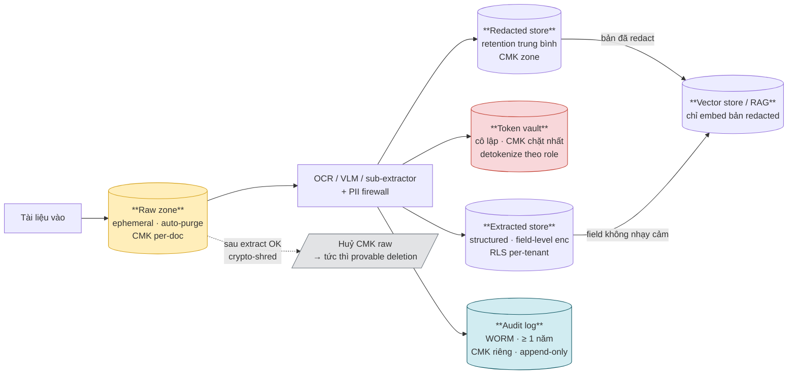

Luồng:
1. Tài liệu vào → **Raw zone** (CMK per-doc).
2. OCR/VLM/PII firewall xử lý → fan-out sang ba kho song song: Redacted, Token vault, Extracted.
3. Audit log nhận mọi sự kiện (chỉ metadata, không dữ liệu thô — §5.4).
4. Vector store / RAG chỉ nạp bản đã redact (chống embedding inversion — OWASP LLM08).
5. Sau khi extract xác nhận OK → huỷ CMK raw → crypto-shred tức thì.

---

### §5.3 Bảng đặc tả 5 zone

| Tiêu chí | Raw | Redacted | Token vault | Extracted | Audit log |
|---|---|---|---|---|---|
| **Kho** | Object storage (quarantine segment) | Object store / text store | Vault cô lập (HashiCorp Vault / AWS Secrets Manager / Azure Key Vault) | Structured DB / warehouse (field-level encryption) | Append-only / WORM object store hoặc immutable log service |
| **Vòng đời** | Ephemeral — TTL ngắn nhất có thể; auto-purge sau extract OK | Trung bình (3–12 tháng tùy nghiệp vụ) | Theo vòng đời của Extracted; xoá khi detokenize không còn cần thiết | Bền theo nghiệp vụ (eKYC ≥ 5 năm SBV) | ≥ 1 năm (eKYC/SBV); Cold archive 1–7 năm theo ngành |
| **Khóa mã hóa** | CMK per-doc (AES-256), lý tưởng nhất; huỷ = xoá tức thì | CMK riêng cho zone Redacted | CMK chặt nhất — rotate định kỳ; mỗi rotation đều logged | CMK field-level cho field nhạy cảm; CMK zone cho phần còn lại | CMK riêng; chỉ append, không update/delete |
| **Access** | Chỉ File Proxy + presigned URL ngắn (<15 phút); không worker nào trực tiếp | RBAC rộng hơn — analytics, ML pipeline; không có PII gốc | Hẹp nhất: chỉ detokenize service + role cụ thể; audit mọi lần detokenize | Row-Level Security (RLS) theo tenant/phòng ban; MFA cho HITL | Chỉ security/audit team; read-only sau khi ghi; không chỉnh sửa |
| **Vào RAG?** | Không | Có (chỉ embed bản đã redact) | Không | Field không nhạy cảm — Có; field nhạy cảm — Không | Không |
| **data_retention_class** | `raw-ephemeral` | `redacted-medium` | `vault-linked` | `extracted-business` | `audit-worm` |

> **Không lưu CVV; mask PAN** trước khi ghi bất kỳ kho nào (PCI DSS). Field nhạy cảm của Extracted đi vào vault-backed store, không ghi plain-text.

---

### §5.4 Event Schema chuẩn (buildable)

Mọi event trong pipeline — từ ingestion, fan-out extractor, fan-in aggregation, HITL, đến output — đều phải tuân schema dưới đây. Schema tự nó cũng được **đánh version** (`schema_version`) để hỗ trợ replay và migration không phá vỡ.

#### 5.4.1 JSON Schema đầy đủ

```json
{
  "$schema": "https://json-schema.org/draft/2020-12",
  "$id": "https://idp.internal/schemas/event/v1.4.0",
  "title": "IDP Unified Event",
  "description": "Schema duy nhất cho mọi event trong IDP pipeline. Dev PHẢI implement đầy đủ các required field; optional field ghi khi có dữ liệu.",
  "type": "object",
  "required": [
    "event_id", "event_type", "timestamp",
    "session_id", "document_id", "tenant_id",
    "schema_version", "pipeline_version",
    "sensitivity_label", "data_retention_class"
  ],
  "properties": {

    "event_id": {
      "type": "string",
      "pattern": "^evt_[A-Za-z0-9_-]{20,}$",
      "description": "UUID v7 (sortable) hoặc ULID. Globally unique. Dùng làm idempotency key."
    },

    "event_type": {
      "type": "string",
      "enum": [
        "document_ingested",
        "region_segmented",
        "extraction_completed",
        "field_accepted",
        "field_edited",
        "field_rejected",
        "region_clicked",
        "document_rejected",
        "hitl_review_started",
        "hitl_review_completed",
        "document_released",
        "document_exported",
        "saga_checkpointed",
        "saga_resumed",
        "saga_completed",
        "saga_failed_terminal",
        "raw_purged",
        "key_shredded",
        "rerun_requested"
      ],
      "description": "Loại sự kiện. Mở rộng bằng cách thêm giá trị mới — không xoá giá trị cũ (backward compat)."
    },

    "timestamp": {
      "type": "string",
      "format": "date-time",
      "description": "ISO-8601 UTC, độ chính xác millisecond. Ví dụ: 2026-06-05T08:30:00.123Z"
    },

    "schema_version": {
      "type": "string",
      "pattern": "^evt-schema@\\d+\\.\\d+\\.\\d+$",
      "description": "Semantic version của chính schema này. Ví dụ: evt-schema@1.4.0. Consumer PHẢI kiểm tra major version trước khi parse."
    },

    "session_id": {
      "type": "string",
      "pattern": "^ses_[A-Za-z0-9_-]{16,}$",
      "description": "ID phiên làm việc (upload session hoặc review session). Dùng để group các event liên quan."
    },

    "document_id": {
      "type": "string",
      "pattern": "^doc_[A-Za-z0-9_-]{16,}$",
      "description": "ID tài liệu — bất biến xuyên suốt vòng đời. Dùng làm correlation key cho saga."
    },

    "document_type": {
      "type": "string",
      "examples": ["invoice", "contract", "ekyc_id_card", "ekyc_selfie", "bank_statement", "medical_record", "claim_form"],
      "description": "Phân loại nghiệp vụ. Ảnh hưởng dispatch (§4.4) và completeness policy (§6.7)."
    },

    "vendor": {
      "type": ["string", "null"],
      "description": "Vendor/nhà phát hành tài liệu nếu xác định được (ví dụ: tên ngân hàng, tên nhà cung cấp). null nếu chưa xác định."
    },

    "tenant_id": {
      "type": "string",
      "pattern": "^tnt_[A-Za-z0-9_-]{8,}$",
      "description": "ID tenant trong môi trường multi-tenant. Bắt buộc. Dùng cho RLS, data isolation, billing."
    },

    "user_id": {
      "type": ["string", "null"],
      "description": "Pseudonymized user ID (KHÔNG phải email hay tên thật). null cho event hệ thống (không có actor là người)."
    },

    "role": {
      "type": ["string", "null"],
      "enum": ["reviewer", "analyst", "admin", "system", null],
      "description": "Vai trò actor phát sinh event."
    },

    "model_version": {
      "type": ["string", "null"],
      "pattern": "^[a-z0-9-]+@\\d+\\.\\d+\\.\\d+$",
      "description": "Version model sinh ra output liên quan. Ví dụ: vlm-extractor@2.1.0. null cho event không liên quan đến model."
    },

    "pipeline_version": {
      "type": "string",
      "pattern": "^pipe@\\d+\\.\\d+\\.\\d+$",
      "description": "Version pipeline lúc event xảy ra. Bắt buộc. Dùng để replay và debug regression."
    },

    "field_name": {
      "type": ["string", "null"],
      "description": "Tên field nghiệp vụ liên quan (ví dụ: total_amount, invoice_date, name_on_id). null cho event mức tài liệu."
    },

    "value_predicted": {
      "type": ["string", "null"],
      "description": "Giá trị model dự đoán. Phải sanitized — KHÔNG chứa PII gốc nếu sensitivity_label là pii/phi/financial."
    },

    "value_corrected": {
      "type": ["string", "null"],
      "description": "Giá trị người duyệt sửa. Cùng quy tắc sanitization với value_predicted. null nếu chấp nhận không sửa."
    },

    "confidence_score": {
      "type": ["number", "null"],
      "minimum": 0.0,
      "maximum": 1.0,
      "description": "Confidence của model cho field/region liên quan. null nếu không áp dụng."
    },

    "grounding_region": {
      "type": ["object", "null"],
      "required": ["page", "bbox"],
      "properties": {
        "page": {
          "type": "integer",
          "minimum": 1,
          "description": "Số trang (1-indexed)."
        },
        "bbox": {
          "type": "array",
          "items": { "type": "number" },
          "minItems": 4,
          "maxItems": 4,
          "description": "Bounding box [x0, y0, x1, y1] tính theo pixel hoặc tỷ lệ (0.0–1.0). Phải nhất quán trong một pipeline version."
        }
      },
      "description": "Vùng nguồn trên trang — dùng để render crop cho HITL và audit trail. null nếu không có grounding."
    },

    "dwell_time_ms": {
      "type": ["integer", "null"],
      "minimum": 0,
      "description": "Thời gian reviewer dừng trên field/region trước khi hành động (milliseconds). Tín hiệu ngầm — dừng lâu = nghi ngờ."
    },

    "sensitivity_label": {
      "type": "string",
      "enum": ["public", "internal", "pii", "phi", "financial", "classified"],
      "description": "Nhãn phân loại độ nhạy cảm. Propagate theo lineage. Chi phối routing tier (§8.2) và retention class (§5.5)."
    },

    "consent_flags": {
      "type": "array",
      "items": { "type": "string" },
      "examples": [["gdpr_consent_given", "pdpa_consent_given", "processing_purpose:ekyc"]],
      "description": "Danh sách flag đồng ý áp dụng. Rỗng nếu không có consent liên quan."
    },

    "latency_ms": {
      "type": ["integer", "null"],
      "minimum": 0,
      "description": "Độ trễ xử lý của bước phát sinh event (milliseconds). Phục vụ SLA monitoring và cost optimization."
    },

    "cost_tokens": {
      "type": ["integer", "null"],
      "minimum": 0,
      "description": "Số token tiêu thụ (input + output) nếu event liên quan đến VLM/LLM call. null cho OCR-only."
    },

    "validation_result": {
      "type": ["object", "null"],
      "properties": {
        "passed": { "type": "boolean" },
        "rules_failed": {
          "type": "array",
          "items": { "type": "string" },
          "description": "Danh sách rule ID thất bại."
        },
        "error_codes": {
          "type": "array",
          "items": { "type": "string" }
        }
      },
      "description": "Kết quả validation schema/business rule. null nếu event không phải validation step."
    },

    "correction_source": {
      "type": ["string", "null"],
      "enum": ["human_reviewer", "business_rule", "downstream_system", null],
      "description": "Nguồn gốc của việc sửa giá trị."
    },

    "downstream_status": {
      "type": ["string", "null"],
      "enum": ["pending", "pushed", "rejected_by_downstream", "error", null],
      "description": "Trạng thái ở hệ hạ nguồn (ERP/CRM). null nếu chưa push hoặc không áp dụng."
    },

    "data_retention_class": {
      "type": "string",
      "enum": ["raw-ephemeral", "redacted-medium", "vault-linked", "extracted-business", "audit-worm"],
      "description": "Liên kết trực tiếp tới chính sách tiering §5.5. Bắt buộc — quyết định lifecycle automation."
    }
  },

  "additionalProperties": false
}
```

#### 5.4.2 Versioning của schema

| Thay đổi | Quy tắc | Ví dụ |
|---|---|---|
| Thêm optional field | MINOR bump — backward compatible | `1.4.0` → `1.5.0` |
| Đổi kiểu / xoá field | MAJOR bump — breaking; consumer phải migrate | `1.x` → `2.0.0` |
| Thêm enum value mới | MINOR bump — consumer phải xử lý `unknown` gracefully | |
| Fix typo / mô tả | PATCH bump | |

Consumer phải kiểm tra **major version** của `schema_version` trước khi parse. Sử dụng schema registry (Confluent, Apicurio, AWS Glue) để phân phối và enforce schema tại gateway event bus.

---

### §5.5 Retention, tiering và provable deletion

#### Bảng tầng lưu trữ

| Tầng | Nội dung | Thời gian | Hạ tầng điển hình | Mục đích |
|---|---|---|---|---|
| **Hot** | Log ≤ 90 ngày, corrections đang dùng để học, saga state | 0–90 ngày | DB nhanh (PostgreSQL/DynamoDB) hoặc object store nóng | Fast-path learning, debug, observability real-time |
| **Warm** | Log tích lũy cho retrain, audit truy cập gần | 3–12 tháng | Data lake / lakehouse (Delta Lake, Iceberg) | Slow-path retrain, phân tích trend, regulatory review |
| **Cold / Archive** | Log cũ, bằng chứng kiểm toán | 1–7 năm (tùy ngành); eKYC SBV ≥ 1 năm log truy cập | Object store lạnh (S3 Glacier, GCS Coldline, Azure Archive) | Kiểm toán pháp lý, truy vết sự cố |
| **Xóa** | Sau hết hạn retention | — | Lifecycle policy tự động | Tuân thủ right-to-erasure (GDPR/PDPA), kiểm soát chi phí |

#### Provable deletion

Xoá dữ liệu phải **chứng minh được** — không đủ nếu chỉ delete record:

1. **Crypto-shredding** (ADR-4): huỷ CMK → mọi ciphertext của kho đó trở thành entropy vô nghĩa → xoá tức thì và chứng minh được dù blob vật lý chưa kịp ghi đè.
2. **Audit log deletion event**: ghi `key_shredded` event vào Audit log (WORM) với timestamp, document_id, CMK ID, lý do xoá — bằng chứng không thể sửa.
3. **Cảnh báo versioning bẫy**: object store có versioning bật → `DELETE` chỉ tạo delete marker, blob vẫn tồn tại. Phải dùng lifecycle rule xoá cả non-current version sau TTL, hoặc crypto-shred để vô hiệu hoá bất kể blob còn tồn tại.
4. **Lineage đồng bộ**: sau khi shred, lineage system cập nhật trạng thái node → `purged`; downstream query trả về `data_unavailable`.

---

### §5.6 Versioning dữ liệu, feature store và lineage

#### Versioning dữ liệu (reproducibility & rollback)

Dữ liệu phải được đánh version như code — không thể tái lập thí nghiệm nếu dataset thay đổi mà không có version.

| Quy mô / Use case | Công cụ khuyến nghị | Cơ chế |
|---|---|---|
| Dự án nhỏ, dữ liệu bảng | DVC | Git-like commit lên S3/GCS; `dvc repro` tái lập pipeline |
| Data lake lớn (ảnh, log TB) | lakeFS | Branch/commit/merge trên object store; zero-copy |
| Lineage theo container/job | Pachyderm | Mỗi pipeline step là commit; lineage tự động |

Mỗi dataset version phải ghi metadata: `valid_from`, `valid_to`, `created_by` (pipeline version), `source_event_ids` (list event IDs đầu vào).

#### Feature store — train/serve consistency

Bước biến log thô thành feature tái sử dụng. Mục tiêu chính: ngăn lỗi "feature lúc huấn luyện khác lúc chạy thật" (training-serving skew).

```
Log thô (Hot store)
    │
    ▼ Feature pipeline (versioned, logged)
Feature store ─┬─► Training set (offline store — snapshot)
               └─► Serving (online store — low-latency lookup)
                        │
                        ▼ Model registry (model_version, feature_version)
                   Deployed model
```

Công cụ tham khảo: Feast (open-source), Tecton (managed), Databricks Feature Store (Unity Catalog).

Mỗi model artifact trong registry phải ghi: `feature_store_version`, `dataset_version`, `eval_metrics`, `approval_timestamp`.

#### Lineage — data → feature → model

Lineage trả lời: dữ liệu **đến từ đâu** → **biến đổi thế nào** → **model nào dùng** → **ai tiêu thụ output**.

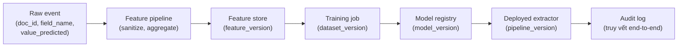

Yêu cầu:
- Lineage metadata phải được **version control** (không chỉ hạ tầng dữ liệu).
- Khi cảnh báo nổ (drift, accuracy drop), lineage cung cấp ngữ cảnh ngay — không phải tra thủ công.
- Với BFSI/y tế: lineage = **bằng chứng kiểm toán** về cách dữ liệu được xử lý, lưu giữ và xoá.

---

### §5.7 Crypto-shredding & lifecycle automation tier-aware

#### Crypto-shredding (ADR-4)

**Nguyên lý:** mã hóa mỗi tài liệu (hoặc tenant) bằng CMK riêng → "xoá" = huỷ CMK → tất cả ciphertext tức thì trở nên không giải mã được, chứng minh được, ngay cả khi blob vật lý chưa bị overwrite.

```
[Ingestion]
    │ sinh CMK per-doc → lưu vào KMS, gắn key_id vào metadata
    ▼
[Raw zone] ─ encrypt với CMK ─► ciphertext object
    │
    ▼ extract OK
[Trigger shred]
    │ KMS.deleteKey(key_id) → ghi audit event key_shredded
    ▼
ciphertext vẫn tồn tại vật lý nhưng = entropy vô dụng
    │
    ▼ lifecycle rule (sau TTL)
blob bị xoá vật lý (cleanup bổ sung)
```

Lưu ý thực thi:
- Với AWS: dùng KMS `ScheduleKeyDeletion` (tối thiểu 7 ngày); cân nhắc dùng per-doc data key (envelope encryption) thay vì CMK trực tiếp để tránh KMS API limit.
- Với Azure: Key Vault + Purge Protection phải tắt cho key có yêu cầu xoá ngay.
- KMS API call phải idempotent (gọi lại `deleteKey` với cùng key_id không gây lỗi nếu đã xoá).

#### Lifecycle automation tier-aware

Mỗi zone có lifecycle policy riêng, tự động chạy theo `data_retention_class`:

| `data_retention_class` | Zone | Action tự động | Trigger |
|---|---|---|---|
| `raw-ephemeral` | Raw | Crypto-shred CMK → purge blob | Sau `extraction_completed` hoặc TTL cứng (ví dụ 24h) |
| `redacted-medium` | Redacted | Transition → Warm sau 90 ngày; Cold sau 12 tháng; Delete sau hết hạn | Thời gian tính từ `document_ingested` |
| `vault-linked` | Token vault | Xoá cùng lúc với Extracted khi xoá theo yêu cầu người dùng | Right-to-erasure request |
| `extracted-business` | Extracted | Retain theo SLA nghiệp vụ; RLS; không tự xoá — chờ lệnh | Manual hoặc regulatory request |
| `audit-worm` | Audit log | WORM — không xoá trước khi hết hạn retention; sau đó purge | ≥ 1 năm (SBV); tối đa 7 năm (BFSI/y tế) |

Lifecycle rule phải **tier-aware**: Tier 0/3/4 không được phép transition sang cloud tier; dữ liệu phải ở lại on-prem/sovereign region (§8.2 tài liệu kiến trúc).

---

## §6 Mô hình thực thi & messaging

### §6.1 Tổng quan event-driven async

Hệ thống chạy theo mô hình **event-driven asynchronous**: các tầng tách rời qua message queue / event bus (Kafka, Kinesis, SQS, Pub/Sub). Mỗi tài liệu / trang / vùng là một event độc lập có thể xử lý song song.

**Lý do phù hợp với IDP:**

| Đặc điểm IDP | Hệ quả kiến trúc |
|---|---|
| Thời gian xử lý biến thiên rất lớn: form sạch ~200ms, trang phức tạp + HITL hàng giờ | Queue hấp thụ chênh lệch; producer không bị block |
| VLM là nút thắt (đắt, chậm, rate-limited) | Đệm queue trước VLM; backpressure tách ingestion khỏi processing |
| HITL vốn bất đồng bộ — người duyệt không online liên tục | HITL = trạng thái chờ event resume; không block luồng |
| Vòng tự sửa = re-emit event | Event bus tự nhiên phục vụ vòng lặp retry |
| Song song hóa mức trang/vùng | Fan-out event per vùng → xử lý song song tự nhiên |
| Cùng backbone cho batch và streaming | Batch = đẩy nhiều event một lúc; streaming = event chảy liên tục |

---

### §6.2 Sơ đồ event flow: fan-out / fan-in / HITL

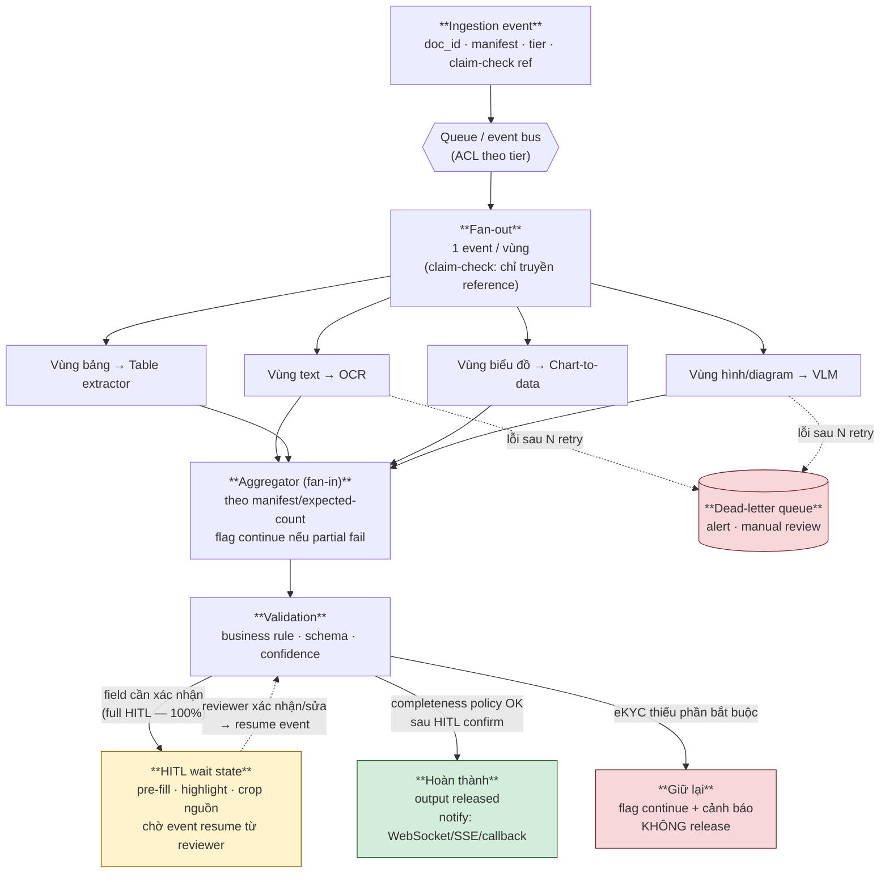

**Các điểm then chốt trong sơ đồ:**
- **Fan-out**: ingestion → N event per vùng, song song hóa tự nhiên.
- **Fan-in (aggregation)**: chờ đủ theo manifest/expected-count; partial fail → flag continue, không block.
- **HITL wait state**: trạng thái chờ bất đồng bộ — worker không bị block; resume khi reviewer gửi event xác nhận.
- **DLQ**: sau N retry, message độc/lỗi vĩnh viễn tách sang DLQ, không chặn luồng chính.
- **Completeness policy**: eKYC thiếu phần bắt buộc → không release, giữ `HOLD` với flag continue.

---

### §6.3 Choreography vs Orchestration → chọn Orchestration/Hybrid (ADR-8)

#### So sánh

| Tiêu chí | Choreography thuần | Orchestration (khuyến nghị) |
|---|---|---|
| Trạng thái tài liệu | Phân tán — không thể hỏi "tài liệu X đang ở đâu?" | Tập trung trong workflow engine — luôn biết trạng thái |
| Nhánh & điều kiện | Khó: mỗi service tự phản ứng event, dễ thành mớ bòng bong | Rõ ràng: workflow định nghĩa điều kiện tường minh |
| Vòng lặp tự sửa | Rất khó trace và debug | Workflow engine xử lý loop, timeout, retry natively |
| HITL chờ người | Phức tạp: ai giữ state trong lúc chờ? | Native: workflow sleep/wait cho đến khi resume event |
| Compensation (rollback) | Khó đồng bộ giữa nhiều service | Saga pattern tường minh trong workflow |
| Debug & observability | Khó: event lan truyền phi tuyến | Workflow timeline visible; audit trail từng bước |

#### Quyết định (ADR-8)

Dùng **orchestration** (hoặc hybrid: orchestration ngồi trên nền event bus async):
- Workflow engine (Temporal / AWS Step Functions / Camunda) giữ vai trò **"nhạc trưởng"** — biết trạng thái, đặt timeout, thực hiện compensation.
- Vẫn **event-driven và async**: worker không biết về workflow engine; chúng chỉ consume event từ queue và publish event kết quả — workflow engine lắng nghe kết quả để advance state machine.
- Lợi ích: nhìn thấy trạng thái toàn tài liệu, đặt SLA timeout, compensation khi lỗi — mà không mất tính async và scalability.

```
[Workflow engine — orchestrator]
    │ phát event vào queue
    ▼
[Queue / event bus]
    │ worker consume
    ▼
[Worker: OCR / VLM / Table extractor ...]
    │ publish result event
    ▼
[Queue / event bus]
    │ orchestrator nhận result, advance state
    ▼
[Workflow engine] ← trạng thái persist, checkpoint, timeout
```

---

### §6.4 Các pattern bắt buộc

#### Claim-check

Event bus **không bao giờ** mang ảnh, file, hay PII gốc trong payload. Event chỉ mang:
- `event_id`, `document_id`, `event_type`, metadata.
- **Reference** (presigned URL hoặc storage path qua File Proxy) tới nội dung thực.

Lý do: giữ bus nhẹ + tuân thủ Zero Data Retention (ZDR) — bus chỉ thấy con trỏ, không thấy nội dung.

#### Idempotency (at-least-once delivery)

Message queue deliver at-least-once → mọi consumer có side-effect phải idempotent:
- Dedup theo `event_id` (idempotency key).
- VLM call đặc biệt quan trọng: gọi lại phải không charge thêm / không tạo bản ghi trùng.
- State machine chi tiết: xem §6.8.

#### Aggregation theo manifest/expected-count

Aggregator **không** dùng timeout để quyết định "đủ" — dùng `expected_count` do bước phân đoạn vùng (§4.3 tài liệu kiến trúc) phát ra trong event đầu tiên.

```
Segmentation event → { document_id, expected_region_count: 7 }
Region result events → mỗi event ghi vào result store kèm document_id
Aggregator → đếm distinct completed regions; khi == 7 → fan-in
```

Xử lý out-of-order: dùng distributed counter hoặc sorted set (Redis); tránh race condition bằng atomic increment.

#### DLQ + circuit breaker

- Sau **N retry** (exponential backoff + jitter) → message sang Dead-letter queue.
- DLQ kích alert để team review thủ công hoặc tái xử lý.
- **Circuit breaker** tại consumer: nếu error rate của một extractor vượt ngưỡng → open circuit → tạm dừng consume từ queue đó → tránh storm vào downstream đang bị lỗi.
- DLQ không block luồng chính — tài liệu khác tiếp tục xử lý bình thường.

#### Backpressure

- Ingestion nhận nhanh và trả **202 Accepted** ngay — không chờ xử lý xong.
- Processing autoscale theo **queue depth**: khi depth vượt ngưỡng → scale out worker; khi depth gần 0 → scale in.
- Ingestion bị throttle nếu queue depth vượt hard limit → tránh OOM và cascade failure.

---

### §6.5 Hai lane: priority/real-time và bulk

| Tiêu chí | Priority lane (real-time) | Bulk lane (throughput) |
|---|---|---|
| **Use case** | eKYC, có người chờ, SLA chặt | Số hoá hàng loạt, batch analytics |
| **Delivery model** | Async + kênh thông báo hoàn thành (WebSocket / SSE / callback URL) | Batch API; polling endpoint; webhook khi xong |
| **SLA** | P95 < 60s (ví dụ, tùy sản phẩm) | Eventual; best-effort throughput |
| **Ưu tiên queue** | Queue riêng hoặc priority queue (preempt bulk) | Queue riêng; worker chia sẻ hoặc dedicated |
| **VLM quota** | Ưu tiên nhận quota trước | Nhận phần còn lại; dùng batch inference API rẻ |
| **Phân lane** | Router/Orchestrator quyết định theo `tier` + `sla_class` trong event | Idem |

**Cơ chế thông báo real-time:**
- Client giữ kết nối WebSocket / SSE với notification service.
- Khi workflow hoàn thành → workflow engine emit `document_released` event → notification service push tới client.
- Nếu client offline → callback URL (webhook) hoặc polling endpoint `/status/{document_id}`.

---

### §6.6 Tải lớn & nút thắt VLM

VLM là tài nguyên khan hiếm nhất: đắt, chậm, rate-limited. Cơ chế xử lý — **giữ tính tất định (ADR-10), không hạ cấp chất lượng động**:

| Cơ chế | Mô tả | Lưu ý |
|---|---|---|
| **Queue hấp thụ spike** | Queue trước VLM worker; spike ingestion không spike thẳng vào VLM | Queue phải persistent (không mất khi worker restart) |
| **Backpressure + autoscale** | Scale VLM worker theo queue depth; ingestion throttle khi queue quá sâu | Metric: queue depth, consumer lag |
| **Rate limit tại AI Gateway** | Tập trung quota management tại gateway; xử lý 429 + exponential backoff với jitter | Gateway là single point — phải HA |
| **Cache theo hash tài liệu** | Hash ảnh trang/vùng → nếu đã xử lý → trả cache (result cache §6.8) | Chỉ cache kết quả thành công; không cache lỗi transient |
| **Sharding theo tenant + multi-region** | Mỗi tenant có queue partition riêng; tải được trải đều; multi-region giảm latency | Cần routing logic nhất quán (consistent hashing) |

**Không dùng load-aware degradation** (nâng ngưỡng confidence → đẩy sang OCR khi tải cao — đã loại theo ADR-10): cùng input phải cho cùng đường xử lý, đảm bảo tính tất định và khả năng audit cho eKYC.

---

### §6.7 Saga mức tài liệu: checkpoint, resumable, completeness policy

Mỗi tài liệu là một **saga** — đơn vị nghiệp vụ hoàn chỉnh với state persist, có thể resume sau lỗi/gián đoạn (ADR-12).

#### Vòng đời saga

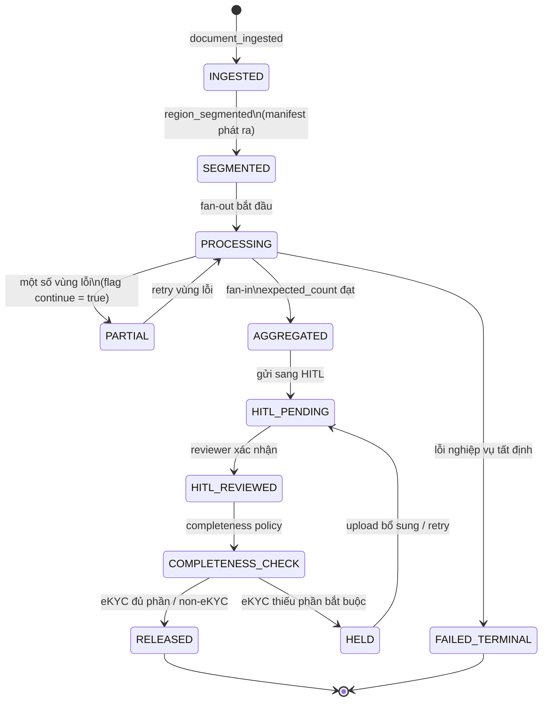

#### Checkpoint và resumable

- Mỗi vùng/trang xong → ghi kết quả vào **result cache** (§6.8) + cập nhật saga state.
- Khi lỗi/gián đoạn → gán `flag_continue = true` cho vùng chưa xong.
- Khi resume: đọc saga state → chỉ xử lý tiếp vùng chưa có kết quả — **không làm lại từ đầu**.
- Cơ chế đọc lại phần đã xong chính là result cache: lookup `(document_id, region_id)` → nếu có → bỏ qua re-process.

#### Manifest / expected-count

```json
{
  "event_type": "region_segmented",
  "document_id": "doc_abc123",
  "expected_region_count": 7,
  "regions": [
    { "region_id": "reg_001", "region_type": "text",   "page": 1 },
    { "region_id": "reg_002", "region_type": "table",  "page": 1 },
    { "region_id": "reg_003", "region_type": "chart",  "page": 2 }
  ]
}
```

Aggregator dùng `expected_region_count` để biết khi nào fan-in hoàn tất — không dùng timeout.

#### Completeness policy (release-gating)

Tách bạch hai cơ chế:

| Cơ chế | Trách nhiệm | Ví dụ |
|---|---|---|
| **Flag continue** | Resume logic — xử lý tiếp phần dở | Vùng text trang 3 lỗi → flag → retry chỉ trang 3 |
| **Completeness policy** | Nghiệp vụ — có được release hay không | eKYC thiếu ảnh mặt trước CMND → KHÔNG release dù các phần khác đã xong |

Completeness policy là **cấu hình per document_type**, không hardcode:

```json
{
  "document_type": "ekyc_id_card",
  "required_regions": ["id_front_face", "id_front_info", "id_back", "selfie"],
  "release_policy": "all_required_present_and_hitl_confirmed"
}
```

---

### §6.8 Idempotency record state machine + result cache

#### Phân loại lỗi — nguyên tắc cache

Bẫy cần tránh: nếu cache lỗi transient, server recover nhưng user vẫn thấy `failed` mãi. Nguyên tắc: **chỉ cache kết cục xác định**.

| Loại lỗi | Ví dụ | Cache vào result? | Lý do |
|---|---|---|---|
| **Nghiệp vụ tất định** | Document sai định dạng (ví dụ: file corrupt); validation fail (field format sai cứng theo rule); schema mismatch | **Có** — `failed-terminal` | Hỏi lại với cùng input cũng fail y vậy; cache đúng và có ích — tránh gọi VLM lại tốn tiền |
| **Transient / hạ tầng** | Server down, timeout, HTTP 503/429, network error, OOM worker | **Không** | Chưa đạt kết cục xác định; server có thể recover; phải cho retry |
| **In-progress (lease còn hạn)** | Worker đang xử lý, lease chưa hết | **Không** — trả `processing` | Chờ hoặc poll |
| **In-progress (lease hết hạn)** | Worker chết giữa chừng, không ghi được kết quả | **Không** — re-execute | Lease timeout = tín hiệu worker đã chết |

#### State machine idempotency record

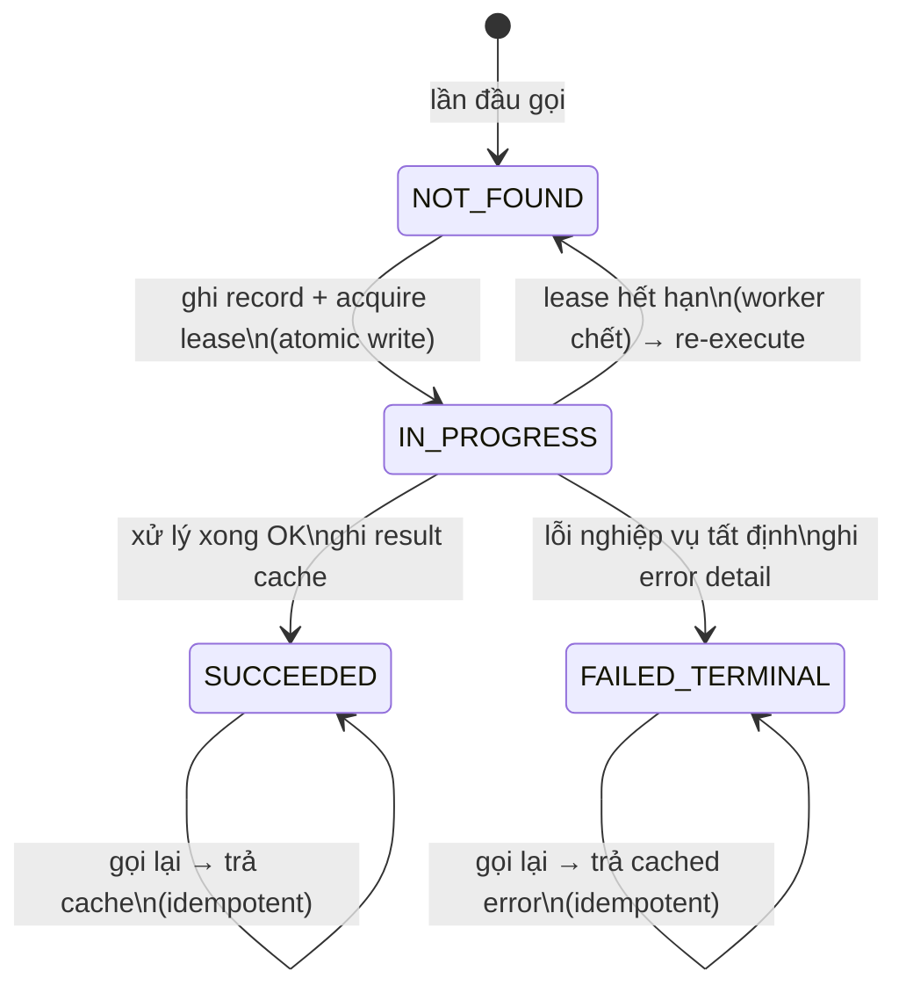

**Hành vi theo trạng thái:**

| Trạng thái record | Hành động |
|---|---|
| Không tồn tại | Chạy xử lý; ghi record `IN_PROGRESS` + lease timestamp |
| `IN_PROGRESS`, lease còn hạn | Trả `202 processing` — đang chạy, chờ |
| `IN_PROGRESS`, lease hết hạn | Coi như worker đã chết; re-execute (ghi lại lease mới) |
| `SUCCEEDED` | Trả cached result ngay — không xử lý lại |
| `FAILED_TERMINAL` | Trả cached error ngay — không xử lý lại |

**Lease / timeout:** lease TTL = max expected processing time của bước đó + buffer (ví dụ VLM call timeout 30s → lease TTL = 60s). Lease phải được renew định kỳ bởi worker đang chạy để phân biệt "đang chạy bình thường" vs "đã chết im lặng".

#### Áp dụng cho VLM result cache (gắn với §6.7)

- **Chỉ ghi result cache khi gọi VLM thành công** (event `extraction_completed` với status OK).
- VLM lỗi / timeout → **không ghi cache** → saga gán `flag_continue = true` cho region đó → retry sau sẽ gọi lại VLM.
- Cache key: `(document_id, region_id, model_version)` — đảm bảo cache miss khi nâng model version (không dùng kết quả cũ của model cũ cho model mới).
- Result cache phục vụ hai mục đích: **idempotency** (gọi lại không charge thêm) và **checkpoint/resume** (§6.7 — đọc lại phần đã xong khi resume saga).

#### Sơ đồ kết hợp: idempotency check → VLM call → cache

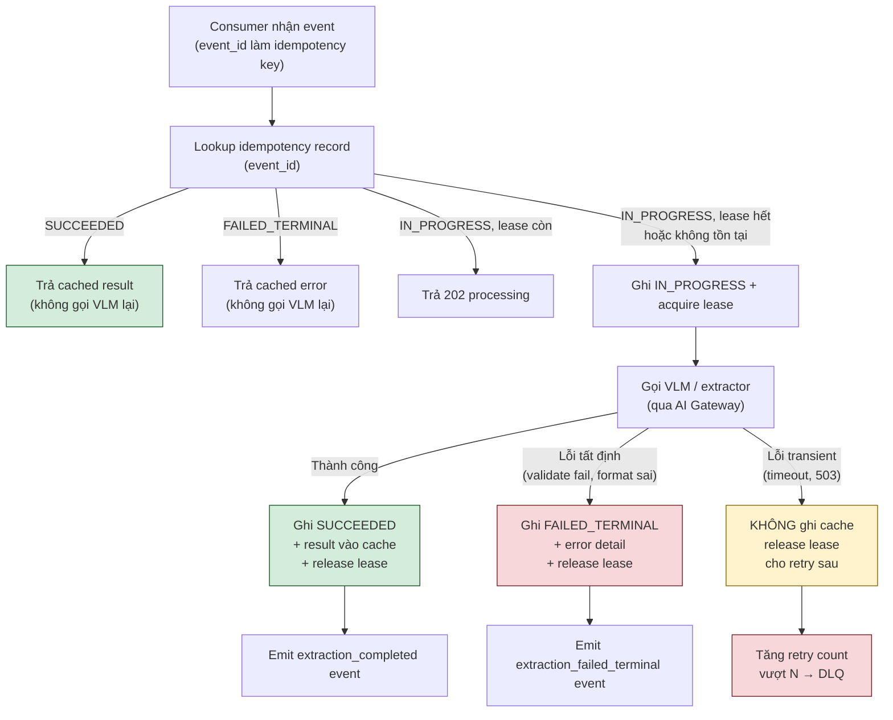


---

## §7 Kiến trúc bảo mật

> **Trọng tâm thiết kế:** VLM biến tài liệu không tin cậy thành prompt thực thi được — đây là khoảng trống lớn nhất so với hệ OCR truyền thống. §7 trình bày lớp kiểm soát *buildable* từng subsection, theo nguyên tắc defense in depth (P6) + Zero Trust + tài liệu-là-dữ liệu (P9). Control plane tập trung (AI Gateway) và vai trò vận hành đầy đủ của nó được trình bày chi tiết ở §8.

---

### §7.1 Ánh xạ tuân thủ

Bảng dưới đây ánh xạ trực tiếp từ khung pháp lý → yêu cầu cụ thể → biện pháp kỹ thuật đã thiết kế. Việc cưỡng chế tại runtime là điều kiện đủ — không chỉ nằm trong văn bản chính sách.

| Khung | Yêu cầu chính | Biện pháp kỹ thuật | Điểm hiện thực |
|---|---|---|---|
| **ISO/IEC 27001** | ISMS; đánh giá rủi ro; kiểm soát truy cập; mã hoá dữ liệu nhạy cảm | Tier model (§7.2); RBAC + Zero Trust (§7.3); AES-256 + external KMS (§7.4); audit log WORM (§7.10) | Kiểm soát A.8 (asset), A.9 (access), A.10 (crypto), A.12 (logging) |
| **PCI DSS** | Không lưu CVV; mask PAN; kiểm soát truy cập chặt | PII firewall tại tiền xử lý (§7.4); field-level masking; vault-backed store (§5 zone storage) | Req 3 (stored data), Req 7 (access), Req 10 (monitoring) |
| **GDPR / PDPA** | Data minimization; quyền được lãng quên; đồng ý thu thập; breach notification | Raw auto-purge TTL; crypto-shredding (§7.8); consent ở ingestion; redact-by-design log (§7.10) | Art.5 (principles), Art.17 (erasure), Art.25 (privacy by design) |
| **SBV — TT 16/2020/TT-NHNN** | Liveness cho eKYC; mã hoá dữ liệu; log truy cập ≥ 1 năm; lưu trữ trong nước | Liveness detection ở ingestion eKYC; AES-256 at-rest; audit WORM ≥ 1 năm; Tier 0/3/4 on-prem/sovereign (§7.2) | Điều 6 (xác thực), Điều 14 (lưu trữ) |

> **Ghi chú thực thi:** Mỗi hàng trên là kiểm soát cưỡng chế ở runtime — Gateway + tier model + audit log hoạt động đồng thời, không phải chính sách trên giấy.

---

### §7.2 Mô hình tier bảo mật

Tier xác định ba thứ cùng lúc: ai được phép xử lý dữ liệu, VLM nào được gọi, và dữ liệu được phép rời khỏi đâu. Dispatcher (§4 — phân đoạn vùng + routing) đọc tier từ metadata của từng event và chặn cứng đường VLM-API bên thứ ba cho tier nhạy cảm.

| Tier | Đặc tính dữ liệu | VLM API bên thứ ba? | Vị trí lưu trữ & xử lý | Ví dụ use case |
|---|---|---|---|---|
| **Tier 0** | Air-gapped; tuyệt đối không rời mạng nội bộ | **Không** — chỉ self-hosted | On-prem, network-isolated | Hồ sơ mật quốc phòng, bí mật nhà nước |
| **Tier 1** | Dữ liệu nội bộ thông thường | Có, theo policy tổ chức | Cloud/hybrid | Tài liệu nội bộ không nhạy cảm |
| **Tier 2** | Nhạy cảm vừa; cần giám sát egress | Có, nhưng egress được ghi log + alert | Cloud/hybrid, egress monitored | Hợp đồng thương mại, dữ liệu khách hàng ẩn danh |
| **Tier 3** | Zero-retention bắt buộc | **Không** — chỉ self-hosted | Private cloud / on-prem | eKYC, CCCD, hộ chiếu |
| **Tier 4** | Isolated network; mã hoá đầu-cuối; sovereignty | **Không** — chỉ self-hosted | Sovereign/on-prem; network-segmented | PAN/tài khoản ngân hàng, dữ liệu y tế |

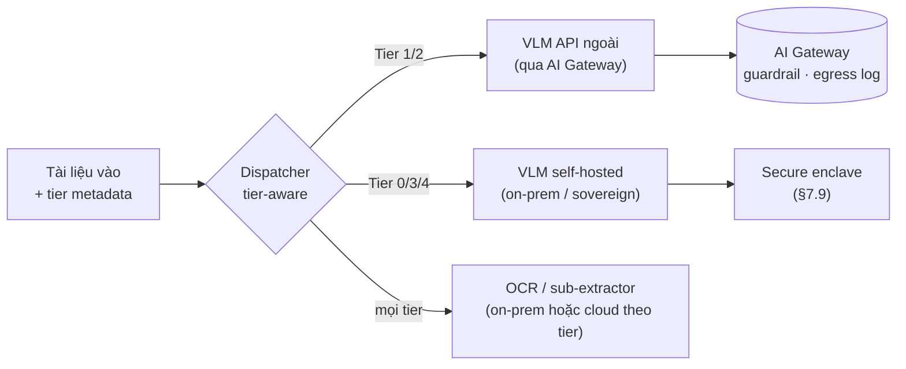

> Chặn cứng cứng ở **Dispatcher + Gateway** — không phụ thuộc cấu hình từng service con.

---

### §7.3 Định danh & truy cập — Zero Trust

Triết lý: không có "inside the perimeter" — mọi request đều phải xác thực và được cấp quyền tối thiểu, kể cả giữa các worker nội bộ. Hiện thực theo NIST SP 800-207 (Zero Trust Architecture).

| Nguyên tắc | Hiện thực cụ thể | Điểm xây |
|---|---|---|
| **File Proxy là thành phần duy nhất giữ storage credentials** | Worker không bao giờ nhận presigned URL dài hạn hay secret bucket; mọi truy cập file đi qua File Proxy + presigned URL ngắn hạn (TTL ≤ 15 phút) | File Proxy service; ký URL theo request |
| **Worker access_key giới hạn phạm vi** | Mỗi worker nhận access_key chỉ đủ cho tác vụ hiện tại (read-only với input, write-only với output); cấm vượt cấp lên storage layer khác | IAM role/policy per worker; Attribute-Based Access Control |
| **RBAC phân cấp** | Vai trò: `ingestor`, `extractor`, `reviewer` (HITL), `auditor`, `admin`; reviewer chỉ thấy bản redacted + crop nguồn, không thấy raw; auditor read-only trên audit log | RBAC layer ở API gateway + storage |
| **MFA qua SSO cho HITL dashboard** | Dashboard duyệt tài liệu yêu cầu MFA; token SSO ngắn hạn (≤ 8 giờ) | SSO integration (OIDC/SAML); session management |
| **Workload identity thay khoá dài hạn** | Service-to-service authentication dùng workload identity (SPIFFE/SPIRE hoặc cloud IAM service account); không hardcode secret | Identity federation; SPIFFE/SPIRE hoặc cloud-native WI |
| **Micro-segmentation + mTLS** | Các tầng pipeline (ingestion, PII firewall, extractor, aggregator, HITL, integration) nằm trên network segment riêng; giao tiếp qua mTLS; không có east-west traffic không được xác thực | Service mesh (Istio/Linkerd) hoặc cloud-native mTLS; firewall rule per segment |
| **Attribute-Based Access Control (ABAC)** | Truy cập tài nguyên quyết định theo tập thuộc tính (tier, classification, tenant, role, time) — theo NIST SP 800-207 | Policy engine (OPA/Cedar) |

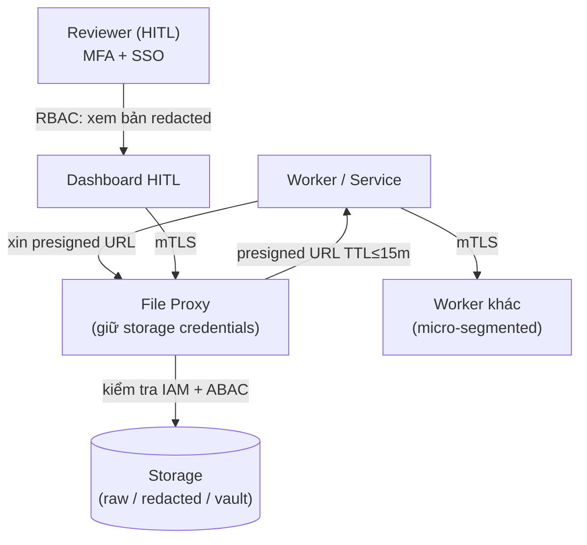

---

### §7.4 Bảo vệ PII

PII firewall (ADR-2) đặt trước model là kiểm soát cứng — giảm diện tích PII chạm model bên thứ ba ngay từ bước đầu. Lớp bảo vệ theo chiều sâu:

**a) Tiền xử lý — auto-redaction / hash**

- Phát hiện PII trong cả text (tên, CCCD, số tài khoản, email, ngày sinh) và ảnh (ảnh mặt, chữ ký, vùng nhạy cảm) bằng công cụ chuyên biệt (Presidio text+image hoặc cloud PII service).
- Với dữ liệu cần giữ liên kết (eKYC): thay thế bằng **token** (pseudonym duy nhất per-document, non-reversible nếu vault bị xâm phạm riêng lẻ). Với dữ liệu không cần giữ liên kết: hash one-way (SHA-256 + salt per-tenant).
- Output PII firewall: bản redacted (an toàn cho analytics/RAG) + ánh xạ token→giá trị thật lưu riêng ở token vault.

**b) Tokenization + vault tách biệt**

- Token vault là kho cô lập: schema riêng, khoá mã hoá riêng (không dùng khoá chung với raw store), network segment riêng.
- Detokenize chỉ theo role có quyền (`reviewer` trong HITL, `integrator` khi xuất vào ERP/CRM); log mỗi lần detokenize.
- Chỉ embed bản đã redacted vào vector store/RAG — ngăn embedding inversion (OWASP LLM08, §7.11).

**c) Dynamic data masking khi đọc**

- Lớp query/API trả về giá trị đã mask tuỳ role: reviewer thấy `****-****-1234`, admin thấy giá trị thật chỉ khi có audit trail.
- Áp cho cả extracted store và audit log query.

**d) Mã hoá in-transit & at-rest**

| Lớp | Chuẩn | Ghi chú |
|---|---|---|
| In-transit | TLS 1.2 tối thiểu; TLS 1.3 khuyến nghị | Áp cho mọi API call, message queue, presigned URL |
| At-rest | AES-256 + CMK (Customer Managed Key) | Khoá riêng per-zone (raw / redacted / vault / extracted / audit) |
| External KMS | KMS ngoài ranh giới cloud provider | Đảm bảo data residency; crypto-shredding khả thi (§7.8) |
| Field-level encryption | Trường nhạy cảm trong extracted store | Khoá per-field hoặc per-tenant |

---

### §7.5 AI Gateway / Guardrails — Control Plane

AI Gateway (ADR-5) là điểm cưỡng chế **duy nhất** cho mọi lời gọi model. Không có lời gọi VLM/LLM nào bypass gateway — đây là bất biến kiến trúc. Bốn nhóm kiểm soát được cưỡng chế tại runtime:

| Nhóm | Kiểm soát cụ thể | Hành động khi vi phạm |
|---|---|---|
| **An toàn nội dung** | Lọc nội dung bạo lực, phân biệt chủng tộc, khai thác trẻ em trong tài liệu trước khi xử lý; phát hiện tài liệu giả mạo/deepfake | Reject + log + alert; không xử lý tiếp |
| **Bảo mật / Injection** | Phát hiện prompt injection trong text (kể cả hidden text, steganography); phát hiện jailbreak pattern; kiểm tra cấu trúc tài liệu bất thường (PDF với embedded script) | Block lời gọi; quarantine tài liệu; alert security team |
| **Bảo vệ dữ liệu** | Kiểm tra output VLM/LLM không rò rỉ PII mẫu nhận ra được (regex + ML-based); phát hiện secret pattern (API key, password) trong response | Strip output; log dấu vết; không gửi response xuống hạ nguồn |
| **Tuân thủ** | Rate limiting per-tenant/per-tier; budget enforcement (trần chi phí trước lời gọi kế tiếp); tier enforcement (chặn VLM-API ngoài cho Tier 0/3/4); kill switch | Throttle / reject / dừng pipeline; alert |

**Audit trail của Gateway:**

Mỗi request qua Gateway tạo một audit record tối thiểu bao gồm: `correlation_id`, `tenant_id`, `tier`, `model_endpoint`, `guardrail_checks_passed[]`, `guardrail_checks_failed[]`, `latency_ms`, `tokens_in/out`, `cost_usd`. Không ghi nội dung tài liệu thô (redact-by-design, §7.10).

**Tính di động posture:** đổi model provider (ví dụ chuyển từ VLM-A sang VLM-B) giữ nguyên tất cả guardrail và audit — posture bảo mật không phụ thuộc vào provider cụ thể.

> Vai trò vận hành đầy đủ của AI Gateway (routing, virtual key, budget enforcement, kill switch, observability) được trình bày chi tiết ở §8.

---

### §7.6 Mối đe dọa đặc thù LLM/VLM

Tài liệu là vector tấn công mới — không phải chỉ là dữ liệu thụ động. Phần này trình bày các mối đe dọa đặc thù và kiểm soát tương ứng.

**a) Prompt injection cross-modal (tài liệu = dữ liệu — P9)**

Kẻ tấn công nhúng chỉ thị ẩn vào tài liệu (text màu trắng trên nền trắng, metadata hidden, pixel-level steganography, hoặc chuỗi Unicode đặc biệt) với mục tiêu điều khiển hành vi VLM/LLM.

| Biện pháp | Hiện thực |
|---|---|
| **Tài liệu = dữ liệu, không phải lệnh** | Nội dung tài liệu KHÔNG BAO GIỜ được diễn giải thành lệnh; system prompt tách biệt hoàn toàn khỏi user content (P9, ADR ngầm định) |
| **Tách system prompt cứng** | System prompt nằm ở configuration layer, không bao giờ nối chuỗi với nội dung tài liệu; dùng cơ chế role-separation của model API (system / user message type tách biệt) |
| **Context isolation** | Mỗi tài liệu xử lý trong context window riêng; không dùng chung context giữa tài liệu khác nhau để ngăn cross-document injection |
| **Strip text ẩn trước khi gọi VLM** | Bước tiền xử lý normalize tài liệu: xoá metadata PDF, flatten layers, strip hidden text, detect Unicode obfuscation (zero-width joiner, right-to-left override) |
| **Gateway guardrail phát hiện injection pattern** | Regex + ML classifier kiểm tra cả input và output lời gọi VLM (§7.5) |

**b) Tier-aware routing — bảo vệ residency**

```
Tier 0 / Tier 3 / Tier 4  →  KHÔNG ra VLM-API bên ngoài (chặn cứng ở Dispatcher + Gateway)
Tier 1 / Tier 2            →  VLM-API ngoài được phép, qua Gateway, egress log
```

Kiểm soát này là **bất biến cứng**, không phải cấu hình tuỳ chọn — vi phạm gây reject ở Gateway trước khi lời gọi rời mạng nội bộ.

**c) Cấm auto-execute tool từ nội dung tài liệu**

Orchestrator (§4.12) cấm tự động thực thi bất kỳ tool call nào suy ra từ nội dung tài liệu. Mọi tool call phải đến từ logic pipeline được định nghĩa trước, không từ output VLM. Đây là kiểm soát cứng chống second-order injection.

**d) Egress control**

Tất cả traffic ra ngoài đi qua egress proxy có whitelist domain; VLM provider được phép phải nằm trong danh sách trắng; alert khi phát hiện kết nối đến domain ngoài whitelist.

---

### §7.7 Toàn vẹn output — Kiểm soát hallucination

Hallucination là rủi ro bảo mật thực sự trong IDP: trường sai (số tài khoản, ngày, tên) có thể gây thiệt hại tài chính hoặc pháp lý. Bốn lớp kiểm soát:

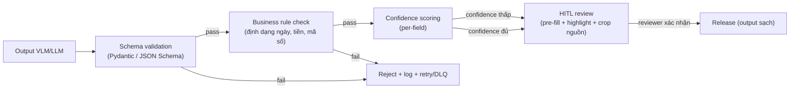

| Lớp | Kiểm soát | Ghi chú |
|---|---|---|
| **Schema validation** | JSON Schema / Pydantic strict mode; kiểm tra type, range, required field | Fail cứng: reject, không release |
| **Business rule** | Định dạng ngày (ISO 8601); range tiền tệ; mã số tổ chức; checksum số tài khoản; cross-field consistency | Fail cứng: reject |
| **Confidence scoring** | Per-field confidence từ VLM/OCR; field confidence thấp được highlight trong HITL dashboard | Không auto-gate (giai đoạn đầu full-HITL) — dùng để ưu tiên chú ý reviewer |
| **Full HITL — guardian** | 100% output phải người duyệt xác nhận; pre-fill, highlight, hiện crop nguồn để đối chiếu pixel-level | Giai đoạn đầu: không có gì auto-release; xác nhận HITL tạo golden data |

---

### §7.8 Zero Data Retention (ZDR)

ZDR (ADR-6) đảm bảo provider bên thứ ba (VLM-API) không lưu lại dữ liệu nhạy cảm của người dùng. Áp cho Tier 1/2 khi phải dùng VLM-API ngoài.

| Biện pháp | Hiện thực |
|---|---|
| **Tokenize trước khi gọi VLM** | PII firewall thay thế giá trị nhạy cảm bằng token trước khi chuỗi text/ảnh rời pipeline nội bộ; VLM nhận bản đã redacted, không thấy giá trị gốc |
| **Proxy stateless** | AI Gateway không lưu trữ nội dung request/response; chỉ log metadata (correlation ID, token count, latency, guardrail result) — không log nội dung thô |
| **RAG context ephemeral** | Khi nạp context vào RAG query, context được tải vào bộ nhớ tạm (in-process) và xả sau khi hoàn thành tác vụ; không persist context vào storage dài hạn |
| **BAA/DPA bắt buộc** | Với mọi VLM provider nhận dữ liệu Tier 1/2, phải ký Business Associate Agreement (nếu y tế) hoặc Data Processing Agreement (GDPR/PDPA) trước khi tích hợp; kiểm tra ZDR policy của provider |
| **Xác minh ZDR** | Định kỳ kiểm tra provider vẫn tuân thủ ZDR commitment; đưa vào checklist change control |

---

### §7.9 Confidential Computing & Quản lý khóa

**Confidential computing:**

- Workload inference nhạy cảm (Tier 3/4, hoặc VLM self-hosted cho dữ liệu Tier 0) chạy trong **secure enclave** (Intel TDX/SGX, AMD SEV-SNP, hoặc equivalent cloud TEE): dữ liệu được mã hoá cả khi đang dùng (in-use encryption), không có quyền truy cập từ hypervisor hay cloud operator.
- Attestation report được log vào audit trail để chứng minh tính toàn vẹn của môi trường thực thi.

**Quản lý khóa:**

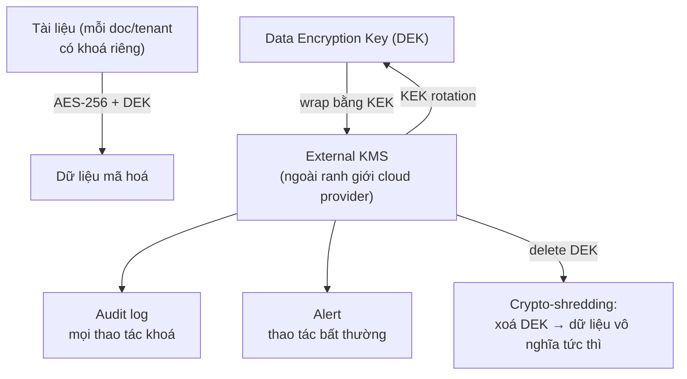

| Thực hành | Chi tiết |
|---|---|
| **External KMS** | KMS nằm ngoài ranh giới provider cloud (ví dụ HashiCorp Vault, Thales, AWS CloudHSM on-prem, hoặc client-managed HSM); đảm bảo data residency và ngăn provider đọc dữ liệu |
| **Khoá riêng per-zone và per-document/tenant** | Mỗi zone storage (raw / redacted / vault / extracted / audit) dùng khoá khác nhau; lý tưởng khoá riêng per-document cho raw zone → crypto-shredding theo hạt |
| **Rotation định kỳ** | KEK rotation theo policy (ví dụ mỗi 90 ngày); DEK rotation khi có sự kiện bảo mật |
| **Log + alert mọi thao tác khoá** | Tạo, xoá, rotate, export khoá đều ghi vào audit WORM và kích hoạt alert khi bất thường (xoá ngoài giờ, export từ IP lạ) |
| **Crypto-shredding (ADR-4)** | Xoá dữ liệu = huỷ DEK → tức thì, chứng minh được, không phụ thuộc vào hạ tầng storage xoá thật sự hay không; thực thi vòng đời raw zone |

---

### §7.10 Kiểm toán "Redact-by-Design"

Log là bằng chứng pháp lý — thiết kế sai log có thể vừa không chứng minh được sự tuân thủ, vừa rò rỉ PII ngay trong hệ kiểm toán.

**Nguyên tắc log tối thiểu:**

| Ghi vào log | Không ghi vào log |
|---|---|
| `correlation_id` (per event/request) | Nội dung tài liệu thô |
| `hash(trước redact)` + `hash(sau redact)` (SHA-256) | Giá trị PII (tên, số tài khoản, CCCD) |
| `tenant_id`, `tier`, `document_id` (pseudonymised) | Response text từ VLM/LLM |
| Guardrail result, checks passed/failed | Secret, token vault values |
| Latency, token count, cost | |
| HITL reviewer ID (không tên đầy đủ), action, timestamp | |
| Thao tác khoá (tạo/xoá/rotate) | |

**Distributed tracing:**

- Mỗi event mang `correlation_id` xuyên suốt từ ingestion → PII firewall → dispatch → extractor → aggregator → validation → HITL → integration → audit.
- Distributed tracing (OpenTelemetry) thu span cho mỗi bước, liên kết qua `trace_id` / `span_id`.
- Audit log WORM: append-only, ≥ 1 năm (eKYC per SBV TT16); chỉ role `auditor` được đọc.

**Ánh xạ chuẩn:**

| Chuẩn | Kiểm soát liên quan trong §7 |
|---|---|
| **OWASP LLM Top 10 (2025)** | LLM01 (§7.6a), LLM02 (§7.4), LLM06 (§7.12), LLM08 (§7.4b), LLM09 (§7.10 audit) |
| **OWASP Agentic Top 10 (12/2025)** | A01 Prompt Injection (§7.6a), A02 Excessive Permissions (§7.12), A03 Memory Poisoning (§7.6d), A09 Underprotected Artifacts (§7.4, §7.8) |
| **NIST AI RMF** | Govern 1.1 (§7.1), Map 2.1 (§7.11), Measure 2.6 (§7.7, §7.10), Manage 2.2 (§7.5 kill switch) |

---

### §7.11 Bảng ánh xạ Mối đe dọa → Biện pháp

Bảng tổng hợp — mỗi mối đe dọa liệt kê lớp kiểm soát kỹ thuật cụ thể và điểm hiện thực trong kiến trúc.

| ID | Mối đe dọa | OWASP / Khung | Biện pháp kỹ thuật | Điểm hiện thực |
|---|---|---|---|---|
| T-01 | **Prompt injection — text** | LLM01 | Tài liệu = dữ liệu (P9); tách system prompt cứng; gateway injection-detect; strip hidden text | §7.5 nhóm Bảo mật; §7.6a |
| T-02 | **Prompt injection — cross-modal (ảnh → VLM)** | LLM01, A01 | Normalize tài liệu trước VLM; context isolation per-document; gateway guardrail input+output VLM | §7.6a; §7.5 |
| T-03 | **Sensitive info disclosure** | LLM02 | PII firewall tiền xử lý; tokenization vault; ZDR; claim-check (event chỉ mang reference); egress control | §7.4; §7.8; §7.5 nhóm Bảo vệ dữ liệu |
| T-04 | **Excessive agency / tool abuse** | LLM06, A02 | Cấm auto-execute tool từ tài liệu; least-privilege worker; full-HITL làm guardian; orchestrator kiểm soát tool call | §7.12; §7.3; §4.12 |
| T-05 | **Vector/embedding inversion (RAG)** | LLM08 | Chỉ embed bản đã redacted vào vector store; access control vector store per-tenant | §7.4b; §5 zone storage |
| T-06 | **Hallucination / insecure output** | — | Schema validation + business rule + confidence scoring + full HITL 100% | §7.7 |
| T-07 | **Rò rỉ raw data** | LLM02 | Raw auto-purge TTL ngắn; crypto-shredding; File Proxy + presigned URL ngắn; tier-aware routing | §7.8; §7.9; §7.3; §5 zone raw |
| T-08 | **Lạm dụng truy cập (insider/compromised credential)** | — | RBAC + ABAC; MFA qua SSO; workload identity; micro-segmentation + mTLS; audit trail đầy đủ | §7.3; §7.10 |
| T-09 | **Poison message / DoS qua tải** | — | DLQ + circuit breaker; backpressure; rate limit tập trung tại Gateway; queue depth monitoring | §7.5 nhóm Tuân thủ; §6 messaging |
| T-10 | **Data residency violation** | ISO 27001, SBV | Tier-aware routing cứng (Tier 0/3/4 không ra VLM-API ngoài); external KMS on-prem; sovereign placement | §7.2; §7.9 |
| T-11 | **Cryptographic failure / key compromise** | — | Khoá riêng per-zone/per-doc; external KMS; rotation; audit + alert thao tác khoá bất thường; crypto-shredding | §7.9 |
| T-12 | **Memory poisoning / context pollution** | A03 | Context isolation per-document; RAG context ephemeral; không share context xuyên tenant | §7.6c; §7.8 |

---

### §7.12 Least-Privilege / Least-Agency

Nguyên tắc: mỗi worker/agent nhận **đúng quyền tối thiểu** để hoàn thành tác vụ, và **không tự chủ hơn mức cần thiết**. Đây là kiểm soát cấu trúc — không phải cấu hình tuỳ chọn.

**Least-Privilege (truy cập):**

| Thực thể | Quyền tối đa được cấp | Bị cấm tường minh |
|---|---|---|
| Ingestion worker | Write vào quarantine zone; read format policy | Đọc raw zone của tenant khác; gọi model trực tiếp |
| OCR/VLM extractor | Read presigned URL (input); write result cache | Đọc vault; gọi external API ngoài whitelist |
| Aggregator | Read result cache; write extracted store | Detokenize PII; modify audit log |
| HITL reviewer | Read bản redacted + crop nguồn; write correction | Đọc raw; đọc token vault; export dữ liệu |
| Integration worker | Read extracted store (field không nhạy cảm); write output | Đọc raw/vault trực tiếp |
| File Proxy | Giữ storage credentials; ký presigned URL | Gọi model; modify extracted store |

**Least-Agency (mức tự chủ):**

- **Giai đoạn 1–2 (hiện tại): Full-HITL là cơ chế guardian.** Không có bước nào auto-release output. Mọi quyết định nghiệp vụ (release tài liệu, tích hợp vào ERP) phải qua xác nhận người duyệt. Đây là cơ chế "controlled autonomy" thực tế nhất: không trao tự chủ rồi giám sát, mà giữ con người làm guardian cho đến khi golden data + eval gate chứng minh đủ tin.
- **Orchestrator cấm tự tạo tool call** từ output VLM/LLM: mọi tool call phải từ workflow engine, không từ nội dung tài liệu (§4.12).
- **Không nới quyền tự động:** Nới quyền (ví dụ chuyển từ full-HITL sang confidence-gating) phải qua quy trình change control có eval gate và phê duyệt (xem lộ trình §13, GĐ3).
- **Giai đoạn 4+ (tùy chọn):** Guardian-agent tự động có thể cân nhắc khi nới khỏi full-HITL, nhưng vẫn phải cấu hình ràng buộc (quyền + ngân sách + kill switch) trước khi trao quyền production.

> **Liên kết §8:** Kiểm soát Least-Agency ở runtime được cưỡng chế thông qua AI Gateway (kill switch, rate limit, budget enforcement) và orchestrator (cấm auto-execute tool). Chi tiết vận hành gateway ở §8.


---

## §8 Vận hành & quản trị runtime (LLMOps)

> **Nguyên tắc xuyên suốt:** Governance thất bại khi nó nằm trong tài liệu thay vì trong cơ chế cưỡng chế. Trách nhiệm AI 2026 được cưỡng chế ở thời điểm chạy, không phải trong văn bản chính sách. Mục tiêu của toàn bộ tầng này là **controlled autonomy** — tự chủ có kiểm soát, không phải tự chủ không ràng buộc.

---

### §8.1 Tư duy compound system

Hệ IDP không phải một model đơn lẻ. Nó là **hệ thống nhiều thành phần tương tác**: retrieval, routing, nhiều model kích cỡ khác nhau (OCR nhẹ → VLM nặng → LLM trích field), guardrail lọc input/output, cache (prompt cache + result cache theo hash), và vòng feedback (HITL → golden data). Thành công không do lựa chọn model quyết định mà do **các thành phần phối hợp như một hệ thống**, được vận hành bằng LLMOps đúng.

Sáu thành phần mà developer phải dây nối cùng nhau:

| Thành phần | Vai trò trong compound system | Tham chiếu kiến trúc |
|---|---|---|
| Retrieval (RAG) | Cung cấp ngữ cảnh grounding cho LLM-field extraction | §4.9, §7.5 |
| Routing / Dispatcher | Dispatch tĩnh theo loại vùng → đúng-công-cụ | §4.4, ADR-10 |
| Model stack | OCR + VLM + sub-extractor + LLM-field | §4.5–4.9 |
| Guardrail | Lọc prompt injection, PII, nội dung nguy hiểm, budget | §8.2 (Gateway), §8.5 |
| Cache | Prompt cache + result cache theo hash | §9.4, §6.6/6.8 |
| Feedback | HITL xác nhận → golden data → eval gate | §8.4, §8.6 |

Developer xây bất kỳ thành phần nào cũng phải đặt câu hỏi: *thành phần này nối với sáu lớp trên như thế nào?* — không được xây rời rạc.

---

### §8.2 Control plane = AI Gateway (ADR-5)

**Mọi lời gọi model đi qua một Gateway duy nhất áp chính sách chung cho mọi provider.** Đây là điểm cưỡng chế **duy nhất** — không tách kiểm soát ra thành nhiều điểm lẻ.

Bảng chức năng Gateway phải triển khai đủ (thiếu một mục = mở lỗ hổng governance):

| Chức năng | Nội dung developer triển khai | Ghi chú ràng buộc |
|---|---|---|
| **Định tuyến provider** | Định tuyến OCR/VLM provider theo tier; chặn cứng VLM-API bên ngoài cho Tier 0/3/4 | §8.2, ADR-7 |
| **Rate-limit & 429 backoff** | Rate-limit tập trung xử lý nút thắt VLM; exponential backoff khi gặp 429; backpressure theo queue depth | §6.6 |
| **Lọc prompt injection + che/ẩn PII** | Guardrail input (content safety, injection, jailbreak); guardrail output (PII leak, secret); tài liệu = dữ liệu, không phải chỉ thị | §8.5/8.6, P9 |
| **Virtual key + RBAC** | Một virtual key mỗi use-case/tenant; RBAC; gom toàn bộ audit trail về một điểm | §8.3 |
| **Budget enforcement — trước lời gọi** | Đếm token tích lũy theo correlation/session ID; so sánh với ngưỡng **trước** khi forward lời gọi kế tiếp; vượt → chặn + phát event anomaly; không cảnh báo sau hóa đơn | §9.6, §6.8 |

> **Lợi ích vận hành:** đổi model provider không thay đổi security posture; một lần cấu hình policy áp cho tất cả; audit trail đơn giản cho eKYC. Kill switch cũng nằm tại đây — xem §8.5.

---

### §8.3 Observability cấp span

Observability cho LLM production khác monitoring truyền thống. Đơn vị đo là **span** — không phải request-level mà là từng chặng trong pipeline.

**Distributed tracing xuyên toàn pipeline:**

```
Ingestion → PII firewall → Dispatcher → [OCR / VLM / sub-extractor] → Merge
         → Validation → HITL → Integration / Output
```

Mỗi chặng phát một span; tất cả span của một tài liệu liên kết bằng **correlation ID** (phát tại Ingestion, truyền xuyên mọi event — §4.1). Khi alert nổ, ngữ cảnh lineage + cost có sẵn ngay — không phải truy ngược thủ công.

**Danh sách metrics phải đo (không tùy chọn):**

| Nhóm | Metric | Ý nghĩa vận hành |
|---|---|---|
| Hiệu suất | Latency p50 / p95 mỗi tầng | Phát hiện tầng nào là nút thắt |
| Lỗi | Error rate mỗi tầng + DLQ depth | Sức khỏe pipeline |
| Chi phí | Token usage mỗi lời gọi (`cost_tokens`), cost/document | §9.2, §9.7 |
| Cache | Cache hit rate (prompt + result) | Hiệu quả đòn bẩy caching |
| Routing | %VLM (tỷ lệ vùng đi VLM) | Đòn bẩy chi phí lớn nhất phần máy |
| HITL | %HITL (tỷ lệ tài liệu vào HITL) | Đòn bẩy chi phí lao động |
| Queue | Queue depth mỗi lane | Cảnh báo sớm overload |
| Cost | Cost/document tách loại/vendor/tier | §9.7 — unit economics |

**Alert kích hoạt TRƯỚC khi suy giảm chạm người dùng:**

- Latency p95 vượt SLO lane.
- Error rate tăng bất thường.
- Cache hit rate giảm đột ngột.
- Cost/document vượt biên mô hình hóa.
- DLQ depth tăng.
- Provider VLM trả 429/5xx liên tục.
- Tỷ lệ HITL-correction của một vendor tăng đột biến (dấu hiệu drift — §governance §6).

**Chia sẻ metadata với lineage:** observability chia metadata (`cost_tokens`, `latency_ms`, `model_version`, `tenant_id`) với lineage (event schema §5.4). Một hệ telemetry phục vụ cả Ops, cost KPI (§9.7), và drift.

---

### §8.4 Evaluation gates trong CI/CD

Đây là ranh giới tách "demo" khỏi "production". Triết lý **eval-first**: kiểm thử có hệ thống là nền móng, không phải tính năng đính kèm.

**Luồng eval gate trong mỗi lần release:**

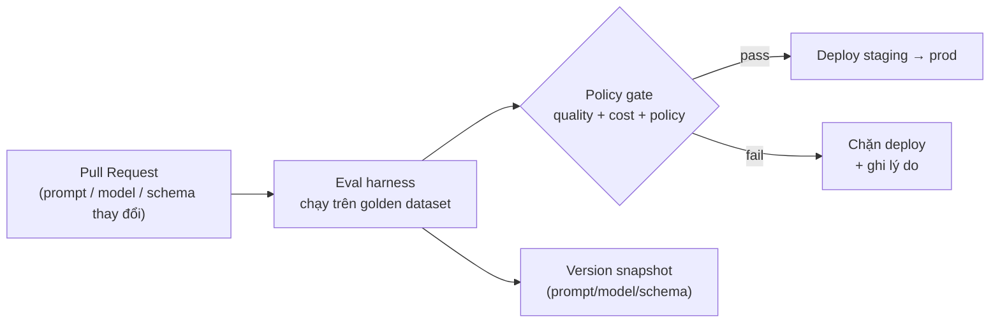

**Bốn thành phần developer phải xây:**

| Thành phần | Nội dung | Nguồn dữ liệu |
|---|---|---|
| **Eval set từ golden data** | Bộ test case lấy từ xác nhận HITL — đây là tài sản eval miễn phí của giai đoạn full-HITL; gắn nhãn chính xác từ reviewer | §4.10, lộ trình §13 |
| **Pre-production policy gates** | Chấm điểm đồng thời **quality + cost + policy** cho mỗi lần thay đổi; ngưỡng hallucination/drift/PII-leak phải ký ở Giai đoạn 0 | §8.9 (runbook), §9.3 |
| **Red-team gate** | Kiểm tra prompt injection, jailbreak, cross-modal injection qua tài liệu test; chạy mỗi release | §8.5/8.6, §11 |
| **Versioning + rollback** | Mỗi lần chạy eval snapshot version prompt/model/schema; nếu production regression → rollback theo path đã test | §8.5, §6.7/6.8 |

**Ngưỡng pass/fail theo use case** (ký ở Giai đoạn 0, nhúng vào gate):

| Use case | Ngưỡng chính xác gate | Ngưỡng chi phí gate |
|---|---|---|
| KYC onboarding | ~99,5% | Biên trên cost/document theo mô hình §9.2 |
| Hóa đơn / AP | ~99% (STP 60–80%) | Biên trên cost/document |
| Phân loại nội bộ | ~92% | Biên trên cost/document |

**Quy tắc "đèn đỏ" — cưỡng chế Pareto chính xác–chi phí (§9.3):**
> Một thay đổi tăng chính xác 1% nhưng tăng chi phí 2× → **bị chặn tại gate**. Gate không chỉ đo chất lượng; nó cưỡng chế đường Pareto đã ký với client.

---

### §8.5 Reliability & change control

> **Nguyên tắc cứng:** Nếu một agent không thể bị ràng buộc, nó không nên được trao quyền production.

Phần lớn sự cố tự động hóa xảy ra **trong lúc thay đổi** (config sai, update vội, rollback chưa từng test). Developer phải xây đủ năm cơ chế:

| Cơ chế | Nội dung triển khai | Tham chiếu |
|---|---|---|
| **Pre-check trước hành động** | Trước khi đẩy output xuống hạ nguồn: kiểm tra completeness policy + validation + (eKYC) completeness policy; không release tài liệu thiếu phần bắt buộc | §4.8, §6.7 |
| **Peer review / approval** | Thay đổi nhạy cảm (prompt production, schema, ngưỡng confidence) qua change-request + review; không direct-push | §13 lộ trình |
| **Cửa sổ thực thi có canh giữ** | Rate-limit + backpressure khi tải cao; lane ưu tiên giữ SLO; không hạ cấp chất lượng động (ADR-10) | §6.4/6.6 |
| **Rollback tự động** | Saga mức tài liệu + checkpoint/resumable; idempotency state machine (in-progress / succeeded / failed-terminal); không đóng băng lỗi transient | §6.7/6.8 (ADR-12/13) |
| **Kill switch tại Gateway** | Công tắc ngắt dừng đường VLM/provider hoặc toàn pipeline khi vi phạm điều kiện (cost trần, anomaly, sự cố provider); kích hoạt thủ công hoặc tự động theo alert | §8.2, §9.6 |

---

### §8.6 Least-privilege / Least-Agency + Guardian

**Least-privilege / Least-Agency (OWASP LLM06):**
Mỗi worker/agent khởi đầu với tập quyền và mức tự chủ tối thiểu. Hiện thực trong IDP:
- File Proxy là thành phần duy nhất giữ storage credentials; worker chỉ có access_key giới hạn (§8.3).
- Cấm auto-execute tool dựa trên chỉ thị suy ra từ nội dung tài liệu (§8.6 / §4.12).
- **Không nới quyền sớm** — mọi mở rộng quyền phải qua change-request.

**Guardian — hai giai đoạn rõ ràng:**

| Giai đoạn | Cơ chế guardian | Lý do |
|---|---|---|
| **GĐ1–3 (full/confidence-gating HITL)** | **Con người là guardian** (ADR-11): duyệt 100% ở GĐ1; confidence-gating ở GĐ3 sau golden data; bắt hallucination + injection-manipulated output | Đủ ràng buộc, sinh golden data, không cần thêm agent giám sát |
| **GĐ4 (agentic — tùy chọn)** | Guardian-agent tự động | Chỉ xem xét khi đã nới khỏi full-HITL và agentic được bật; out-of-scope GĐ đầu |

> **Điểm controlled autonomy của dự án:** không trao tự chủ rồi giám sát sau; giữ con người làm guardian cho tới khi golden data + eval gate chứng minh đủ tin để nới — đồng bộ lộ trình §13 GĐ3.

---

### §8.7 Registry tài sản + audit log bất biến + ánh xạ chuẩn

**Registry tài sản tập trung — developer xây:**

Mỗi model/agent/extractor vào registry với:

| Trường | Nội dung |
|---|---|
| `asset_id` | ID định danh duy nhất |
| `type` | ocr / vlm / sub-extractor / llm-field / guardrail |
| `version` | `model_version` + `pipeline_version` (§event schema §5.4) |
| `owner` | Tên/email người chịu trách nhiệm |
| `risk_class` | low / medium / high |
| `data_dependencies` | Tier dữ liệu được phép xử lý |
| `legal_scope` | Phạm vi pháp lý (vùng, quy định áp dụng) |
| `eval_gate_last_pass` | Timestamp + kết quả eval gate gần nhất |

**Audit log bất biến (WORM):**
- Append-only, ≥1 năm cho eKYC (§7.3).
- Redact-by-design: log hash before/after, không nội dung thô (§8.10).
- Correlation ID per event + distributed tracing xuyên mọi span (§8.3).
- Chỉ security/audit team có quyền đọc.

**Ánh xạ chuẩn — mỗi chuẩn gắn vào điểm cưỡng chế cụ thể:**

| Chuẩn | Điểm cưỡng chế trong hệ IDP |
|---|---|
| **OWASP LLM Top 10 (2025)** | Gateway guardrail (LLM01/02/06/08) — §8.5/8.6/8.7/§11 |
| **OWASP Agentic Top 10 (12/2025)** | §8.10; áp đầy đủ khi vào GĐ4 agentic |
| **NIST AI RMF Measure 2.6** | Observability (§8.3) + eval gate (§8.4) + audit WORM (§8.7) |
| **EU AI Act Điều 15** (hệ AI rủi ro cao — accuracy, robustness, cybersecurity) | Gateway + eval gate + tier-aware routing |
| **Singapore IMDA Khung Agentic (1/2026)** | Tham chiếu khi bật agentic GĐ4; Least-Agency + kill switch |
| **ISO 27001 / PCI DSS / GDPR-PDPA / SBV TT16** | §8.1 (bảng tuân thủ), §7.3, §8.3/8.4 |

> **Ranh giới altitude:** ánh xạ chuẩn *cho hệ IDP được giao* = in-scope. Chương trình responsible-AI/registry cấp toàn tổ chức = out-of-scope (client sở hữu).

---

### §8.8 Sơ đồ kiến trúc tham chiếu vận hành

Góc nhìn vận hành chồng lên pipeline xử lý ở §3.1 — developer dùng để hiểu luồng control, không phải luồng dữ liệu.

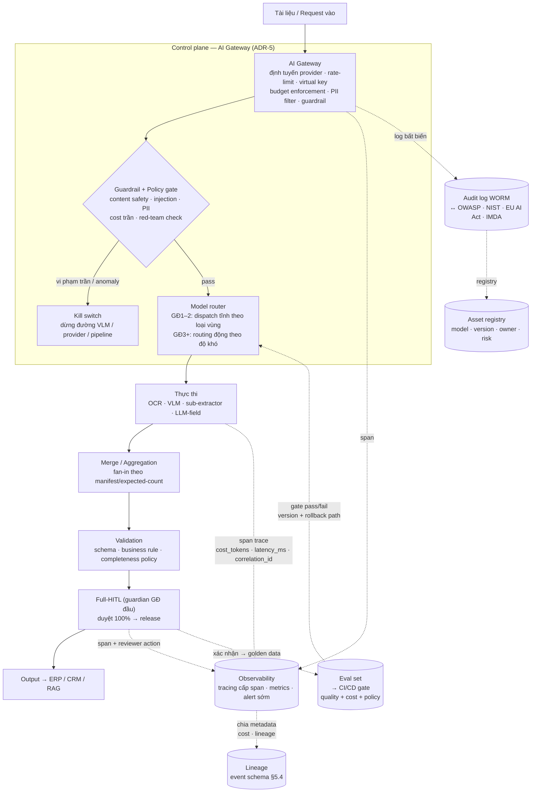

---

### §8.9 Bàn giao SRE runbook — checklist tóm tắt

Developer giao hệ kèm runbook này; client/SRE điền số thực ở Giai đoạn 0. **Vận hành production dài hạn (on-call 24/7, SLA vận hành) = out-of-scope trừ hợp đồng bảo trì.**

**SLO (theo lane — §6.5):**
- [ ] Priority lane (eKYC): latency p95 < `_<điền>_`; uptime `_<điền>_`.
- [ ] Bulk lane: throughput `_<điền>_` tài liệu/giờ; eventual.
- [ ] Eval real-time (nếu bật): chấm chất lượng < 200ms.

**Ngưỡng chấp nhận (ký Giai đoạn 0):**
- [ ] Chính xác theo use case: KYC ~99,5% / AP ~99% / nội bộ ~92% — §9.3.
- [ ] Cost-per-document trần mỗi loại/tenant — §9.6.
- [ ] Ngưỡng eval gate: hallucination `_<điền>_`; drift `_<điền>_`; PII-leak `_<điền>_`.

**Alert (kích hoạt trước khi chạm người dùng):**
- [ ] Latency p95 vượt SLO; error rate tăng bất thường.
- [ ] Cache hit rate giảm đột ngột; DLQ depth tăng.
- [ ] Cost/document vượt biên; chạm trần per-action/doc/tenant.
- [ ] Drift: tỷ lệ HITL-correction của một vendor tăng đột biến.
- [ ] Provider VLM trả 429/5xx liên tục → trigger kill switch path.

**Change control & rollback:**
- [ ] Mọi thay đổi prompt/model/schema qua eval gate + version snapshot.
- [ ] Rollback path test được (saga/checkpoint §6.7/6.8) — test định kỳ, không chờ sự cố.
- [ ] Kill switch: điều kiện kích hoạt, người được kích hoạt, cách khôi phục.

**Bảo mật & audit:**
- [ ] Least-privilege mọi worker; File Proxy giữ credentials (§8.3).
- [ ] Audit WORM ≥1 năm; redact-by-design (§7.3/8.10).
- [ ] Registry: owner/rủi ro/phụ thuộc/phạm vi pháp lý từng model/agent.

---

## §9 Kiến trúc chi phí (FinOps)

> **Nguyên tắc xuyên suốt:** Agent bị khai tử không phải vì AI đắt, mà vì triển khai trước khi mô hình hóa chi phí, ROI tính theo giả định sai, và thiếu phanh tài chính. **FinOps và ngưỡng chính xác theo use case là yêu cầu thiết kế, không phải vá sau.**

---

### §9.1 Ràng buộc tài chính C1–C8

Tám ràng buộc cứng hệ IDP phải thỏa. Developer không thể giao hệ thiếu bất kỳ ràng buộc nào trong số này:

| # | Ràng buộc | Nội dung cô đọng | Điểm cưỡng chế |
|---|---|---|---|
| **C1** | **Đơn vị chi phí = cost-per-document** | Đo chi phí mỗi tài liệu xử lý xong (sau validation + HITL + đẩy hạ nguồn), không phải cost-per-token; tách theo loại/vendor/tier | Dashboard §9.7 + event schema §5.4 |
| **C2** | **Trần chi phí cưỡng chế trước khi tiêu** | Token/session tích lũy vượt ngưỡng → chặn lời gọi model kế tiếp; không cảnh báo sau hóa đơn | Gateway §9.6 |
| **C3** | **Chi phí đoán trước được, có trần** | Mỗi loại tài liệu có biên chi phí trên đã mô hình hóa; không để chi "trôi" | §9.2 (mô hình) + §9.6 (guardrail) |
| **C4** | **Ngưỡng chính xác theo rủi ro use case** | Không tối đa hóa chính xác mọi nơi; chốt ngưỡng theo rủi ro rồi tối thiểu chi phí để đạt ngưỡng | §9.3 (Pareto) + eval gate §8.4 |
| **C5** | **Bỏ Big Model Fallacy** | Không dùng model frontier cho mọi tác vụ; dispatch đúng-công-cụ; routing động theo độ khó hoãn tới GĐ3 | ADR-1/ADR-10, §9.5 |
| **C6** | **Mọi khoản chi gắn metadata** | Liên kết chi phí → tài liệu / use case / model version / tenant để truy vết và quy trách | Event schema §5.4 (`cost_tokens`, `latency_ms`, `tenant_id`) |
| **C7** | **Quản trị tài chính liên tục** | Alert ngân sách, anomaly chi phí, phát hiện bất thường, review hàng tháng, post-mortem vượt chi | Observability §8.3 + §9.7 |
| **C8** | **Payback < 6 tháng với chi phí có trần** | Payback neo <6 tháng kèm điều kiện chi phí có giới hạn dự đoán được | Lộ trình §13, scope KPI |

> **Ranh giới altitude:** các ràng buộc trên là về cost-control của bản thân hệ IDP giao. Chương trình FinOps cấp tổ chức (chargeback đa đơn vị, ngân sách AI toàn doanh nghiệp) = out-of-scope, thuộc client. Hệ cung cấp telemetry + guardrails để client cắm vào FinOps của họ.

---

### §9.2 Mô hình cost-per-document

**Bắt buộc hoàn thành ở Giai đoạn 0, trước khi build.** Không có cost model = dự án agentic "chết" (cảnh báo từ lộ trình §13).

**Công thức:**

```
Cost/doc = Σ(cost_OCR × trang_OCR)
         + Σ(cost_VLM × tỷ_lệ_vùng_VLM × trang)     ← đòn bẩy lớn nhất phần máy
         + cost_sub_extractors
         + cost_LLM_field_extraction (sau prompt cache + result cache)
         + cost_HITL_lao_động                          ← đòn bẩy lớn nhất phần lao động
             = thời_gian_duyệt_trung_bình × đơn_giá_reviewer × tỷ_lệ_vào_HITL
         + cost_hạ_tầng_phân_bổ (queue + storage + gateway)
```

**Hai biến chi phối lớn nhất:**

| Biến | Giai đoạn 1 | Giai đoạn 3+ | Đòn bẩy hạ |
|---|---|---|---|
| **%VLM** (tỷ lệ vùng đi VLM) | Phụ thuộc loại tài liệu | Giảm nhờ dispatch tĩnh đúng-công-cụ + cache | Dispatch tĩnh (§4.4) + result cache (§6.8) |
| **%HITL** (tỷ lệ vào HITL) | **100%** (full-HITL, ADR-11) | Giảm khi nới sang confidence-gating (GĐ3) | Golden data → confidence-gating (§13) |

> **Hệ quả ngân sách quan trọng:** ROI Giai đoạn 1 không đến từ chi phí máy thấp (vì 100% HITL còn tốn lao động), mà từ **cycle time giảm + nền golden data**. Tiết kiệm chi phí lao động thực sự đến ở GĐ3. Truyền đạt rõ với client để tránh kỳ vọng ROI sai.

---

### §9.3 Đường đánh đổi chính xác–chi phí (Pareto)

**Nguyên tắc:** không tối đa hóa cả hai chiều — chọn ngưỡng chính xác cho từng use case theo rủi ro, rồi tối thiểu hóa chi phí để đạt ngưỡng đó.

**Bằng chứng benchmark (10.000 hồ sơ tài chính SEC 10-K/10-Q/8-K):**

| Kiến trúc | F1 | Chi phí so baseline | Vị trí Pareto |
|---|---|---|---|
| Reflexive (tự sửa lặp) | **0,943** | **2,3×** | Đắt — chỉ xứng khi rủi ro rất cao |
| **Hierarchical** (phân cấp) | 0,921 | 1,4× | **Tốt nhất trên biên Pareto** |
| **Hybrid** (lai) | phục hồi 89% cải thiện của reflexive | **1,15×** | Thực dụng nhất — gần như cùng chính xác, chi phí thấp hơn nhiều |

> Vài phần trăm chính xác cuối cùng thường **đắt gấp đôi**. Cấu hình lai (OCR rẻ trước + chọn lọc dùng VLM/HITL cho phần khó) chiếm gần hết phần cải thiện với chi phí thấp — đúng triết lý dispatch theo loại vùng + full-HITL của §4.

**Bảng ngưỡng theo use case — ký ở Giai đoạn 0:**

| Use case | Ngưỡng chính xác mục tiêu | Cơ chế đạt ngưỡng | Ghi chú rủi ro |
|---|---|---|---|
| **KYC onboarding** | ~99,5% (tuân thủ) | Full-HITL 100% GĐ1; giữ HITL lâu nhất vì rủi ro pháp lý | Rủi ro tuân thủ cao → chấp nhận cost/doc cao hơn |
| **Hóa đơn / AP** | ~99% cấu trúc; STP 60–80% "sạch" | OCR + LLM + confidence-gating sau golden data | ROI rõ nhất; nới HITL khi đủ tin |
| **Phân loại / định tuyến nội bộ** | ~92% | Model nhỏ/OCR; ít hoặc không HITL | Rủi ro thấp → tối thiểu chi phí |

**Quy tắc "đèn đỏ" cưỡng chế tại eval gate (§8.4):**
> Thay đổi tăng chính xác 1% nhưng tăng chi phí 2× → **bị chặn ngay tại gate**. Gate cưỡng chế "chọn ngưỡng theo rủi ro rồi tối thiểu chi phí", không để chính xác trôi vô tội vạ.

---

### §9.4 Các đòn bẩy chi phí gắn kiến trúc

Năm đòn bẩy developer triển khai ngay GĐ1–2 (không phá tính tất định ADR-10):

| Đòn bẩy | Cơ chế | Tham chiếu kiến trúc | Tiết kiệm |
|---|---|---|---|
| **Dispatch tĩnh theo loại vùng** | Text → OCR rẻ; vùng khó (hình/diagram) → VLM; tránh ép cả trang qua VLM | §4.4, ADR-9 | Lớn — cốt lõi tránh "VLM cho mọi thứ" |
| **Prompt caching** | Cache system prompt + ngữ cảnh lặp; input đã cache tính ~10–25% chi phí input thường | Gateway §8.5 | Đáng kể ở quy mô lớn |
| **Result cache theo hash** | Tài liệu trùng/lặp không gọi lại VLM; chỉ ghi cache khi thành công (§6.8, IDR-13) | §6.6/6.8 | Cao với khối lượng lặp |
| **Batch API — bulk lane** | Số hóa hàng loạt qua batch API (~−50% chi phí) | §6.5 | ~50% cho lane bulk |
| **Cắt tỉa cửa sổ ngữ cảnh** | Không gửi lại ngữ cảnh thừa qua các bước; ngữ cảnh gửi lại có thể chiếm phần lớn hóa đơn | Thiết kế prompt §4.9 | Lớn ở luồng nhiều bước |

**Đòn bẩy giảm khối lượng (xuyên suốt):**
- Gate chất lượng đầu vào sớm (DPI/định dạng) → tài liệu rác không tiêu token VLM, đẩy thẳng hàng đợi ngoại lệ (§4.1).
- Confidence chỉ ưu tiên HITL, không gate ở GĐ1 — nhưng golden data từ HITL mở đường nới confidence-gating sau, giảm %HITL (§13 GĐ3).

---

### §9.5 Hòa giải ADR-10: routing động hoãn tới GĐ3

> **Điểm tích hợp quan trọng nhất giữa FinOps và kiến trúc.** Thị trường khuyến nghị mạnh "model tier routing theo độ khó" như đòn bẩy chi phí hàng đầu. Nhưng đó **chính là dynamic model selection đã bị ADR-10 hoãn lại** để giữ tính tất định cho eKYC.

**Hòa giải theo lộ trình — không sửa ADR-10:**

| Giai đoạn | Đòn bẩy routing được phép | Lý do |
|---|---|---|
| **GĐ1–2 (tất định + full HITL)** | Chỉ **dispatch tĩnh theo loại vùng** (text → OCR, bảng → table extractor, hình → VLM). Đây đã là một dạng "tier routing theo loại nội dung" — rẻ đúng-công-cụ, tính tất định giữ nguyên | Audit/test được; xóa mâu thuẫn load-aware vs tier accuracy |
| **GĐ3+ (sau golden data)** | Mở **model tier routing động theo độ khó/confidence** cho phần đã chứng minh đủ tin — đồng bộ nới full-HITL → confidence-gating | Golden data cung cấp cơ sở chứng minh; đúng §13 GĐ3 |

> "Bỏ Big Model Fallacy" (C5) được hiện thực theo **hai nhịp**: ngay lập tức bằng dispatch tĩnh đúng-công-cụ (đã rẻ, không cần frontier cho text); và động theo độ khó chỉ khi đã có golden data. Không bật routing động sớm để "tiết kiệm" rồi đánh mất khả năng audit eKYC.

---

### §9.6 Cost guardrails 3 lớp — cưỡng chế tại Gateway

**Kỹ thuật then chốt:** khi tiêu thụ tích lũy vượt ngưỡng, phiên/tài liệu bị chấm dứt **TRƯỚC lời gọi model kế tiếp** — không phải cảnh báo sau hóa đơn, không phải trần cấp tài khoản cloud.

**Ba lớp — mỗi lớp bắt loại lỗi lớp khác bỏ sót:**

| Lớp | Phạm vi | Ví dụ ngưỡng | Hành vi khi vượt |
|---|---|---|---|
| **Per-action** | Mỗi lời gọi model | Số token / lời gọi; kích thước ngữ cảnh | Từ chối lời gọi; ghi log anomaly |
| **Per-document / per-session** | Trọn vòng xử lý một tài liệu | Tổng token/tài liệu vượt biên mô hình hóa (§9.2) | Dừng xử lý tự động → đẩy hàng đợi ngoại lệ + cảnh báo; KHÔNG release dở |
| **Per-tenant / per-team** | Quota theo khách hàng / đội | Ngân sách ngày / tháng | Throttle/đợi; báo client; không tràn sang tenant khác |

**Điểm cưỡng chế = AI Gateway (§8.2):**

Gateway đếm token tích lũy theo `correlation_id` / `session_id`, so ngưỡng **trước** khi forward lời gọi kế tiếp. Vượt → chặn + phát event anomaly → observability (§8.3) nhận và alert. Tận dụng sẵn cơ chế 429/backoff/rate-limit ở §6.6.

> Lưu ý: chặn-vì-vượt-trần là **kết cục nghiệp vụ tất định** (cache được, hỏi lại vẫn chặn), khác lỗi transient — phân loại đúng theo idempotency state machine §6.8 để không đóng băng nhầm.

**Kill switch gắn với guardrail lớp 2/3:** khi per-document hoặc per-tenant liên tục chạm trần trong một cửa sổ thời gian → tự động kích hoạt kill switch (§8.5) dừng đường VLM/provider để điều tra.

---

### §9.7 KPI chi phí

Mở rộng KPI ở scope §5 và event schema §5.4. Developer phải đảm bảo mọi metric dưới đây có thể truy vấn từ observability dashboard (§8.3):

| Nhóm | KPI | Ý nghĩa | Nguồn dữ liệu |
|---|---|---|---|
| **Unit economics** | **Cost-per-document** tách loại / vendor / tier | Đơn vị FinOps cốt lõi (C1) | Event `cost_tokens` + cost lao động HITL |
| | Cost máy vs cost lao động (tỷ trọng) | Hiểu ROI đến từ đâu theo giai đoạn | §9.2 (mô hình) |
| **Hiệu suất chi phí** | **%VLM** (tỷ lệ vùng đi VLM) | Đòn bẩy chi phí lớn nhất phần máy | NFR §10, §8.3 metrics |
| | **Cache hit rate** (prompt + result) | Hiệu quả đòn bẩy caching §9.4 | Gateway + result cache |
| | **%HITL** (tỷ lệ vào HITL) | Đòn bẩy chi phí lao động; mục tiêu giảm dần theo lộ trình | §governance KPI §9 |
| **Guardrail** | Số lần chạm trần (per-action / doc / tenant) | Phát hiện cấu hình ngưỡng sai sớm; nếu cao → xem lại mô hình §9.2 | Gateway anomaly log |
| | % tài liệu vượt biên chi phí mô hình hóa | Sức khỏe dự báo chi phí | §9.2 |
| **ROI** | Payback (mục tiêu <6 tháng) | Chứng minh ROI có trần (C8) | Scope KPI §5 |
| | Cycle time trước / sau | ROI GĐ1 đến từ cycle time, không cost máy | Scope KPI §5 |

> Mọi KPI trên phải có **ngưỡng alert** đã cấu hình (không chỉ hiển thị số) — xem runbook §8.9. Số thực điền ở Giai đoạn 0 cùng với cost-per-document model.


---

## §10 Kiến trúc tích hợp & hợp đồng API

### §10.1 Nguyên tắc tích hợp

Lớp tích hợp là **nơi ROI sống hoặc chết** (scope-implementation §1, hàng 3): trích xuất mà không có API hai chiều với hệ hạ nguồn thì nhân viên vẫn copy JSON thủ công, triệt tiêu hoàn toàn tiết kiệm tự động hóa. Do đó integration layer **in-scope từ Giai đoạn 1**, không được đẩy sang giai đoạn sau.

**Bốn nguyên tắc chỉ đạo:**

| # | Nguyên tắc | Diễn giải |
|---|---|---|
| I1 | Contract-first | Hợp đồng API (OpenAPI 3.1) được thiết kế và phê duyệt **trước khi** viết một dòng code tích hợp |
| I2 | API hai chiều | Inbound: client hệ thống bên ngoài đẩy tài liệu vào IDP. Outbound: IDP đẩy kết quả có cấu trúc vào ERP/CRM khi hoàn thành |
| I3 | Client cấp endpoint hạ nguồn | IDP không xây/sửa hệ hạ nguồn; client cung cấp endpoint nhận payload — ranh giới trách nhiệm ghi tường minh trong hợp đồng |
| I4 | Idempotency xuyên suốt | Mọi cuộc gọi API (cả inbound lẫn outbound) đều idempotent — gắn với state machine §6.8 để không đóng băng lỗi transient |

**Vị trí trong kiến trúc:** Integration layer ngồi sau bước Output & Integration (§4.11), nhận output từ HITL đã duyệt, rồi fan-out tới ERP/CRM và phản hồi caller ban đầu.

---

### §10.2 API ngoài (inbound) — hợp đồng endpoint

Tất cả endpoint đều nằm dưới tiền tố `/v1/` (versioning §10.7). Auth mô tả ở §10.3. Idempotency-key semantics ở §10.4.

---

#### `POST /v1/documents` — Nộp tài liệu xử lý

**Mô tả:** Tiếp nhận một tài liệu (hoặc batch nhỏ) để xử lý; trả về `202 Accepted` ngay lập tức cùng `job_id`. Pipeline lõi chạy bất đồng bộ (ADR-10: event-driven async). Caller không block chờ kết quả tại đây.

**Request mẫu:**

```http
POST /v1/documents
Content-Type: application/json
Authorization: Bearer <access_token>
Idempotency-Key: client-req-f47ac10b-58cc-4372

{
  "source": {
    "type": "base64",
    "content": "JVBERi0xLjQK...",
    "filename": "invoice-2026-001.pdf",
    "mime_type": "application/pdf"
  },
  "document_type": "invoice",
  "tenant_id": "tenant-acme",
  "priority": "realtime",
  "callback_url": "https://erp.acme.com/idp/webhook/result",
  "metadata": {
    "source_system": "erp_ap_module",
    "reference_id": "AP-20260605-0042",
    "tags": ["ap", "vendor-abc"]
  }
}
```

> Thay cho `base64`, `source.type` có thể là `"url"` + `source.url` trỏ tới presigned URL của object storage (khuyến nghị cho file lớn > 1 MB để không phình payload).

**Response mẫu — 202 Accepted:**

```json
{
  "job_id": "job-9f3d2a7e-1bc4-4e89-a501-8c6f0d3e2f91",
  "status": "queued",
  "idempotency_key": "client-req-f47ac10b-58cc-4372",
  "created_at": "2026-06-05T08:12:34.123Z",
  "estimated_completion_seconds": 30,
  "_links": {
    "status": "/v1/documents/job-9f3d2a7e-1bc4-4e89-a501-8c6f0d3e2f91/status",
    "result": "/v1/documents/job-9f3d2a7e-1bc4-4e89-a501-8c6f0d3e2f91/result"
  }
}
```

**Status codes:**

| Code | Nghĩa |
|------|-------|
| `202 Accepted` | Đã nhận, đang xử lý bất đồng bộ |
| `400 Bad Request` | Body malformed, thiếu trường bắt buộc, MIME không hỗ trợ |
| `409 Conflict` | `Idempotency-Key` đã tồn tại với tham số khác |
| `413 Content Too Large` | Vượt giới hạn kích thước file (mặc định 20 MB per document) |
| `422 Unprocessable Entity` | File hợp lệ về syntax nhưng fail business validation (ví dụ: PDF mã hóa không mở được) |
| `429 Too Many Requests` | Vượt rate limit; `Retry-After` header kèm theo |
| `503 Service Unavailable` | Pipeline quá tải, backpressure kích hoạt; retry sau |

---

#### `GET /v1/documents/{job_id}/status` — Trạng thái xử lý

**Mô tả:** Truy vấn trạng thái hiện tại và tiến độ của một job. Dành cho client muốn **polling** (§10.6 mô tả các kênh push thay thế). Không tốn chi phí nặng — chỉ đọc idempotency record (§6.8).

**Request mẫu:**

```http
GET /v1/documents/job-9f3d2a7e-1bc4-4e89-a501-8c6f0d3e2f91/status
Authorization: Bearer <access_token>
```

**Response mẫu — 200 OK:**

```json
{
  "job_id": "job-9f3d2a7e-1bc4-4e89-a501-8c6f0d3e2f91",
  "status": "in_review",
  "stage": "hitl_pending",
  "progress": {
    "pages_total": 3,
    "pages_processed": 3,
    "regions_total": 12,
    "regions_processed": 12,
    "hitl_reviewer_assigned": true
  },
  "created_at": "2026-06-05T08:12:34.123Z",
  "updated_at": "2026-06-05T08:12:51.007Z",
  "estimated_completion_seconds": 120,
  "_links": {
    "result": "/v1/documents/job-9f3d2a7e-1bc4-4e89-a501-8c6f0d3e2f91/result"
  }
}
```

**Trạng thái `status` hợp lệ:**

| Giá trị | Nghĩa |
|---------|-------|
| `queued` | Đang chờ trong queue |
| `processing` | Pipeline lõi đang chạy (OCR/VLM/sub-extractor) |
| `in_review` | Đang chờ HITL reviewer xác nhận (§4.10) |
| `completed` | HITL đã duyệt, kết quả sẵn sàng |
| `failed` | Lỗi terminal (lỗi nghiệp vụ tất định — §6.8) |
| `partial` | Một số trang/vùng lỗi; completeness policy chưa cho release (§6.7) |

**Status codes:** `200 OK` · `404 Not Found` (job_id không tồn tại hoặc không thuộc tenant này) · `401/403` (auth).

---

#### `GET /v1/documents/{job_id}/result` — Kết quả có cấu trúc

**Mô tả:** Trả kết quả đầy đủ sau khi job đạt `status=completed`. Nếu job chưa xong → `409 Conflict` kèm `status` hiện tại. Kết quả bao gồm fields trích xuất, confidence từng field, và grounding (tọa độ bounding box để kiểm toán).

**Request mẫu:**

```http
GET /v1/documents/job-9f3d2a7e-1bc4-4e89-a501-8c6f0d3e2f91/result
Authorization: Bearer <access_token>
Accept: application/json
```

**Response mẫu — 200 OK:**

```json
{
  "job_id": "job-9f3d2a7e-1bc4-4e89-a501-8c6f0d3e2f91",
  "document_type": "invoice",
  "status": "completed",
  "completed_at": "2026-06-05T08:14:02.456Z",
  "reviewer_id": "reviewer-usr-0021",
  "extraction": {
    "fields": [
      {
        "field_name": "invoice_number",
        "value": "INV-2026-001",
        "confidence": 0.98,
        "source": "ocr",
        "grounding": {
          "page": 1,
          "bounding_box": { "x": 420, "y": 85, "w": 160, "h": 22 }
        },
        "reviewer_corrected": false
      },
      {
        "field_name": "invoice_date",
        "value": "2026-06-01",
        "confidence": 0.95,
        "source": "ocr",
        "grounding": {
          "page": 1,
          "bounding_box": { "x": 420, "y": 110, "w": 130, "h": 22 }
        },
        "reviewer_corrected": false
      },
      {
        "field_name": "total_amount",
        "value": 12500000,
        "currency": "VND",
        "confidence": 0.91,
        "source": "ocr",
        "grounding": {
          "page": 1,
          "bounding_box": { "x": 380, "y": 540, "w": 200, "h": 24 }
        },
        "reviewer_corrected": true,
        "original_value": "12.500.000"
      },
      {
        "field_name": "line_items",
        "value": [
          {
            "description": "Dịch vụ tư vấn tháng 5/2026",
            "quantity": 1,
            "unit_price": 12500000,
            "total": 12500000
          }
        ],
        "confidence": 0.89,
        "source": "table_extractor",
        "grounding": {
          "page": 1,
          "bounding_box": { "x": 40, "y": 320, "w": 700, "h": 180 }
        },
        "reviewer_corrected": false
      }
    ],
    "overall_confidence": 0.93,
    "extraction_path": ["ocr", "table_extractor"],
    "hitl_review": {
      "reviewed_at": "2026-06-05T08:13:58.100Z",
      "corrections_count": 1,
      "reviewer_notes": null
    }
  },
  "metadata": {
    "source_system": "erp_ap_module",
    "reference_id": "AP-20260605-0042",
    "tenant_id": "tenant-acme",
    "pages_processed": 3,
    "processing_duration_ms": 8312
  },
  "downstream_push": {
    "status": "pending",
    "target_system": "sap_fi",
    "scheduled_at": "2026-06-05T08:14:05.000Z"
  }
}
```

**Status codes:** `200 OK` · `202 Accepted` (job chạy xong nhưng downstream push chưa confirm) · `404 Not Found` · `409 Conflict` (job chưa `completed`) · `410 Gone` (kết quả đã bị purge theo retention policy).

---

#### Đăng ký & nhận webhook/callback

**Mô tả:** Client đăng ký `callback_url` ngay khi submit (trường `callback_url` trong `POST /v1/documents`). Khi job hoàn thành (status `completed` hoặc `failed`), IDP POST đến URL đó. Đây là cơ chế push ưu tiên cho **priority lane** (§6.5).

**Payload webhook mẫu:**

```http
POST https://erp.acme.com/idp/webhook/result
Content-Type: application/json
X-IDP-Signature: sha256=<hmac_signature>
X-IDP-Event: document.completed

{
  "event": "document.completed",
  "job_id": "job-9f3d2a7e-1bc4-4e89-a501-8c6f0d3e2f91",
  "status": "completed",
  "occurred_at": "2026-06-05T08:14:02.456Z",
  "tenant_id": "tenant-acme",
  "_links": {
    "result": "/v1/documents/job-9f3d2a7e-1bc4-4e89-a501-8c6f0d3e2f91/result"
  }
}
```

- Chữ ký HMAC-SHA256 dùng shared secret do client đăng ký khi cấu hình; client **phải xác thực** chữ ký trước khi xử lý.
- IDP retry webhook với exponential backoff (tối đa 5 lần trong 24h); sau 5 lần thất bại → event vào DLQ nội bộ + cảnh báo vận hành.
- Client endpoint phải trả `2xx` trong vòng 10 giây; nếu không, IDP tính là thất bại và retry.

---

### §10.3 Xác thực & bảo mật API

Phương thức xác thực chọn theo **tier dữ liệu** (tier §7.2 / §8.2). Nguyên tắc least-privilege áp dụng xuyên suốt.

| Tier | Phương thức auth | Ghi chú |
|------|-----------------|---------|
| Tier 1 (tiêu chuẩn) | **OAuth 2.0 / OIDC** — Client Credentials hoặc Authorization Code + PKCE | Token ngắn hạn (≤ 1h), refresh token rotation; Identity Provider của client tích hợp qua OIDC federation |
| Tier 2 (nhạy cảm vừa) | **OAuth 2.0** + **API Key** như lớp bổ sung | API Key gắn với scopes cụ thể; rotate định kỳ |
| Tier 3/4 (sovereign/on-prem) | **mTLS** (mutual TLS) + **OAuth 2.0** | Client certificate được quản lý bởi PKI nội bộ; không ra public internet |
| Tier 0 (air-gapped) | **mTLS** nội bộ + service account | Không có public endpoint; chỉ gọi nội bộ network |

**Scopes OAuth2 tối thiểu:**

| Scope | Quyền |
|-------|-------|
| `idp:documents:write` | Submit tài liệu (`POST /v1/documents`) |
| `idp:documents:read` | Đọc status và result |
| `idp:webhooks:manage` | Đăng ký/hủy webhook |
| `idp:admin` | Cấu hình tenant, schema — chỉ dành admin |

**Các biện pháp bổ sung:**
- Mọi request HTTPS (TLS 1.2+); từ chối TLS 1.0/1.1.
- Rate limiting tại AI Gateway (§8.5): theo tenant + IP; `429` kèm `Retry-After`.
- Audit log mọi lời gọi API: timestamp, tenant, endpoint, response code, độ trễ — không log body chứa PII (§8.10).
- Token không chứa PII; payload không trả token trong log.

---

### §10.4 Idempotency-key — semantics gắn §6.8

**Vấn đề:** Network có thể drop response sau khi server đã xử lý; client retry → tài liệu bị submit hai lần → tốn tiền VLM + tạo bản ghi trùng trong ERP.

**Giải pháp — Idempotency-Key header:**

```
Idempotency-Key: <client-generated-uuid-v4>
```

Client sinh UUID v4 cho mỗi yêu cầu logic; gắn vào header. Server tra cứu idempotency record theo key này:

```
Không thấy record     → Chạy mới; ghi record trạng thái "in_progress" + lease timeout
Thấy "in_progress"
  + lease chưa hết    → Trả 409 Conflict (request khác đang chạy cùng key)
  + lease đã hết      → Re-execute (server chết giữa chừng — §6.8)
Thấy "succeeded"      → Trả lại response đã cache (không chạy lại)
Thấy "failed_terminal"→ Trả lại lỗi nghiệp vụ đã cache (không chạy lại)
```

**Quy tắc chỉ cache kết cục xác định** (gắn §6.8):
- Lỗi **nghiệp vụ tất định** (PDF mã hóa không mở, định dạng không hỗ trợ) → cache `failed_terminal`.
- Lỗi **transient/hạ tầng** (timeout, 503, server crash) → **không cache** → retry sẽ re-execute.

**Scope của key:** `(tenant_id, idempotency_key)` — cùng key từ tenant khác là request khác.

**TTL của record:** 24 giờ từ thời điểm tạo (sau đó client phải dùng key mới nếu muốn retry).

---

### §10.5 Đẩy hạ nguồn (outbound) — ERP/CRM

Sau khi HITL xác nhận (§4.10), pipeline tự động đẩy kết quả xuống hệ hạ nguồn mà client đã cấp endpoint.

#### Payload JSON outbound mẫu (hóa đơn/AP)

```json
{
  "idp_job_id": "job-9f3d2a7e-1bc4-4e89-a501-8c6f0d3e2f91",
  "idempotency_key": "idp-push-job-9f3d2a7e-page1-20260605T081402",
  "document_type": "invoice",
  "tenant_id": "tenant-acme",
  "reference_id": "AP-20260605-0042",
  "extracted_at": "2026-06-05T08:14:02.456Z",
  "payload": {
    "invoice_number": "INV-2026-001",
    "invoice_date": "2026-06-01",
    "vendor_name": "Công ty TNHH ABC",
    "vendor_tax_id": "0123456789",
    "currency": "VND",
    "subtotal": 12500000,
    "vat_rate": 0.10,
    "vat_amount": 1250000,
    "total_amount": 13750000,
    "line_items": [
      {
        "description": "Dịch vụ tư vấn tháng 5/2026",
        "quantity": 1,
        "unit_price": 12500000,
        "total": 12500000
      }
    ]
  },
  "quality": {
    "overall_confidence": 0.93,
    "reviewer_corrections": 1,
    "hitl_reviewed": true
  }
}
```

> Nếu hệ hạ nguồn yêu cầu XML (SAP iDoc, EDIFACT), IDP transform từ JSON canonical → XML tại lớp adapter. Client xác nhận format khi cấu hình tenant.

#### Xử lý downstream từ chối

| Kịch bản | Hành động IDP |
|----------|--------------|
| `2xx` từ ERP | Đánh dấu `downstream_status: delivered`; ghi audit |
| `4xx` (400, 422) từ ERP | **Lỗi nghiệp vụ tất định** — không retry; đánh dấu `downstream_status: rejected`; đẩy vào hàng đợi ngoại lệ để reviewer/admin xử lý |
| `5xx` hoặc timeout | **Lỗi transient** — retry với exponential backoff (2^n giây, tối đa 5 lần trong 2h); sau đó `downstream_status: delivery_failed` + cảnh báo |
| Downstream offline > 2h | Circuit breaker mở; batch queue cho downstream; gửi alert vận hành |

#### Trường `downstream_status` trong result

```json
"downstream_push": {
  "status": "delivered",
  "target_system": "sap_fi",
  "delivered_at": "2026-06-05T08:14:10.230Z",
  "attempts": 1
}
```

Giá trị hợp lệ: `pending` · `delivered` · `rejected` · `delivery_failed` · `skipped` (manual push).

#### Reconciliation

Hàng ngày, IDP chạy job reconcile: so sánh tập `job_id` trạng thái `completed` với tập `downstream_status=delivered`. Các record bất nhất → alert + report cho admin. Client cũng có thể gọi `GET /v1/reconciliation?date=2026-06-05` để lấy danh sách chênh lệch.

---

### §10.6 Kênh thông báo hoàn thành

Hai lane (§6.5) dùng kênh thông báo khác nhau:

| Kênh | Lane | Khi nào dùng | Ghi chú |
|------|------|-------------|---------|
| **Webhook/callback** (push HTTP) | Priority (real-time) | Client có endpoint nhận push; eKYC, AP approval có người chờ | Ưu tiên; retry tự động (§10.2 webhook) |
| **WebSocket** (`/v1/ws/jobs/{job_id}`) | Priority (real-time) | Web UI/dashboard cần cập nhật tức thì | Server push event khi stage thay đổi; timeout tự reconnect |
| **SSE** (`GET /v1/documents/{job_id}/stream`) | Priority (real-time) | Client HTTP/2, không cần WebSocket | `text/event-stream`; browser-friendly |
| **Polling** (`GET /v1/documents/{job_id}/status`) | Bulk (throughput) | Batch processing, client không hỗ trợ push | Recommend interval ≥ 5s; `Retry-After` hint trong response |

**WebSocket event mẫu:**

```json
{
  "event": "stage_changed",
  "job_id": "job-9f3d2a7e-1bc4-4e89-a501-8c6f0d3e2f91",
  "stage": "hitl_pending",
  "timestamp": "2026-06-05T08:12:51.007Z"
}
```

**SSE stream mẫu:**

```
data: {"event":"processing","stage":"ocr_complete","progress":{"pages_processed":2,"pages_total":3}}

data: {"event":"processing","stage":"vlm_complete","progress":{"pages_processed":3,"pages_total":3}}

data: {"event":"stage_changed","stage":"hitl_pending","progress":{"hitl_reviewer_assigned":true}}

data: {"event":"completed","status":"completed","result_url":"/v1/documents/job-.../result"}
```

---

### §10.7 Error model, mã trạng thái & versioning API

#### Error model chuẩn

Mọi response lỗi đều trả JSON cùng cấu trúc:

```json
{
  "error": {
    "code": "VALIDATION_ERROR",
    "message": "Trường 'document_type' là bắt buộc",
    "details": [
      {
        "field": "document_type",
        "issue": "required"
      }
    ],
    "request_id": "req-a3f2c1d9-88bb-4c12-b04f-1f2e3a4b5c6d",
    "timestamp": "2026-06-05T08:12:34.000Z",
    "docs_url": "https://idp.internal/docs/errors#VALIDATION_ERROR"
  }
}
```

**Mã lỗi nghiệp vụ chuẩn hóa:**

| Code | HTTP | Tình huống |
|------|------|-----------|
| `VALIDATION_ERROR` | 400 | Thiếu/sai trường request |
| `UNSUPPORTED_MIME` | 400 | Định dạng file không hỗ trợ |
| `IDEMPOTENCY_CONFLICT` | 409 | Idempotency-Key trùng với tham số khác |
| `JOB_NOT_COMPLETE` | 409 | Đọc result khi job chưa xong |
| `RESULT_EXPIRED` | 410 | Kết quả đã purge theo retention |
| `DOWNSTREAM_REJECTED` | 422 | ERP từ chối payload (4xx từ downstream) |
| `RATE_LIMIT_EXCEEDED` | 429 | Vượt quota; `Retry-After` trong header |
| `PIPELINE_OVERLOAD` | 503 | Backpressure; retry sau |
| `INTERNAL_ERROR` | 500 | Lỗi không lường trước; `request_id` để tra log |

#### Versioning API

- URI versioning: `/v1/`, `/v2/` — thay đổi breaking buộc tăng version.
- Version hiện tại: `v1`.
- Deprecation: version cũ được hỗ trợ tối thiểu 12 tháng sau khi announce v_next; header `Deprecation: <date>` + `Sunset: <date>` trong response.
- Non-breaking (thêm field, thêm optional param) không tăng version.
- Breaking (xóa field, đổi kiểu dữ liệu, đổi semantic): bắt buộc version mới + migration guide.

---

## §11 Kiến trúc triển khai

### §11.1 Hybrid theo tier

Vị trí triển khai phụ thuộc **tier bảo mật** của dữ liệu (tier §7.2 / §8.2). Không có một mô hình triển khai duy nhất — đây là ràng buộc thiết kế, không phải lựa chọn tùy thích.

| Tier | Đặc tính | VLM/API bên thứ ba? | Môi trường | Ghi chú |
|------|----------|--------------------|-----------|----|
| **Tier 0** | Air-gapped, không rời nội bộ | Không — self-hosted model | On-prem, mạng cô lập | Dành tài liệu mật tuyệt đối (quốc phòng, bí mật nhà nước) |
| **Tier 1** | Tiêu chuẩn | Có — qua AI Gateway, policy kiểm soát | Cloud (public/VPC) | Hóa đơn thông thường, tài liệu không nhạy cảm |
| **Tier 2** | Nhạy cảm vừa | Có — qua AI Gateway + giám sát egress chặt | Cloud hybrid (VPC private link) | CCCD, hợp đồng; cần BAA/DPA với provider |
| **Tier 3** | Zero-retention với external provider | Không — self-hosted | Private cloud/co-location | Hồ sơ y tế, bí mật thương mại cao |
| **Tier 4** | Sovereign, isolated network, e2e encryption | Không — self-hosted | Sovereign cloud/on-prem | Ngân hàng tier 1, eKYC SBV |

**Quy tắc cứng:**
- Tier 0/3/4: **cấm** mọi egress ra VLM-API bên thứ ba; mọi model phải self-hosted trong network boundary.
- Tier 1/2: VLM-API được phép nhưng phải qua AI Gateway với egress log đầy đủ; cần BAA (Business Associate Agreement) / DPA (Data Processing Agreement) với provider.
- Tier routing là dispatch cứng trong Orchestrator — không thể override lúc runtime bởi caller (ADR-7).

---

### §11.2 Serverless / microservice cho pipeline lõi

Pipeline lõi được triển khai dưới dạng **stateless microservice / serverless function**, mỗi tầng là một đơn vị scale độc lập:

| Thành phần | Hình thức triển khai | Rationale |
|-----------|---------------------|-----------|
| Ingestion API | Container (long-running) | Cần keep-alive cho WebSocket / SSE |
| Malware scan, PII firewall | Serverless function / container job | Stateless, burst workload |
| Segmentation / OCR worker | Container + queue consumer | Cần GPU tùy cấu hình; autoscale theo queue |
| VLM worker | Container + GPU node pool | Resource intensive; scale-to-zero khi không tải |
| Table extractor, Math OCR | Container job | Stateless; triggered per-event |
| Aggregator | Stateful service (nhỏ) + persistent store | Giữ manifest/expected-count; state per job |
| HITL service | Container (long-running) | Serving web UI; WebSocket |
| Integration / outbound push | Container + queue consumer | Retry logic, circuit breaker |
| Orchestrator (workflow engine) | Dedicated cluster (Temporal/Step Functions) | Durability, saga state |

**Song song hóa mức trang/vùng:** Fan-out event mỗi vùng được xử lý bởi worker pool độc lập — N vùng chạy song song, aggregator fan-in khi đủ (§4.8, §6.2).

---

### §11.3 Hai lane real-time / bulk

Hai lane chia sẻ cùng codebase nhưng tách biệt về queue, worker pool, và SLA (§6.5):

| Thuộc tính | Priority lane (real-time) | Bulk lane (throughput) |
|-----------|--------------------------|----------------------|
| Trigger | `"priority": "realtime"` trong request | `"priority": "bulk"` hoặc batch submit |
| Queue | Dedicated high-priority queue | Standard queue |
| Worker pool | Reserved capacity (không chia sẻ với bulk) | Shared, scale-to-zero khi rảnh |
| VLM API | Synchronous call path, timeout chặt | Batch API (async, rẻ hơn) |
| Notification | WebSocket / SSE / webhook ngay khi xong | Polling hoặc daily digest |
| SLA target | p95 < 60s (tài liệu 1–5 trang, OCR path) — placeholder chốt GĐ0 | Eventual, hours |
| Cost profile | Standard pricing | Batch API pricing (~50% rẻ hơn) |

---

### §11.4 Tách mạng (network segmentation)

Ba vùng mạng tách biệt với chính sách truy cập tường minh:

```
┌─────────────────────────────────────────────────┐
│ DMZ / Ingress zone                              │
│  - API Gateway (TLS termination)                │
│  - WAF, DDoS protection                         │
│  - Rate limiter                                 │
└──────────────────┬──────────────────────────────┘
                   │ mTLS
┌──────────────────▼──────────────────────────────┐
│ Processing zone (quarantine + pipeline)         │
│  - Quarantine segment: malware scan + PII check │
│    (tách khỏi pipeline cho đến khi scan sạch)  │
│  - Pipeline segment: OCR/VLM workers,           │
│    aggregator, orchestrator                     │
│  - HITL service                                 │
│  - AI Gateway (egress kiểm soát tới VLM-API)   │
└──────────────────┬──────────────────────────────┘
                   │ mTLS
┌──────────────────▼──────────────────────────────┐
│ Storage zone                                    │
│  - Raw zone (ephemeral, auto-purge)             │
│  - Redacted store                               │
│  - Token vault (cô lập nhất)                   │
│  - Extracted store / audit log                  │
│  - Event bus (Kafka/Kinesis, mã hóa in-transit) │
└─────────────────────────────────────────────────┘
```

**Quy tắc tách mạng:**
- Không có kết nối trực tiếp từ DMZ vào Storage zone; phải đi qua Processing zone.
- Quarantine segment không có kết nối ra Pipeline segment cho đến khi malware scan pass.
- Token vault chỉ cho phép request từ service account được ủy quyền trong Processing zone; không có kết nối từ DMZ.
- **Event bus** mã hóa TLS in-transit; ACL topic theo tier — worker Tier 1 không đọc được topic Tier 3/4.
- mTLS giữa mọi segment (mutual authentication — không chỉ server auth).

**AI Gateway** đặt trong Processing zone, kiểm soát mọi egress ra VLM-API bên thứ ba: log request/response metadata (không log PII), apply quota, block Tier 0/3/4 cứng.

---

### §11.5 Autoscale theo queue depth

Autoscale không dựa trên CPU/memory đơn thuần mà dựa trên **queue depth** — chỉ số thực sự phản ánh backlog công việc:

| Thành phần | Metric trigger | Scale-up | Scale-down |
|-----------|---------------|----------|-----------|
| OCR worker | `queue_depth_ocr > 20` message | +2 replica / 30s | -1 replica / 5 phút nếu depth < 5 |
| VLM worker | `queue_depth_vlm > 5` message | +1 GPU replica / 60s | -1 / 10 phút (GPU đắt — giảm chậm) |
| Table extractor | `queue_depth_table > 10` | +2 / 30s | -1 / 5 phút |
| Integration pusher | `queue_depth_outbound > 50` | +3 / 30s | -1 / 5 phút |

**Backpressure chain:** khi VLM queue vượt `high_watermark` (cấu hình, ví dụ 200 message), Ingestion API bắt đầu trả `503` với `Retry-After` — không nhận thêm tài liệu mới cho đến khi queue giảm xuống `low_watermark`. Bulk lane bị throttle trước; Priority lane được bảo vệ qua dedicated queue.

**Scale-to-zero** áp dụng cho VLM worker và GPU node pool (chi phí lớn nhất): sau 15 phút không có message, terminate về 0; cold start ~90s được hấp thụ bởi queue buffer.

---

### §11.6 Sơ đồ triển khai

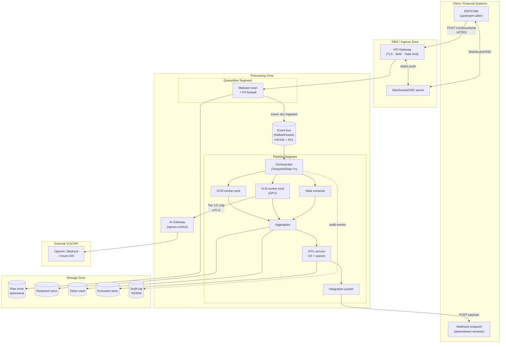

---

### §11.7 Bảng tham chiếu triển khai các hãng

| Nhóm | Hãng / Dịch vụ | Vai trò trong IDP | Ghi chú |
|------|---------------|------------------|---------|
| **OCR / Document AI** | AWS Textract | OCR + layout + bounding box; confidence score; Tier 1/2 | BDA (Blueprint) cho template-based; nhanh, rẻ |
| | Azure Document Intelligence v4.0 | OCR + VLM hybrid (Foundry); prebuilt invoice/KYC model | Tích hợp Azure AI Search cho RAG downstream |
| | Google Document AI | OCR + form parser; Pub/Sub native | Tốt cho pipeline GCP-native |
| | PaddleOCR / Tesseract | Self-hosted OCR; Tier 0/3/4 | Không phụ thuộc cloud; cần infra riêng |
| **VLM / LLM** | Amazon Bedrock (Claude/Titan) | VLM inference; qua AI Gateway | Tier 1/2; audit trail Bedrock native |
| | Azure OpenAI | GPT-4o vision; Tier 1/2 qua APIM | VNet integration cho Tier 2 |
| | Google Vertex AI (Gemini) | VLM + multimodal; Tier 1/2 | Pub/Sub event-driven native |
| | Self-hosted (vLLM + LLaMA/Qwen-VL) | VLM Tier 0/3/4 | GPU cluster nội bộ; không egress |
| | LlamaParse / Reducto / Extend | VLM-first parsing chuyên dụng | Tier 1/2; tốt cho PDF phức tạp |
| **Event / Messaging** | Apache Kafka (MSK/Confluent) | Event bus backbone; ACL topic; mã hóa | Multi-tenant, high throughput |
| | AWS SQS + SNS | Queue + fan-out; serverless; đơn giản | Tốt cho AWS-native setup |
| | Azure Service Bus + Event Grid | Queue + webhook delivery | Azure-native; retry/DLQ built-in |
| | Google Pub/Sub | Event streaming GCP | Ordering + exactly-once option |
| **Orchestration** | Temporal | Workflow engine; saga; checkpoint; HITL wait state | Recommended cho complex pipeline |
| | AWS Step Functions | Managed; native với Lambda/ECS | Tốt cho AWS-native; ít code |
| | Camunda 8 | BPM + BPMN; tốt nếu cần visual workflow | Phức tạp hơn Temporal |
| **PII / Bảo vệ dữ liệu** | Microsoft Presidio | Text + image PII detection/redaction; self-hosted | Open source; tùy chỉnh entity |
| | AWS Macie | S3 PII discovery; Tier 1/2 | Complement Presidio |
| | Azure PII Redaction (Document Intelligence) | PII redaction built-in | Azure-native workflow |
| **AI Gateway / Guardrails** | AWS Bedrock Guardrails | Policy runtime; content filter; PII | Tier 1/2 AWS |
| | Azure AI Content Safety | Content filter; prompt shield | Azure-native |
| | Apigee / Kong AI Gateway | Multi-provider gateway; rate limit; log | Provider-agnostic |
| | Custom + OWASP LLM guardrails | Self-hosted policy engine; Tier 0/3/4 | Không phụ thuộc vendor |
| **Bảo mật / KMS** | AWS KMS + CloudHSM | CMK; crypto-shredding; per-doc key | HSM cho Tier 3/4 |
| | Azure Key Vault + Managed HSM | Tương tự; Tier 2/3 | Managed HSM cho sovereign |
| | HashiCorp Vault | Self-hosted; đa cloud; token vault | Tier 0/3/4 |
| **Observability** | Datadog / Grafana + Prometheus | Metrics, tracing, log; queue depth dashboard | Chọn theo stack hiện tại |
| | AWS CloudWatch / Azure Monitor | Cloud-native observability | Tích hợp native với cloud services |
| | OpenTelemetry | Vendor-neutral tracing/metrics | Khuyến nghị làm instrumentation layer |

---

## §12 Yêu cầu phi chức năng (NFR)

Bảng mở rộng từ NFR tóm tắt (workflow §10). Mỗi thuộc tính có: **mục tiêu cụ thể**, **biện pháp thực hiện**, và **cách kiểm chứng/verify**.

> **Lưu ý placeholder:** Các con số p95 latency và throughput được đánh dấu `[GĐ0]` — phải được client ký nhận tại Giai đoạn 0 (Discovery) sau khi có tài liệu mẫu và baseline đo thực tế. Không dùng con số giả định để tính SLA hợp đồng.

---

### §12.1 Bảng NFR đầy đủ

| Thuộc tính NFR | Mục tiêu cụ thể | Biện pháp thực hiện | Cách kiểm chứng / Verify |
|---------------|----------------|--------------------|-----------------------------|
| **Khả năng mở rộng (Scalability)** | Xử lý tăng 10× tải đột biến mà không thay đổi kiến trúc | Event-driven fan-out; autoscale worker pool theo queue depth (§11.5); scale-to-zero VLM khi không tải; tách Priority/Bulk lane (§11.3) | Load test: inject 10× tải thông thường trong 5 phút; đo queue depth, throughput, error rate; xác nhận autoscale kích hoạt < 60s |
| **Thông lượng (Throughput)** | Priority lane: ≥ N trang/phút `[GĐ0]`; Bulk lane: ≥ M trang/giờ `[GĐ0]` | Parallel worker pool; batch API cho bulk; cache kết quả theo hash tài liệu (§6.6) | Benchmark với tài liệu mẫu thực tế; đo pages/min tại 50th/95th/99th percentile |
| **Độ trễ (Latency)** | Priority lane p95 < 60s (1–5 trang, OCR path) `[GĐ0]`; Bulk lane: eventual (giờ) | Hai lane tách biệt; reserved capacity Priority; queue buffer hấp thụ spike; cold start VLM < 90s | Đo distributed trace end-to-end (ingestion → HITL complete → result); p50/p95/p99; tách OCR path vs VLM path |
| **Độ tin cậy (Reliability)** | Uptime ≥ 99.5% cho API (không tính HITL wait time); không mất message | DLQ sau N retry (§6.4); idempotency state machine (§6.8) chống duplicate; circuit breaker downstream; checkpoint/resumable saga (§6.7); WAL-backed event bus | Chaos test: kill worker mid-processing → xác nhận resume đúng từ checkpoint; kiểm tra DLQ có capture message; đo uptime qua synthetic monitoring |
| **Idempotency & at-least-once safety** | Cùng `idempotency-key` không tạo duplicate job hoặc duplicate push xuống ERP | Idempotency record với trạng thái tường minh + lease timeout (§6.8, §10.4); outbound push idempotent với key riêng | Unit test: gửi cùng request 3 lần liên tiếp → chỉ 1 job được tạo; kiểm tra ERP nhận đúng 1 bản ghi |
| **Completeness & release-gating** | eKYC thiếu trường bắt buộc → không release; tài liệu partial không lọt xuống ERP | Completeness policy (§6.7) trong Aggregator; `status=partial` block outbound push; alert vận hành | Integration test: submit tài liệu thiếu trang bắt buộc → confirm status=partial, downstream_push=skipped |
| **Quan sát được (Observability)** | Mọi job traceable end-to-end; anomaly phát hiện < 5 phút | OpenTelemetry distributed tracing; metrics per stage (latency, cost/page, %VLM, %HITL, queue depth — §8.3); structured log (không PII); correlation ID per event | Truy trace một job_id cụ thể xuyên tất cả service; đo MTTD (Mean Time to Detect) anomaly bằng synthetic test |
| **Chi phí (Cost efficiency)** | VLM cost/page không vượt ngưỡng cấu hình; cache giảm VLM call trùng | Cache VLM result theo SHA-256 hash trang (§6.6); batch API cho bulk lane; giám sát tỷ lệ %VLM thực tế qua dashboard | Đo cost/page thực tế mỗi tuần; so sánh trước/sau cache; alert khi %VLM vượt ngưỡng cấu hình |
| **Cấu hình runtime** | Thay OCR engine, VLM endpoint, business rule không phải build lại | Dispatch table cấu hình (extractor per region type); schema/document-type management plane (§4-D scope-implementation); feature flag; hot-reload config | Thay OCR engine (ví dụ Textract → PaddleOCR) qua config; chạy pipeline → confirm đúng engine được dùng mà không redeploy |
| **Bảo mật — PII & data minimization** | PII không lọt vào log, event bus, hay VLM prompt khi không được phép | PII firewall trước model (§4.2); claim-check trên event bus (§6.4); log redact-by-design (§8.10); raw auto-purge sau extract | Audit log review: grep PII pattern (CCCD, tax_id) trong log — không được xuất hiện dưới dạng plaintext; pen test injection qua tài liệu |
| **Bảo mật — tier enforcement** | Tier 0/3/4 không có egress ra VLM-API ngoài | Tier routing cứng trong Orchestrator + AI Gateway block (§8.5, §11.1); network policy cứng (§11.4) | Deploy Tier 3 document → xác nhận AI Gateway block egress; network policy test (iptables/firewall rule verify) |
| **Tuân thủ (Compliance)** | Audit log ≥ 1 năm; crypto-shredding chứng minh được; GDPR right-to-erasure < 72h | WORM audit log (§7.3); crypto-shredding per-doc key (§7.7); retention policy tự động; consent capture tại ingestion | Xóa một job_id: confirm raw zone purged + key destroyed (KMS audit); audit log tồn tại sau 12 tháng; DSAR test |
| **Toàn vẹn output (Output integrity)** | Không có hallucination lọt xuống ERP mà không qua HITL | Full HITL duyệt 100% trước release (§4.10); schema validation + business rule tại extraction (§4.9); HITL dashboard hiển thị crop nguồn để reviewer đối chiếu | Manual audit: so sánh 100 job kết quả vs tài liệu gốc; đo reviewer_corrections_count; đo first-pass yield |
| **Khả năng phục hồi (Recoverability)** | RTO (Recovery Time Objective) < 15 phút sau sự cố; RPO < 5 phút | Checkpoint saga per vùng/trang (§6.7); result cache bảo vệ công việc đã làm; event bus durable (Kafka replication); orchestrator durable state | Chaos test: kill orchestrator process; restart; đo thời gian resume; xác nhận không mất job đang chạy |
| **Hiệu năng HITL UI** | Reviewer xử lý ≥ 30 tài liệu/giờ cho hóa đơn đơn giản | Pre-fill kết quả trích xuất; highlight field confidence thấp; hiển thị crop nguồn cạnh field; hotkey confirm/reject | User testing với reviewer thực tế; đo thời gian xử lý trung bình/tài liệu; NPS reviewer |

---

### §12.2 Thứ tự ưu tiên NFR

Phản ánh quality attribute priority (§2.2):

```
Bảo mật & tuân thủ
  > Toàn vẹn output (không hallucination lọt ERP)
    > Idempotency & reliability
      > Khả năng quan sát
        > Độ trễ (hai lane — priority trước bulk)
          > Chi phí
            > Cấu hình runtime
```

Khi có trade-off (ví dụ giảm độ trễ vs tăng bảo mật), luôn ưu tiên theo thứ tự trên. Điều chỉnh theo use case: eKYC ưu tiên **tuân thủ + độ trễ thấp** hơn; số hóa nội bộ bulk ưu tiên **throughput + chi phí** hơn.


---

## §13 Lộ trình triển khai

Phần này hợp nhất bốn chiều lộ trình — kiến trúc (§4–§8), use case & phạm vi giao hàng (§3–§4 phạm vi), chi phí/FinOps (§9), và vận hành/LLMOps (§8) — thành một kế hoạch giai đoạn duy nhất. Mỗi giai đoạn chỉ khởi động khi tiêu chí ra của giai đoạn trước được xác nhận; không chạy song song các giai đoạn.

---

### §13.1 Bảng tổng hợp giai đoạn

| GĐ | Tên | Mục tiêu | Hạng mục chính | Tiêu chí ra |
|----|-----|----------|----------------|-------------|
| **0** | Discovery | Chốt toàn bộ điều kiện tiên quyết trước khi viết một dòng code | (1) Thu thập và phân tích mẫu tài liệu đại diện. (2) Client ký nhận: KPI nghiệm thu (STP, first-pass yield, lỗi/1.000, cycle time), ngưỡng chính xác theo use case (KYC ~99,5%; hóa đơn/AP ~99%; phân loại nội bộ ~92%), trần chi phí per-document và per-session. (3) Xác nhận khung tuân thủ (GDPR/PDPA/SBV/ISO 27001) và tier bảo mật cho từng use case. (4) Chốt endpoint API hạ nguồn (ERP/CRM) + credentials. (5) Lập mô hình cost-per-document hai kịch bản (GĐ1 full-HITL và GĐ3 confidence-gating). (6) Định nghĩa SLO (độ trễ p95 theo lane, uptime) và ngưỡng eval gate (hallucination, drift, PII). | KPI + ngưỡng chính xác + trần chi phí + SLO + mô hình cost-per-document được ký nhận bởi tất cả các bên. Bộ mẫu tài liệu đại diện có sẵn. Endpoint hạ nguồn đã xác nhận. |
| **1** | Lõi tất định + full HITL + event backbone | Đưa một use case (hóa đơn/AP) vào vận hành thật với nền kiến trúc đầy đủ; thu thập golden data từ mọi quyết định của reviewer | (1) Pipeline OCR-first tất định: ingestion → PII firewall → phân loại tài liệu → OCR + LLM trích field → validation (§4.1–4.2, §4.5, §4.9). (2) Storage 4 zone (raw/redacted/vault/extracted) + audit WORM (§5). (3) Event backbone: message queue, fan-out/fan-in, idempotency state machine, DLQ, completeness policy, saga mức tài liệu + checkpoint/resumable (§6). (4) File Proxy + tier-aware routing + mã hoá per-doc (§7). (5) Full HITL 100%: UI pre-fill/highlight confidence/crop nguồn + hàng đợi ngoại lệ; bắt diff predicted-vs-corrected làm golden data (§4.10). (6) AI Gateway kích hoạt đủ vai trò control plane: routing/rate-limit/virtual-key/budget enforcement/PII guardrail (§8.5 + ADR-5, ADR-16). (7) Observability nền: tracing cấp span xuyên pipeline, correlation ID per event, metrics (latency/cost-per-document/%VLM/%HITL/queue depth), alert sớm (§8 LLMOps). (8) Cost dashboard: cost-per-document tách theo loại/vendor/tier; guardrail 3 lớp cưỡng chế tại Gateway (§9, ADR-16). (9) Integration layer ERP/CRM GĐ1: API submit/status/result + webhook/callback + idempotency-key client + đẩy JSON có cấu trúc vào endpoint hạ nguồn (§10, ADR-14). (10) KPI dashboard nghiệp vụ: STP, first-pass yield, lỗi/1.000, cycle time — baseline + theo dõi. (11) Registry tài sản nền + audit log bất biến WORM ≥1 năm. | Use case hóa đơn/AP đạt KPI nghiệm thu đã ký. Gateway + observability + audit chạy và trace được xuyên pipeline. Cost-per-document đo được và nằm trong biên mô hình hóa. Golden data từ HITL bắt đầu tích lũy. |
| **2** | Hybrid VLM + phân đoạn vùng (vẫn tất định) | Nâng năng lực xử lý tài liệu khó; mở use case 2 (KYC); tích lũy golden data đủ sâu; xây evaluation harness | (1) Phân đoạn vùng (region segmentation): object detection → gắn nhãn loại vùng → phát event per vùng; manifest/expected-count (§4.3). (2) Đường VLM cho vùng hình/diagram phức tạp; sub-extractor chuyên biệt: table extractor, chart-to-data, math OCR, signature/stamp detect (§4.6–4.7). (3) Dispatcher tất định theo loại vùng + tier — dispatch tĩnh, KHÔNG load-aware degradation (§4.4, ADR-10). (4) Merge/aggregation fan-in với partial failure handling (§4.8). (5) Vận hành hàng đợi ngoại lệ: routing ca tới reviewer, ưu tiên, trạng thái, escalation. (6) Schema management plane: định nghĩa field/rule bằng config + vài mẫu gán nhãn, không cần kỹ năng ML. (7) Evaluation harness trong CI/CD: chấm đồng thời quality + cost + policy; ngưỡng hallucination/drift/PII; eval set từ golden data HITL; gate "đèn đỏ" chặn thay đổi "tăng nhẹ chính xác, tăng mạnh chi phí" (ADR-15). (8) Versioning (prompt/model/schema) + rollback tự động + kill switch tại Gateway (§7 LLMOps). (9) Tối ưu phần máy: result cache theo hash giảm gọi VLM lặp; cắt tỉa cửa sổ ngữ cảnh; batch API cho bulk lane. (10) Use case KYC onboarding với full HITL 100%. | Use case KYC đạt KPI nghiệm thu. Mọi release phải qua eval gate (quality + cost + policy). Rollback test được. Golden data đủ sâu để đánh giá mức tin cậy theo loại field/vendor. %VLM và cost-per-document nằm trong biên. Không regression use case 1. |
| **3** | Golden data → nới confidence-gating + hardening | Dùng golden data tích lũy để nới full-HITL sang confidence-gating có chứng minh; giảm chi phí lao động; hardening bảo mật/vận hành | (1) Phân tích golden data: chứng minh độ tin cậy theo loại field/vendor/tier → xác định phần nào đủ điều kiện nới khỏi full-HITL (§4.10). (2) Nới full-HITL → confidence-gating có kiểm soát: field confidence cao đã chứng minh qua gate tự động; field confidence thấp vẫn đẩy HITL; VLM-as-verifier cho field cần đối chiếu pixel (§5.3, ADR-11 nới có điều kiện). (3) Mở model tier routing động theo độ khó (ADR-10 nới): Haiku/model nhỏ cho việc thô đã chứng minh; model mạnh chỉ cho phần cần suy luận — đồng bộ với nới confidence-gating. (4) ZDR đầy đủ: tokenization vault + stateless proxy; confidential computing cho inference nhạy cảm (§7, ADR-6 hoàn thiện). (5) Drift monitoring đầy đủ: theo dõi phân phối input, tỷ lệ HITL-correction theo vendor, chất lượng field theo thời gian; cảnh báo và rollback khi vi phạm ngưỡng. (6) Evaluation gate nâng cao: định kỳ re-eval toàn bộ golden data set; tự động phát hiện phần đã nới nhưng drift. (7) Giảm %HITL kéo giảm cost-per-document — ROI lao động thực sự đến ở giai đoạn này. | %HITL giảm đáng kể so với GĐ2 mà không regression chất lượng hoặc chi phí. Cost-per-document giảm theo mô hình GĐ3 đã ký ở GĐ0. Drift/anomaly được phát hiện và xử lý tự động. ZDR hoạt động đầy đủ. |
| **4** | Agentic (tùy chọn) | Chỉ triển khai khi một use case cụ thể chứng minh ROI vượt luồng tất định; bắt buộc kèm phanh tài chính và ràng buộc agency | (1) Workflow engine điều phối agentic (Temporal/Step Functions/Camunda): vòng tự sửa lỗi có giới hạn bước, tool-calling với least-privilege tuyệt đối, cấm auto-execute tool từ nội dung tài liệu (§4.12, ADR-8). (2) Trần chi phí bắt buộc per-session: phiên agent không được chạy không giới hạn; vượt trần → dừng và đẩy HITL; không tùy chọn (§9, ADR-16). (3) Cân nhắc guardian-agent giám sát agent: bắt buộc ánh xạ OWASP Agentic Top 10 (12/2025), NIST AI RMF, Singapore IMDA (1/2026) trước khi triển khai. (4) MCP (Model Context Protocol) mở cho ứng dụng ngoài qua gateway kiểm soát (§10). (5) Least-Agency chặt: mỗi agent nhận tập quyền và mức tự chủ tối thiểu cần thiết; phải ràng buộc và test được trước khi trao quyền production. (6) Kill switch + rollback đến luồng tất định GĐ3 phải hoạt động bất cứ lúc nào. | ROI đo được vượt luồng tất định GĐ3 *sau khi* trừ toàn bộ chi phí agentic (hệ số nhân 5–30×). Agent ràng buộc được và kill switch hoạt động. Ánh xạ OWASP Agentic/NIST/IMDA đầy đủ. Trần chi phí per-session vận hành. |

---

### §13.2 Đóng góp theo mục kiến trúc — mỗi giai đoạn làm gì

Bảng dưới tóm tắt đóng góp của từng giai đoạn vào mỗi mục kiến trúc chính. Tham chiếu số mục theo dàn bài chuẩn của tài liệu này.

| GĐ | §4 Thành phần | §5 Dữ liệu | §6 Thực thi/messaging | §7 Bảo mật | §8 LLMOps | §9 Chi phí | §10 Tích hợp/API |
|----|---------------|------------|----------------------|------------|-----------|------------|------------------|
| **0** | Xác nhận scope thành phần; phân tích mẫu tài liệu | Xác nhận tier tuân thủ; zone storage phù hợp use case | Không xây; chỉ thiết kế event schema | Xác nhận khung tuân thủ; tier bảo mật per use case | Định nghĩa SLO, ngưỡng eval gate, ngưỡng alert | Lập mô hình cost-per-document hai kịch bản; client ký trần chi phí và ngưỡng chính xác | Xác nhận endpoint hạ nguồn; thiết kế contract API hai chiều |
| **1** | Ingestion, PII firewall, phân loại tài liệu, OCR+LLM trích field, validation, full HITL (§4.1–4.2, §4.5, §4.9–4.10) | 4 zone storage + audit WORM; File Proxy; tier-aware; crypto-shred raw sau extract (§5) | Event backbone đầy đủ: queue, fan-out/fan-in, idempotency state machine, DLQ, saga + checkpoint + completeness policy (§6) | Gateway control plane đầy đủ (routing/rate-limit/virtual-key/budget/PII/guardrail); RBAC/MFA HITL; audit WORM; Zero Trust (§7) | Tracing cấp span nền; metrics dashboard; alert sớm; registry tài sản nền; full-HITL = guardian (§8) | Cost telemetry vào event schema; cost-per-document dashboard; guardrail 3 lớp cưỡng chế tại Gateway (§9) | Integration layer ERP/CRM: submit/status/result API + webhook + idempotency; push JSON có cấu trúc (§10) |
| **2** | Phân đoạn vùng + VLM + sub-extractor (table/chart/math/signature) + merge fan-in + dispatcher tĩnh theo loại vùng (§4.3–4.8) | Schema management plane; version schema trong event | Fan-out per vùng + manifest/expected-count; partial failure handling; result cache theo hash; cắt tỉa ngữ cảnh (§6) | Kill switch tại Gateway; versioning + rollback prompt/model/schema (§7 LLMOps) | Evaluation harness CI/CD: quality+cost+policy gate; eval set từ golden data; red-team gate; change control (§8) | Tối ưu phần máy: result cache + batch API + dispatch tĩnh giảm %VLM; tinh chỉnh cost-per-document (§9) | Exception-queue ops; reconciliation downstream; kênh thông báo hoàn thành WebSocket/SSE; use case KYC (§10) |
| **3** | VLM-as-verifier cho field confidence thấp; model tier routing động (ADR-10 nới); confidence-gating có chứng minh (§4.3–4.10) | Drift monitoring toàn bộ zone; lineage nâng cao; auto-purge theo confidence-gating | Routing động theo golden data evidence; re-emit event khi nới gating; không phá saga/checkpoint đã có (§6) | ZDR đầy đủ: vault + stateless proxy; confidential computing inference; hardening bảo mật toàn diện (§7) | Eval gate định kỳ re-eval golden data set; auto-rollback khi vi phạm ngưỡng; drift đầy đủ (§8) | %HITL giảm → cost lao động giảm → ROI lao động thực đến; mô hình cost-per-document GĐ3 so với GĐ1 (§9) | API nâng cao: schema versioning; SLA per lane; anomaly reporting; multi-use-case routing (§10) |
| **4** | Workflow engine agentic; vòng tự sửa; tool-calling least-privilege; cấm auto-exec từ tài liệu; MCP qua gateway (§4.12) | Không thêm zone; giữ nguyên 4 zone; lineage xuyên vòng tự sửa | Saga agentic multi-step; context window management chặt; cắt tỉa ngữ cảnh gửi lại (§6) | Least-Agency; guardian-agent (cân nhắc); OWASP Agentic Top 10; NIST AI RMF; IMDA; kill switch + rollback về GĐ3 (§7) | Ánh xạ đầy đủ chuẩn pháp lý agentic; eval gate cho vòng tự sửa; registry agent (§8) | Trần chi phí per-session bắt buộc; giám sát hệ số nhân agentic 5–30×; ROI đo được vượt GĐ3 (§9) | MCP cho ứng dụng ngoài; API agentic; tool registry least-privilege; multi-agent coordination (§10) |

---

### §13.3 Nhấn mạnh: Giai đoạn 0 và đầu tư guardrail sớm

**Giai đoạn 0 thường bị bỏ qua, nhưng là nơi quyết định thành/bại ROI.** Hai nguyên nhân chính dự án AI bị hủy — triển khai trước khi mô hình hóa chi phí, và thiếu phanh tài chính — đều có thể ngăn ngừa hoàn toàn ở GĐ0. Không bắt đầu build khi chưa có: mô hình cost-per-document + ngưỡng chính xác theo use case + trần chi phí + SLO + endpoint hạ nguồn, tất cả được ký nhận bởi tất cả các bên.

**Đầu tư guardrail ở GĐ1 — không để sang sau.** Nhóm đầu tư guardrail sớm (Gateway đủ vai trò control plane + observability cấp span + audit WORM ngay GĐ1) là nhóm đạt quy mô production. Hai hạng mục thường bị trì hoãn nhưng không được trì hoãn: **(a) cost guardrail 3 lớp cưỡng chế tại Gateway** (nếu không có, bill có thể vượt 3× kế hoạch trước khi phát hiện); **(b) evaluation harness trong CI/CD** (nếu không có, thay đổi prompt/model/schema phá chất lượng mà không ai biết cho đến khi lỗi ra production). Cả hai được xây ở GĐ1 (guardrail) và GĐ2 (eval harness) — không để sang GĐ3.

**Full HITL ở GĐ1–2 là guardrail kiến trúc, không phải gánh nặng tạm thời.** Hai vai trò đồng thời: (1) hàng rào toàn vẹn — bắt hallucination và output bị injection thao túng trước khi release; (2) sinh golden data — mọi xác nhận của reviewer trở thành dữ liệu nhãn chất lượng cao để đánh giá VLM và làm cơ sở nới confidence-gating ở GĐ3. Đây là "vòng đức hạnh": càng review kỹ ở GĐ1–2, càng nới được nhiều ở GĐ3 mà không mất an toàn.

---

## §14 Phụ lục — ADR & Thuật ngữ

### §14.1 Architecture Decision Records

Mỗi ADR ghi lại một quyết định kiến trúc cốt lõi: điều gì đã được chọn, tại sao, và đánh đổi phải chấp nhận. ADR-1 đến ADR-13 là các quyết định nền từ thiết kế ban đầu; ADR-14 đến ADR-16 là các quyết định mới bổ sung để hoàn thiện khung hợp nhất.

| ID | Quyết định | Lý do | Đánh đổi |
|----|-----------|-------|----------|
| **ADR-1** | Hybrid OCR + VLM, **dispatch cố định theo loại vùng** (text→OCR rẻ; bảng/biểu đồ/công thức/chữ ký→sub-extractor; hình/diagram phức tạp→VLM) | Cân bằng chi phí/độ chính xác trong một luồng tất định: OCR đủ tốt cho text; VLM chỉ khi thực sự cần; sub-extractor chuyên biệt cho loại nội dung có cấu trúc | Mất tối ưu chi phí của routing động theo confidence/tải (để sang GĐ3); một pipeline duy nhất → mọi tài liệu cùng loại đi cùng đường |
| **ADR-2** | PII firewall đặt **trước** model và trước lưu trữ dài hạn | Giảm PII chạm model bên thứ ba ngay từ điểm vào; giảm bề mặt vi phạm dữ liệu; phù hợp GDPR/PDPA data minimization | Thêm độ trễ tiền xử lý; cần engine phát hiện PII (text + image) chạy trên mọi tài liệu trước mọi bước xử lý khác |
| **ADR-3** | Tách **4 zone storage** (raw / redacted / token vault / extracted) mỗi zone có khoá mã hoá riêng, retention riêng, access policy riêng | Cô lập rủi ro giữa các giai đoạn xử lý; breach một zone không tự động lộ zone khác; retention độc lập (raw ephemeral, extracted lâu dài, audit WORM ≥1 năm) | Vận hành nhiều kho; cần lifecycle automation per zone; complexity cao hơn một kho gộp |
| **ADR-4** | **Crypto-shredding** để "xoá" dữ liệu: mã hoá mỗi tài liệu/tenant bằng khoá riêng; xoá = huỷ khoá | Xoá tức thì, chứng minh được (không cần overwrite từng byte); đáp ứng GDPR "right to be forgotten" kể cả trên backup; phù hợp ZDR | Quản lý khoá per-document/per-tenant: cần KMS ngoài; khoá hết hạn/mất = mất dữ liệu vĩnh viễn (không recovery) |
| **ADR-5** | **AI Gateway tập trung**: mọi lời gọi model đi qua một gateway áp một chính sách chung | Một điểm kiểm soát cho mọi provider; đổi model/provider không phá posture bảo mật; gom audit về một chỗ; bề mặt tấn công nhỏ nhất | Gateway là điểm tập trung → cần HA + failover; bottleneck nếu không scale đúng |
| **ADR-6** | **ZDR (Zero Data Retention) + tokenization**: tokenize PII trước khi gửi model; proxy stateless; RAG nạp context vào bộ nhớ tạm và xả sau tác vụ | Loại bỏ hidden cache ở provider; LLM không thấy giá trị gốc; đáp ứng yêu cầu zero-retention của tier cao | Chi phí vault và latency detokenize; cần thiết kế prompt không phụ thuộc giá trị raw |
| **ADR-7** | **Tier-aware routing & placement**: mức nhạy cảm dữ liệu chi phối định tuyến, lưu trữ, và vị trí triển khai; Tier 0/3/4 → self-hosted, không ra VLM-API ngoài | Tuân thủ data residency/sovereignty; chặn cứng đường ra VLM-API bên thứ ba cho dữ liệu nhạy cảm cao; phù hợp SBV/GDPR | Giảm linh hoạt và tăng chi phí ở tier cao (phải self-host); pipeline phân nhánh theo tier |
| **ADR-8** | **Event-driven async + orchestration** (workflow engine trên nền event bus, không choreography thuần) | Hợp với thời gian xử lý biến thiên lớn (ms đến giờ); HITL vốn bất đồng bộ; vòng tự sửa = re-emit event; orchestrator cho thấy trạng thái tài liệu, đặt timeout, và compensation — choreography thuần không làm được | Cần workflow engine (Temporal/Step Functions/Camunda) + kỷ luật distributed tracing; phức tạp hơn REST đơn giản |
| **ADR-9** | **Phân đoạn vùng (region segmentation) + sub-extractor chuyên biệt** (table/chart/math/signature) như plugin cắm vào theo loại vùng | Nội dung phức tạp (bảng lồng, biểu đồ, công thức) cần extractor riêng; tránh ép VLM đắt cho text mà OCR xử lý được; sub-extractor chuyên biệt chính xác hơn VLM tổng quát cho loại nội dung có cấu trúc | Thêm bước segmentation (object detection) trước xử lý; nhiều extractor phải maintain; partial failure của một extractor cần xử lý trong aggregator |
| **ADR-10** | **Luồng deterministic đơn — không chọn model động/load-aware** ở GĐ1–2: cùng input luôn cho cùng đường xử lý; dispatch tĩnh theo loại vùng (ADR-9), không nâng-ngưỡng-confidence-hay-tải động | Dễ test/audit/chứng minh hành vi cho eKYC; xoá mâu thuẫn "load-aware degradation vs tier accuracy"; cùng input → cùng kết quả → reproducible. Nút thắt VLM khi tải cao xử lý bằng queue/backpressure/rate-limit (§6.4, §6.6), không hạ cấp chất lượng | Mất tối ưu chi phí của routing động (ví dụ doc dễ đẩy sang OCR-only khi tải cao). **ADR-10 được nới ở GĐ3** sau khi golden data đủ để chứng minh routing động an toàn |
| **ADR-11** | **Full HITL duyệt 100%** trước khi release ở GĐ1–2: không có gì auto-release; confidence chỉ ưu tiên/điều hướng sự chú ý reviewer, không gate | Không lỗi lọt; bắt hallucination và output bị injection thao túng; xác nhận của người = golden data nuôi đánh giá VLM. Điểm khởi đầu an toàn nhất cho eKYC | Reviewer là nút thắt 100% volume → UI duyệt nhanh (pre-fill/highlight/crop) là bắt buộc để throughput khả thi. **ADR-11 được nới ở GĐ3** khi golden data đủ và eval gate chứng minh tin cậy |
| **ADR-12** | **Saga mức tài liệu + checkpoint/resumable + completeness policy**: mỗi tài liệu là một saga có state persist; partial/lỗi → flag continue + resume; release tuân completeness policy | Resume chỉ phần dở (không chạy lại từ đầu) qua result cache (§6.8); completeness policy tách biệt quyết định resume và quyết định được phép release (eKYC thiếu phần bắt buộc → không release) | Cần persist state + manifest/expected-count; aggregator phức tạp hơn; lưu trữ kết quả trung gian per vùng/trang |
| **ADR-13** | **Idempotency record state machine**: `in-progress` / `succeeded` (kèm cache) / `failed-terminal`; lease có timeout; chỉ cache kết cục xác định — lỗi transient KHÔNG cache | Không đóng băng lỗi hạ tầng tạm thời thành terminal; server chết giữa chừng → record kẹt `in-progress` quá hạn → re-execute an toàn; đúng pattern Stripe. Cache chỉ cho kết cục nghiệp vụ tất định (validation fail = cache; server timeout = không cache) | Cần phân loại lỗi tường minh (transient vs terminal); cần lease/timeout mechanism; logic phức tạp hơn "cache kết quả đơn giản" |
| **ADR-14** | **Integration layer contract-first**: API hai chiều (submit/status/result) được thiết kế theo hợp đồng (OpenAPI/AsyncAPI) **trước khi build**, in-scope từ GĐ1; không để tích hợp sang giai đoạn sau | Tích hợp là nơi ROI sống hoặc chết — trích xuất không có đường ra ERP/CRM = nhân viên copy JSON thủ công = triệt tiêu tiết kiệm. Contract-first đảm bảo client ký nhận interface trước khi code; idempotency-key phía client và xử lý downstream rejection là yêu cầu bắt buộc | Client phải cung cấp endpoint + credentials từ GĐ0; hợp đồng API là ràng buộc cứng giữa hai bên; thay đổi contract sau cần versioning |
| **ADR-15** | **Evaluation gates trong CI/CD chấm đồng thời quality + cost + policy**: mọi thay đổi prompt/model/schema phải qua gate trước khi release; gate dùng golden data từ full-HITL làm eval set; "đèn đỏ" khi chất lượng tăng nhẹ nhưng chi phí tăng mạnh | Tách "demo" khỏi "production"; thay đổi nhỏ ở prompt/retrieval/model version có thể tác động lớn; eval-first là nền móng chứ không phải tính năng đính kèm. Gate cưỡng chế đường Pareto chính xác–chi phí: chọn ngưỡng theo rủi ro use case rồi tối thiểu chi phí đạt ngưỡng — không cho chính xác "trôi" | Cần xây eval harness từ GĐ2 (không có sẵn); cần golden data đủ sâu (GĐ1 full-HITL phải chạy đủ lâu trước khi eval harness có dữ liệu tốt); thêm bước trong pipeline CI/CD |
| **ADR-16** | **Cost guardrails cưỡng chế tại Gateway trước khi tiêu — 3 lớp**: per-action (từng lời gọi model), per-document/per-session (trọn vòng một tài liệu), per-tenant/per-team (quota theo khách hàng/đội); vượt ngưỡng → chặn *trước* lời gọi kế tiếp, không cảnh báo sau hóa đơn | 96% doanh nghiệp vượt dự toán AI; chỉ 44% có financial guardrails thực sự; phiên agent không trần đốt budget theo hệ số nhân 5–30×. "Chặn trước khi tiêu" là yêu cầu kỹ thuật phân biệt với "cảnh báo ngân sách" thông thường. Chặn-vì-vượt-trần là kết cục nghiệp vụ tất định (ADR-13: cache được) | Gateway phải đếm token tích lũy theo correlation/session ID theo thời gian thực và so ngưỡng trước mỗi lần forward; cần thiết kế state đếm token không phá throughput; trần sai → block hợp lệ hoặc cho qua khi lẽ ra chặn |

---

### §14.2 Thuật ngữ

Bảng dưới gộp toàn bộ thuật ngữ kỹ thuật sử dụng trong tài liệu. Mục tiêu: một lần tra cứu cho cả developer, reviewer, và security auditor.

| Thuật ngữ | Định nghĩa |
|-----------|------------|
| **IDP** (Intelligent Document Processing) | Hệ thống biến tài liệu phi cấu trúc/bán cấu trúc thành dữ liệu có cấu trúc sẵn sàng cho nghiệp vụ và AI, kết hợp OCR, VLM, và các sub-extractor chuyên biệt. |
| **VLM** (Vision-Language Model) | Mô hình thị giác–ngôn ngữ đọc thẳng ảnh trang/vùng và xuất text/JSON có cấu trúc; xử lý scan mờ, chữ viết tay, hình và diagram phức tạp mà OCR không làm được. |
| **HITL** (Human-in-the-loop) | Con người tham gia vào vòng xử lý để xác nhận hoặc sửa output của model trước khi release. Ở GĐ1–2 là **full HITL** (100% volume). Ở GĐ3+ nới sang confidence-gating. |
| **OCR-free** | Kiến trúc nơi VLM đọc thẳng ảnh, không có bước OCR riêng biệt để trích text. Đắt hơn OCR-first nhưng linh hoạt hơn với tài liệu khó. |
| **Phân đoạn vùng** (region segmentation) | Bước chia mỗi trang thành các vùng theo loại nội dung (text block, bảng, hình, biểu đồ, công thức, chữ ký/con dấu) để định tuyến mỗi vùng tới extractor chuyên biệt thay vì ép cả trang qua một extractor. |
| **Sub-extractor** | Extractor chuyên biệt cho một loại nội dung cụ thể: table extractor (bảng lồng/tràn trang), chart-to-data (chuỗi số liệu nền của biểu đồ), math OCR (công thức → LaTeX), signature/stamp detection (chữ ký/con dấu theo pixel). |
| **PII firewall** | Lớp phát hiện và redact/băm/tokenize PII đặt trước model và trước lưu trữ dài hạn; giảm PII chạm model bên thứ ba ngay từ điểm vào. |
| **AI Gateway / Guardrails** | Control plane runtime đặt mọi lời gọi model đằng sau một điểm kiểm soát duy nhất: routing/rate-limit/virtual-key/budget enforcement/PII guardrail/content safety. Đổi model/provider không phá posture. |
| **Control plane** | Lớp điều phối và cưỡng chế chính sách ở runtime: AI Gateway + cost guardrails + eval gates + kill switch. Phân biệt với data plane (thực thi xử lý tài liệu). |
| **Choreography vs Orchestration** | **Choreography**: các service tự phản ứng event mà không có nhạc trưởng — đơn giản nhưng khó quan sát trạng thái toàn hệ, khó đặt timeout, khó compensation. **Orchestration**: workflow engine điều phối tập trung — biết trạng thái từng tài liệu, đặt timeout, quản lý compensation saga. IDP dùng orchestration (hoặc hybrid) trên nền event bus. |
| **Claim-check** | Pattern: event mang *reference + metadata + tier*, không mang ảnh/PII/nội dung thô. Phần nặng/nhạy cảm nằm ở storage (qua File Proxy). Bus chỉ thấy con trỏ — khớp ZDR và giảm kích thước message. |
| **Fan-out / fan-in** | **Fan-out**: từ một event tài liệu tách thành nhiều event per vùng/trang để xử lý song song. **Fan-in** (aggregation): chờ đủ kết quả từ các vùng/trang (theo manifest/expected-count) rồi ráp lại, xử lý partial failure không chặn cả tài liệu. |
| **DLQ** (Dead-Letter Queue) | Hàng đợi nhận message sau N lần retry thất bại để không chặn dòng chính; cần runbook xử lý message trong DLQ. |
| **Idempotency** | Tính chất của một thao tác: thực thi lại cùng request nhiều lần không gây tác dụng phụ trùng lặp. Bắt buộc cho mọi consumer có side-effect trong hệ event-driven at-least-once delivery. |
| **Luồng deterministic** (luồng đơn) | Một đường xử lý cố định: cùng input luôn cho cùng đường xử lý; dispatch theo loại vùng (ADR-9), không chọn model động theo confidence/tải (ADR-10). Dễ test, audit, và chứng minh hành vi. |
| **Full HITL** | Mọi output đều phải người duyệt xác nhận trước khi save và trả file; không có gì auto-release. Confidence dùng để ưu tiên/điều hướng sự chú ý reviewer, KHÔNG dùng để gate. Áp ở GĐ1–2. |
| **Confidence-gating** | Cơ chế ở GĐ3+: field có confidence vượt ngưỡng đã chứng minh qua golden data → gate tự động; field dưới ngưỡng → đẩy HITL. Chỉ bật sau khi có đủ golden data và eval gate xác nhận tin cậy. |
| **Golden data** | Dữ liệu nhãn chất lượng cao tạo ra từ xác nhận/sửa chữa của reviewer trong giai đoạn full-HITL; dùng để (1) đánh giá độ chính xác VLM, (2) làm eval set trong CI/CD gate, (3) làm cơ sở chứng minh để nới confidence-gating ở GĐ3. |
| **Checkpointing / resumable processing** | Lưu kết quả từng vùng/trang đã hoàn thành và đánh dấu. Khi lỗi/dở, gán flag continue. Khi retry, đọc lại phần đã xong (qua result cache) và chỉ xử lý tiếp phần còn thiếu — không chạy lại từ đầu. |
| **Manifest / expected-count** | Số phần kỳ vọng của tài liệu do bước phân đoạn vùng phát ra; aggregator dùng để biết khi nào "đủ" để fan-in. |
| **Completeness policy** | Chính sách nghiệp vụ quyết định tài liệu được phép release hay phải giữ lại: eKYC thiếu phần bắt buộc → không release, giữ flag continue + cảnh báo. Tách biệt với flag continue (lo phần resume). |
| **Result cache** | Kho kết quả các vùng/trang đã hoàn thành đúng; phục vụ checkpointing/resumable và idempotency. Chỉ ghi khi thao tác thành công — không cache lỗi transient. |
| **Idempotency record / lease** | Bản ghi trạng thái (`in-progress` / `succeeded` kèm cache / `failed-terminal`) + lock có timeout. Lease hết hạn → re-execute an toàn. Chỉ ghi `succeeded` khi hoàn thành đúng; lỗi transient → không ghi → cho retry sau khi recover. |
| **ZDR** (Zero Data Retention) | Cam kết provider không giữ lại dữ liệu sau khi inference xong. Trong kiến trúc: tokenize trước khi gửi (LLM không thấy giá trị gốc); proxy stateless chỉ log metadata; RAG xả context sau tác vụ. |
| **Crypto-shredding** | "Xoá" dữ liệu bằng cách huỷ khoá mã hoá thay vì overwrite; tức thì, chứng minh được, hoạt động kể cả trên backup. |
| **Token vault** | Kho cô lập giữ ánh xạ token → giá trị thật PII; khoá riêng, access chặt nhất; chỉ detokenize theo role được phép. |
| **Tier-aware routing** | Định tuyến và placement có nhận thức về mức nhạy cảm dữ liệu: Tier 0/3/4 → self-hosted on-prem/sovereign, không ra VLM-API ngoài; Tier 1/2 → cloud + VLM-API qua gateway. |
| **Prompt injection** | Kỹ thuật tấn công nhúng chỉ thị độc hại vào input (kể cả văn bản ẩn trong tài liệu) để chiếm quyền điều khiển model. Biện pháp: coi nội dung tài liệu là dữ liệu, không phải lệnh (P9); tách system prompt; context isolation; gateway guardrail; strip text ẩn. |
| **Cost-per-document** | Đơn vị FinOps cốt lõi: tổng chi phí xử lý một tài liệu từ ingestion đến output release (bao gồm chi phí máy OCR/VLM/LLM + chi phí lao động HITL + hạ tầng phân bổ). Đo theo loại tài liệu/vendor/tier. |
| **Financial guardrail** | Cơ chế cưỡng chế trần chi phí *trước khi tiêu* (không phải cảnh báo sau hóa đơn): Gateway đếm token tích lũy và chặn lời gọi kế tiếp khi vượt ngưỡng. Ba lớp: per-action / per-document / per-tenant. |
| **Đường Pareto chính xác–chi phí** | Tập hợp các điểm cấu hình mà tại đó không thể tăng chính xác mà không tăng chi phí (và ngược lại). Hệ IDP "ngồi trên" đường Pareto bằng cách chọn ngưỡng chính xác theo rủi ro use case rồi tối thiểu chi phí để đạt ngưỡng — không tối đa hóa cả hai. Vài phần trăm chính xác cuối thường đắt gấp đôi. |
| **Evaluation gate** | Điểm kiểm tra tự động trong CI/CD chạy trước khi release: chấm đồng thời quality (hallucination, drift, field accuracy), cost (cost-per-document so mô hình hóa), và policy (PII-leak, tuân thủ). Pass/fail theo ngưỡng đã ký ở GĐ0. |
| **Span tracing** | Kỹ thuật distributed tracing theo dõi một request xuyên nhiều thành phần: mỗi chặng (ingestion→PII firewall→dispatch→extractor→merge→validation→HITL→integration) tạo một span con liên kết bằng correlation ID. Phân biệt với logging đơn giản (log per service, không liên kết). |
| **Least-agency** | Nguyên tắc OWASP Agentic: mỗi agent/worker nhận tập quyền và mức tự chủ tối thiểu cần thiết để hoàn thành nhiệm vụ. Không nới quyền sớm; trao quyền production chỉ khi agent đã ràng buộc và test được. |
| **Guardian agent** | Agent chuyên giám sát và ràng buộc hành vi của các agent khác; cân nhắc ở GĐ4 khi nới khỏi full-HITL. Ở GĐ1–2, full-HITL đóng vai trò guardian (con người duyệt 100%). Khái niệm GĐ4/doanh nghiệp — Gartner dự báo 40% CIO yêu cầu đến 2028. |
| **Registry tài sản** | Kho tập trung theo dõi mọi model/agent/extractor/pipeline kèm: owner, phân loại rủi ro, phụ thuộc dữ liệu, phạm vi pháp lý, version hiện tại. Bắt buộc cho khả năng audit và biện hộ trước auditor. |
| **Kill switch** | Công tắc ngắt tại Gateway dừng một đường xử lý (VLM, provider cụ thể, hoặc cả pipeline) khi vi phạm điều kiện: cost trần, anomaly bất thường, sự cố provider, vi phạm policy. Phải test được ở GĐ2 và rollback về GĐ trước hoạt động. |
| **Model tier routing** | Định tuyến động theo độ khó/confidence của tác vụ: model nhỏ/rẻ cho việc thô đã chứng minh; model lớn/mạnh chỉ cho phần cần suy luận phức tạp. Hoãn tới GĐ3 (ADR-10) do cần golden data làm cơ sở chứng minh và giữ tính tất định cho eKYC ở GĐ1–2. |


---

## Tài liệu liên quan (nội bộ)

Tài liệu kiến trúc này **hợp nhất và thay thế vai trò tra cứu chính** của năm tài liệu nghiên cứu nền. Khi cần chiều sâu lý do/nghiên cứu thị trường đằng sau một quyết định, tham chiếu:

- `workflow.md` — Khung kiến trúc nền (chi tiết pattern xử lý, messaging, bảo mật).
- `governance.md` — Quản trị, lưu trữ & cải tiến dữ liệu vận hành (event schema, lineage, vòng học).
- `scope-implementation.md` — Phạm vi giao hàng, KPI nghiệm thu, work breakdown, handoff.
- `cost-finops.md` — Ràng buộc tài chính & cơ chế quản lý chi phí (cost-per-document, guardrails).
- `operations-llmops.md` — Quản trị & vận hành runtime (control plane, observability, eval gates).

> Khi kiến trúc thay đổi: cập nhật tài liệu này TRƯỚC, rồi đồng bộ tài liệu nền liên quan. Mọi quyết định kiến trúc mới phải được ghi thành ADR ở §14.1.
