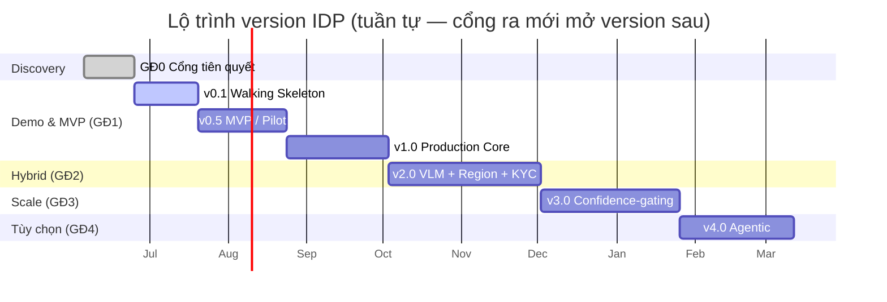
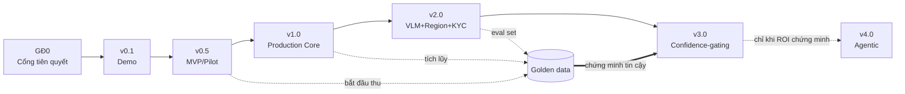

# Roadmap — Lộ trình triển khai hệ thống IDP

> **Phiên bản:** v1.0 (lộ trình thực thi)
> **Loại tài liệu:** Execution roadmap — kế hoạch hiện thực hóa theo từng version giao được (shippable), từ demo → production → scale.
> **Tài liệu nền:** [`Architecture_design.md`](Architecture_design.md) — SAD hợp nhất. Mọi quyết định kiến trúc, hợp đồng thành phần và ADR là **chuẩn cuối cùng** ở SAD (§14). Roadmap này **không thay thế** §13; nó bổ sung một lát cắt khác.

---

## Về tài liệu này

`Architecture_design.md §13` đã có một lộ trình **giai đoạn (GĐ0–4)** neo theo **trưởng thành use case + ROI + quản trị**. Tài liệu này bổ sung **lát cắt thực thi**: chia công việc thành các **version giao được** (`v0.1 → v4.0`), bắt đầu từ một **demo/walking-skeleton mỏng nhất chạy được end-to-end**, rồi mở rộng có kiểm soát theo **ba trục scale**:

| Trục scale | Câu hỏi trả lời | Tham chiếu SAD |
|---|---|---|
| **Tính năng (Feature)** | Hệ làm được gì? (loại tài liệu, loại vùng, extractor, confidence-gating, agentic) | §4, §13.1 |
| **Hạ tầng (Infrastructure)** | Chạy trên nền gì? (single-node → managed queue → autoscale → tier-aware hybrid) | §6, §11 |
| **Lượng user / tải (Volume)** | Phục vụ bao nhiêu? (vài tester → pilot reviewer → production volume → multi-tenant) | §11.5, §12 |

**Quan hệ với §13:** mỗi version dưới đây **ánh xạ vào một GĐ** của §13. Version chỉ "cắt mỏng" GĐ thành các mốc giao hàng nhỏ hơn để demo sớm và giảm rủi ro — **không bỏ qua tiêu chí ra của GĐ tương ứng**. Đặc biệt: **GĐ0 (Discovery) là điều kiện tiên quyết tuyệt đối** trước cả `v0.1` cho dữ liệu thật (xem §"Cổng GĐ0" bên dưới).

---

## Nguyên tắc lộ trình

1. **Demo-first, walking-skeleton.** Lát cắt dọc mỏng nhất chạy **toàn trình** (ingest → trích xuất → người duyệt → output) trước, rồi mới "dày" từng tầng. Không xây xong từng tầng theo chiều ngang rồi mới ráp.
2. **Mỗi version là một lằn ranh giao được.** Kết thúc mỗi version phải có thứ demo được cho stakeholder và có tiêu chí ra rõ ràng.
3. **Bảo mật không phải tính năng "thêm sau".** PII firewall, tier-aware routing, audit là *kiến trúc nền* (§7). Demo được phép **stub** chúng **chỉ khi** dùng dữ liệu tổng hợp/không nhạy cảm (xem §"Lằn cắt demo"). Dữ liệu thật ⇒ guardrail thật.
4. **Guardrail tài chính + eval gate đi sớm, không để sang GĐ3.** (SAD §13.3) — cost guardrail xây ở `v1.0`, eval harness ở `v2.0`.
5. **Không nới full-HITL trước khi có golden data đủ.** Confidence-gating chỉ bật ở `v3.0` (ADR-11 nới có điều kiện).
6. **Tính tất định trước, routing động sau.** Dispatch tĩnh theo loại vùng ở `v1–v2`; model tier routing động hoãn tới `v3.0` (ADR-10).

---

## Cổng GĐ0 (Discovery) — điều kiện tiên quyết, không bỏ qua

> **Không viết một dòng code production khi chưa qua cổng này.** (SAD §13.1 GĐ0, §13.3, §9.2)

| # | Hạng mục phải chốt & ký | Chặn version nào nếu thiếu |
|---|---|---|
| G0-1 | Bộ **mẫu tài liệu đại diện** (hóa đơn/AP) có sẵn | `v0.1` (cần để demo thật) |
| G0-2 | **KPI nghiệm thu** (STP, first-pass yield, lỗi/1.000, cycle time) | `v0.5` (pilot không có thước đo = vô nghĩa) |
| G0-3 | **Ngưỡng chính xác theo use case** (AP ~99%, KYC ~99,5%, phân loại ~92%) | `v0.5` |
| G0-4 | **Trần chi phí** per-document & per-session + **mô hình cost-per-document** 2 kịch bản | `v1.0` (guardrail cần ngưỡng) |
| G0-5 | **Khung tuân thủ + tier bảo mật** từng use case (GDPR/PDPA/SBV/ISO 27001) | `v0.5` cho dữ liệu thật |
| G0-6 | **Endpoint API hạ nguồn** (ERP/CRM) + credentials + hợp đồng contract-first | `v1.0` (ADR-14) |
| G0-7 | **SLO** (p95 latency theo lane, uptime) + **ngưỡng eval gate** (hallucination/drift/PII) | `v2.0` (eval gate) |

> Demo `v0.1` có thể bắt đầu với **chỉ G0-1** nếu dùng dữ liệu tổng hợp/Tier 1 và được hiểu rõ là demo nội bộ. Mọi thứ chạm dữ liệu khách hàng thật cần các cổng còn lại.

---

## Tổng quan các version

| Version | Tên | GĐ (§13) | Mục tiêu một câu | Use case | Lượng user/tải mục tiêu | Hạ tầng |
|---|---|---|---|---|---|---|
| **v0.1** | **Demo / Walking Skeleton** | GĐ1 (lát mỏng) | Chứng minh giá trị end-to-end trên 1 luồng happy-path | Hóa đơn/AP (text rõ) | 1–3 tester nội bộ; input qua API + UI | **Local — công cụ free self-host** (chưa dùng cloud); queue in-memory |
| **v0.5** | **MVP / Pilot** | GĐ1 (lõi) | Một pilot thật với reviewer thật, đo KPI | Hóa đơn/AP | 2–5 reviewer pilot; ~10²–10³ doc/tuần | 1 cloud env; managed queue; 4 zone storage |
| **v1.0** | **Production Core** | GĐ1 (đủ) | Vận hành production với đủ guardrail + tích hợp ERP | Hóa đơn/AP | Reviewer team; production volume; SLA | Autoscale theo queue; gateway; observability |
| **v2.0** | **Hybrid VLM + Region** | GĐ2 | Tài liệu khó + mở use case KYC + eval gate | + KYC onboarding | + reviewer KYC; 2 lane real-time/bulk | + GPU pool scale-to-zero; tier-aware hybrid |
| **v3.0** | **Scale + Confidence-gating** | GĐ3 | Nới HITL bằng golden data → giảm cost lao động | AP + KYC (+Claims tùy chọn) | Volume cao; %HITL giảm mạnh | + ZDR đầy đủ; dynamic routing; drift monitor |
| **v4.0** | **Agentic (tùy chọn)** | GĐ4 | Chỉ khi 1 use case chứng minh ROI vượt luồng tất định | Use case cụ thể | — | + workflow engine agentic; per-session cap |

> Thời lượng trong sơ đồ là **placeholder minh họa thứ tự phụ thuộc**, không phải cam kết lịch. Chốt số thực ở GĐ0 sau khi có baseline.

---

## Ba trục scale — thang tiến hóa

Mỗi trục tiến độc lập nhưng đồng bộ theo version. Bảng dưới đọc theo **cột (version)** để biết một thời điểm hệ đang ở đâu trên cả 3 trục.

### Trục A — Tính năng (Feature)

| Năng lực | v0.1 | v0.5 | v1.0 | v2.0 | v3.0 | v4.0 |
|---|---|---|---|---|---|---|
| Ingestion đa nguồn | Input qua API + UI | + email/scan | Đầy đủ + quality gate | + DPI nâng cao | — | — |
| PII firewall | Stub¹ / text cơ bản | Text PII (Presidio) | Text đầy đủ + tokenize | + Image PII bbox | + ZDR vault đầy đủ | — |
| Phân loại tài liệu | 1 loại cố định | Cơ bản | Cơ bản ổn định | — | — | — |
| Phân đoạn vùng | Full-page | Full-page | Full-page đơn giản | **Region segmentation** | — | — |
| Extractor | OCR + LLM field | OCR + LLM | OCR + LLM ổn định | + VLM + sub-extractor (table/chart/math/sig) | + VLM-as-verifier | — |
| Dispatch | Cố định 1 đường | Tĩnh cơ bản | Tĩnh text/full-page | **Tĩnh đủ loại vùng** | + **routing động** (ADR-10 nới) | — |
| Validation | Schema tối thiểu | Schema + vài rule | Business rule + grounding | + schema management plane | — | — |
| HITL | UI duyệt thô | Full HITL + pre-fill | Full HITL + crop/highlight + exception queue | + exception ops nâng cao | **Confidence-gating** | — |
| Integration | Xuất JSON file | API submit/status/result | + webhook + ERP push idempotent | + reconciliation + WebSocket | + multi-use-case routing | + MCP |
| Eval gate | — | — | — | **Eval harness CI/CD** | Re-eval định kỳ golden data | + eval vòng tự sửa |
| Agentic | — | — | — | — | — | **Workflow engine agentic** |

¹ *Chỉ ở demo với dữ liệu tổng hợp/không nhạy cảm — xem §"Lằn cắt demo".*

### Trục B — Hạ tầng (Infrastructure)

| Hạ tầng | v0.1 | v0.5 | v1.0 | v2.0 | v3.0 | v4.0 |
|---|---|---|---|---|---|---|
| Triển khai | **Local — công cụ free self-host** (chưa dùng cloud) | 1 cloud env (dev) — chốt nền tảng cloud | dev + prod; microservice | + tier-aware hybrid | + private/sovereign cho Tier cao | — |
| Messaging | In-memory / DB queue | Managed queue (SQS/Service Bus/PubSub) | Event bus đầy đủ (Kafka/Kinesis) + DLQ | + topic ACL theo tier; 2 lane queue | — | + saga agentic multi-step |
| Storage | 1 thư mục / 1 bucket | **4 zone** (raw/redacted/vault/extracted) | + audit WORM + crypto-shred + lifecycle | + per-tier bucket | — | — |
| Orchestration | Gọi hàm tuần tự | Saga tối giản (DB state) | **Workflow engine** (Temporal/Step Fn) + checkpoint | + completeness policy đầy đủ | — | + agentic orchestration |
| Compute | CPU only | CPU | CPU + autoscale theo queue | + **GPU pool scale-to-zero** (VLM) | — | — |
| AI Gateway | Bỏ qua / wrapper mỏng | Wrapper log cơ bản | **Control plane đầy đủ** (routing/rate-limit/budget/PII guardrail) | + kill switch + versioning/rollback | + dynamic routing policy | + per-session cap + tool registry |
| Mạng | 1 mạng | Tách cơ bản | **3 zone** (DMZ/Processing/Storage) + mTLS | + egress control chặt | + confidential computing | — |
| KMS | — | Khóa cơ bản | External KMS per-doc key | + HSM cho Tier 3/4 | — | — |

### Trục C — Lượng user / tải (Volume & Users)

| Chiều | v0.1 | v0.5 | v1.0 | v2.0 | v3.0 | v4.0 |
|---|---|---|---|---|---|---|
| Người dùng | 1–3 dev/tester | 2–5 reviewer pilot | Reviewer team + caller ERP | + reviewer KYC | Volume team rộng | Theo use case |
| Tải tài liệu | Vài chục, chạy tay | ~10²–10³/tuần | Production volume 1 use case | 2 use case; spike 10× chịu được (§12) | Volume cao, %HITL thấp | — |
| Đồng thời (concurrency) | 1 | Vài | Autoscale theo queue depth (§11.5) | + reserved capacity Priority lane | + scale động theo độ khó | — |
| SLA/SLO | Không | Best-effort | Uptime ≥99,5%; p95 theo lane `[GĐ0]` | + 2 lane SLA tách biệt | + RTO<15ph/RPO<5ph (§12) | — |
| Multi-tenant | Không | Single tenant | tenant_id trong schema; quota cơ bản | Per-tenant guardrail (§9.6 lớp 3) | Quota/throttle đầy đủ | — |
| Throughput HITL | N/A | Đo baseline reviewer | ≥30 doc/giờ hóa đơn đơn giản (§12) | + KYC review flow | Tăng nhờ confidence-gating | — |

---

## Chi tiết từng version

---

### v0.1 — Demo / Walking Skeleton

> **Ánh xạ:** GĐ1 (lát mỏng nhất). **Mục tiêu:** chứng minh giá trị toàn trình + làm tài liệu mẫu chảy qua hệ thật, **không** phải production.

**Phạm vi (in-scope)**
- Lát cắt dọc **happy-path duy nhất**: nhận 1 file hóa đơn PDF text rõ **qua 2 đường input — API (`POST` nộp tài liệu) và UI (form upload)** → OCR → LLM trích ~5–8 field cốt lõi (số hóa đơn, ngày, nhà cung cấp, tổng tiền, thuế) → **UI duyệt tối giản** (xem field cạnh ảnh, sửa, xác nhận) → xuất **JSON file**.
- **Hạ tầng:** chạy **local** bằng **công cụ free/open-source self-host được** (ví dụ OCR open-source như Tesseract/PaddleOCR; LLM local hoặc free-tier; Presidio cho PII) — **chưa dùng dịch vụ cloud trả phí**; nền tảng cloud sẽ được chọn ở `v0.5`. Pipeline gọi **tuần tự trong một process** (chưa cần message bus thật — in-memory/DB queue).
- Schema field tối thiểu + validation cơ bản (định dạng số/ngày).

**Out-of-scope (cố ý hoãn)**
- PII firewall thật, tier enforcement, 4-zone storage, audit WORM, cost guardrail, idempotency state machine, DLQ, saga, AI Gateway control plane, **integration API đầy đủ** (contract-first submit/status/result + webhook + ERP push — chỉ là endpoint nộp tài liệu tối giản ở demo), autoscale.

**Feature / Infra / Volume:** xem cột `v0.1` ở 3 bảng trục trên.

**Tiêu chí ra (exit)**
- Demo end-to-end chạy được trước stakeholder trên ≥1 mẫu thật (G0-1).
- Thu được phản hồi: field nào quan trọng, UI duyệt có dùng được không, độ chính xác OCR+LLM thô trên mẫu thật ra sao.
- **Quyết định go/no-go** mở rộng sang MVP.

**Rủi ro & đánh đổi**
- Dễ bị nhầm là "gần xong" → **phải truyền đạt rõ**: demo bỏ qua toàn bộ guardrail; khoảng cách tới production là phần lớn công sức (§13.3).
- **Cấm tuyệt đối** đưa dữ liệu khách hàng thật/PII vào `v0.1` khi PII firewall còn stub.

---

### v0.5 — MVP / Pilot

> **Ánh xạ:** GĐ1 (lõi). **Mục tiêu:** một pilot thật với reviewer thật, đo được KPI nghiệm thu trên dữ liệu thật Tier 1.

**Phạm vi (in-scope)**
- **PII firewall text** (Presidio + recognizer VN: CCCD, MST, số tài khoản) — bật thật trước khi chạm dữ liệu thật.
- **4 zone storage** (raw/redacted/vault/extracted), TTL raw cơ bản.
- **Saga tối giản** state trong DB + idempotency cơ bản theo content hash.
- **Full HITL** đúng nghĩa: pre-fill, highlight field confidence thấp, hàng đợi tài liệu.
- **Bắt diff predicted-vs-corrected** → bắt đầu tích lũy **golden data** (mạch máu của GĐ3).
- **Integration API** `submit/status/result` (contract-first, OpenAPI) — chưa cần webhook đầy đủ.
- KPI dashboard baseline: STP, first-pass yield, lỗi/1.000, cycle time.

**Out-of-scope:** VLM, region segmentation, sub-extractor, eval harness, autoscale GPU, ZDR đầy đủ, confidence-gating.

**Tiêu chí ra (exit)**
- Pilot hóa đơn/AP đạt (hoặc tiệm cận) **KPI nghiệm thu đã ký** (G0-2/G0-3).
- Golden data bắt đầu tích lũy đều.
- Reviewer xác nhận UI duyệt đạt throughput khả thi (hướng tới ≥30 doc/giờ).
- Cost-per-document đo được (dù chưa có guardrail cưỡng chế).

**Rủi ro & đánh đổi**
- Saga tối giản (DB state) chấp nhận được ở pilot; phải nâng lên workflow engine ở `v1.0` trước production volume.
- Kỳ vọng ROI: nhấn mạnh ROI GĐ1 đến từ **cycle time + golden data**, không từ cost máy thấp (§9.2).

---

### v1.0 — Production Core

> **Ánh xạ:** GĐ1 (đủ). **Mục tiêu:** vận hành production cho hóa đơn/AP với **đủ guardrail**, đạt **tiêu chí ra GĐ1** của §13.

**Phạm vi (in-scope)**
- **Event backbone đầy đủ:** message bus, fan-out/fan-in, **idempotency state machine** (ADR-13), **DLQ**, **completeness policy**, **saga + checkpoint/resumable** (ADR-12).
- **AI Gateway = control plane đầy đủ:** routing, rate-limit, virtual-key, **budget enforcement (cost guardrail 3 lớp — ADR-16)**, PII guardrail.
- **Observability cấp span:** OpenTelemetry, correlation_id per event, metrics (latency, cost/doc, %VLM, %HITL, queue depth), alert sớm.
- **Cost dashboard** tách loại/vendor/tier + guardrail cưỡng chế tại Gateway.
- **Audit log WORM ≥1 năm** + **crypto-shredding** per-doc key + External KMS.
- **Integration đầy đủ:** webhook/callback, ERP push idempotent, reconciliation downstream reject (ADR-14).
- **Autoscale theo queue depth** (§11.5); **3 zone mạng** + mTLS.
- **Workflow engine** (Temporal/Step Functions) thay saga tối giản.

**Tiêu chí ra (exit)** — bằng **tiêu chí ra GĐ1 (§13.1)**:
- Use case hóa đơn/AP đạt KPI nghiệm thu đã ký.
- Gateway + observability + audit chạy và trace xuyên pipeline.
- Cost-per-document đo được và **trong biên mô hình hóa** (G0-4); guardrail chặn-trước-khi-tiêu hoạt động.
- Golden data tích lũy đủ đều để chuẩn bị eval set.

**Rủi ro & đánh đổi**
- Đây là version "đắt" nhất về công sức nền (guardrail/observability/audit) nhưng **không được trì hoãn** (§13.3) — bỏ qua = bill vượt 3× hoặc lỗi ra production không ai biết.

---

### v2.0 — Hybrid VLM + Region Segmentation

> **Ánh xạ:** GĐ2. **Mục tiêu:** nâng năng lực xử lý tài liệu khó, mở **use case KYC**, dựng **eval harness**.

**Phạm vi (in-scope)**
- **Region segmentation:** object detection layout → gắn nhãn loại vùng → event per vùng + **manifest/expected-count** (§4.3).
- **Đường VLM** cho hình/diagram phức tạp + **sub-extractor** (table, chart-to-data, math OCR, signature/stamp) — §4.6–4.7.
- **Dispatcher tĩnh đủ loại vùng + tier** (ADR-9/ADR-10) — **vẫn tất định**, không load-aware degradation.
- **Merge/aggregation fan-in** + partial failure handling (§4.8).
- **Eval harness trong CI/CD** (ADR-15): chấm đồng thời quality + cost + policy; eval set từ golden data; **gate "đèn đỏ"** chặn "tăng nhẹ chính xác, tăng mạnh chi phí".
- **Versioning + rollback + kill switch** tại Gateway (§7 LLMOps); test kill switch được.
- **Tối ưu chi phí:** result cache theo hash, cắt tỉa ngữ cảnh, **batch API cho bulk lane**; **2 lane** real-time/bulk (§11.3).
- **GPU pool scale-to-zero** cho VLM (§11.5).
- **Image PII bbox** đầy đủ; **schema management plane** (config-driven, không cần ML).
- Use case **KYC onboarding** với full HITL 100%.

**Tiêu chí ra (exit)** — bằng **tiêu chí ra GĐ2 (§13.1)**:
- KYC đạt KPI nghiệm thu; không regression use case AP.
- **Mọi release qua eval gate**; rollback test được; kill switch test được.
- %VLM và cost-per-document trong biên; golden data đủ sâu để đánh giá tin cậy theo loại field/vendor.

**Rủi ro & đánh đổi**
- VLM là nút thắt chi phí + throughput → xử lý bằng queue/backpressure/cache, **không hạ cấp model động** (giữ ADR-10).
- KYC kéo theo ràng buộc SBV (liveness, log ≥1 năm, AES-256 biometric) — phải xác nhận tier 4 + self-hosted nếu áp dụng (§7, §11.1).

---

### v3.0 — Scale + Confidence-gating

> **Ánh xạ:** GĐ3. **Mục tiêu:** dùng golden data để **nới full-HITL → confidence-gating có chứng minh**, giảm cost lao động, hardening.

**Phạm vi (in-scope)**
- **Phân tích golden data** chứng minh tin cậy theo loại field/vendor/tier → xác định phần đủ điều kiện nới (§4.10).
- **Confidence-gating có kiểm soát:** field confidence cao đã chứng minh → gate tự động; field thấp → vẫn HITL; **VLM-as-verifier** cho field cần đối chiếu pixel (ADR-11 nới có điều kiện).
- **Model tier routing động theo độ khó** (ADR-10 nới): model nhỏ cho việc thô đã chứng minh; model mạnh chỉ cho phần suy luận — đồng bộ với nới confidence-gating.
- **ZDR đầy đủ:** tokenization vault + stateless proxy; **confidential computing** cho inference nhạy cảm (ADR-6 hoàn thiện).
- **Drift monitoring đầy đủ:** phân phối input, tỷ lệ HITL-correction theo vendor, chất lượng field theo thời gian; cảnh báo + auto-rollback.
- **Eval gate nâng cao:** định kỳ re-eval toàn bộ golden data set; tự phát hiện phần đã nới nhưng drift.

**Tiêu chí ra (exit)** — bằng **tiêu chí ra GĐ3 (§13.1)**:
- **%HITL giảm đáng kể** vs `v2.0` mà không regression chất lượng/chi phí.
- Cost-per-document giảm theo **mô hình GĐ3 đã ký ở GĐ0**.
- Drift/anomaly phát hiện & xử lý tự động; ZDR hoạt động đầy đủ.

**Rủi ro & đánh đổi**
- **Đây là nơi ROI lao động thực sự đến** (§9.2) — nhưng chỉ an toàn nếu golden data đủ và eval gate chứng minh được. Nới sớm = mất an toàn eKYC.

---

### v4.0 — Agentic (tùy chọn)

> **Ánh xạ:** GĐ4. **Mục tiêu:** chỉ triển khai khi **một use case cụ thể chứng minh ROI vượt luồng tất định GĐ3** sau khi trừ hết chi phí agentic (hệ số nhân 5–30×).

**Phạm vi (in-scope)**
- **Workflow engine agentic:** vòng tự sửa có giới hạn bước, tool-calling **least-privilege tuyệt đối**, **cấm auto-execute tool từ nội dung tài liệu** (ADR-8, P9).
- **Trần chi phí bắt buộc per-session** (ADR-16): vượt → dừng + đẩy HITL; không tùy chọn.
- Cân nhắc **guardian-agent**; **bắt buộc ánh xạ OWASP Agentic Top 10 / NIST AI RMF / IMDA** trước khi triển khai.
- **MCP** mở cho ứng dụng ngoài qua gateway kiểm soát; tool registry least-privilege.
- **Kill switch + rollback về luồng tất định GĐ3** phải hoạt động bất cứ lúc nào.

**Tiêu chí ra (exit)** — bằng **tiêu chí ra GĐ4 (§13.1)**: ROI đo được vượt GĐ3 sau khi trừ toàn bộ chi phí agentic; agent ràng buộc được + kill switch hoạt động; ánh xạ chuẩn pháp lý đầy đủ; trần per-session vận hành.

**Rủi ro & đánh đổi**
- Mặc định **không làm** trừ khi ROI chứng minh được. Phần lớn dự án dừng ở GĐ3 là hợp lý.

---

## Lằn cắt demo (Demo cut-line) — cái gì được stub, cái gì TUYỆT ĐỐI không

> Demo `v0.1` được phép stub để chạy nhanh — nhưng các stub này **không bao giờ** được lên production. Bảng này là "hợp đồng" giữa tốc độ demo và an toàn.

| Hạng mục | Demo `v0.1` được phép | Điều kiện bắt buộc | Phải có thật từ version |
|---|---|---|---|
| Hạ tầng / cloud | **Local + công cụ free self-host**; chưa dùng cloud | Demo nội bộ; không chạy production trên máy local | `v0.5` (chốt nền tảng cloud) |
| PII firewall | Stub / bỏ qua | **Chỉ với dữ liệu tổng hợp/không nhạy cảm, Tier 1** | `v0.5` (text), `v2.0` (image) |
| Tier enforcement | Giả định Tier 1 | Không nhận tài liệu Tier 0/3/4 vào demo | `v1.0` (cứng tại Gateway + mạng) |
| Storage zones | 1 bucket/thư mục | Không lưu PII; xóa sau demo | `v0.5` (4 zone) |
| Audit WORM | Log thường | Không dùng cho tài liệu cần tuân thủ | `v1.0` |
| Cost guardrail | Không | Giới hạn tay số lượng doc demo | `v1.0` (ADR-16) |
| Idempotency/DLQ/saga | Tối giản | Không chạy volume thật | `v1.0` |
| Message bus | In-memory | Không bền — mất khi restart, chấp nhận ở demo | `v1.0` (bus bền) |
| Integration ERP | Xuất file tay | Không đẩy vào hệ hạ nguồn thật | `v0.5` API / `v1.0` webhook |

> **Quy tắc vàng:** khoảnh khắc dữ liệu thật/PII hoặc tài liệu Tier > 1 xuất hiện, **mọi guardrail tương ứng phải bật** — không có ngoại lệ "tạm cho demo".

---

## Phụ thuộc & thứ tự (không chạy song song giai đoạn)

- **Tuần tự cứng:** GĐ0 → `v0.1` → `v0.5` → `v1.0` → `v2.0` → `v3.0` → (`v4.0`). Mỗi version chỉ mở khi **tiêu chí ra** version trước được xác nhận (§13: "không chạy song song các giai đoạn").
- **Trong một version, có thể song song theo trục:** ví dụ ở `v1.0`, đội infra dựng event bus/autoscale trong khi đội backend hoàn thiện gateway/observability — miễn ráp lại đạt tiêu chí ra chung.
- **Hai hạng mục không được trì hoãn** (§13.3): **(a)** cost guardrail 3 lớp → `v1.0`; **(b)** eval harness → `v2.0`. Không đẩy sang `v3.0`.
- **Golden data là đường găng (critical path) tới ROI:** bắt đầu thu từ `v0.5`, càng sớm và càng kỹ thì `v3.0` nới được càng nhiều (vòng đức hạnh — §13.3).

---

## Bản đồ rủi ro nhanh (top theo lộ trình)

| Rủi ro | Version dễ vấp | Biện pháp |
|---|---|---|
| Nhầm demo là "gần xong" → cắt guardrail | `v0.1`→`v1.0` | Truyền đạt lằn cắt demo; guardrail là tiêu chí ra `v1.0` |
| Triển khai trước khi mô hình hóa chi phí | trước `v1.0` | Cổng G0-4; guardrail cưỡng chế `v1.0` |
| PII/Tier rò khi vội demo dữ liệu thật | `v0.1`/`v0.5` | Lằn cắt demo: dữ liệu thật ⇒ guardrail thật |
| Thay prompt/model phá chất lượng âm thầm | từ `v2.0` | Eval gate CI/CD (ADR-15) |
| Nới confidence-gating quá sớm | `v3.0` | Chỉ nới khi golden data + eval gate chứng minh (ADR-11) |
| Agentic đốt budget hệ số 5–30× | `v4.0` | Per-session cap (ADR-16); chỉ làm khi ROI vượt GĐ3 |
| Kỳ vọng ROI sai (mong cost máy thấp ở GĐ1) | `v0.5`/`v1.0` | Truyền đạt: ROI GĐ1 = cycle time + golden data (§9.2) |

---

## Tài liệu liên quan

- [`Architecture_design.md`](Architecture_design.md) — SAD hợp nhất (chuẩn cuối cùng). Đặc biệt **§13 (lộ trình giai đoạn)**, **§14 (ADR)**, **§9 (FinOps)**, **§11 (triển khai)**, **§12 (NFR)**.
- [`scope-implementation.md`](scope-implementation.md) — phạm vi giao hàng, KPI nghiệm thu, work breakdown.
- [`cost-finops.md`](cost-finops.md) — cost-per-document, guardrails.
- [`operations-llmops.md`](operations-llmops.md) — control plane, observability, eval gates.
- [`governance.md`](governance.md) — event schema, lineage, vòng học golden data.
- [`workflow.md`](workflow.md) — pattern xử lý, messaging, bảo mật nền.

> **Đồng bộ:** khi kiến trúc đổi, cập nhật `Architecture_design.md` TRƯỚC (ghi ADR ở §14), rồi đồng bộ roadmap này. Roadmap không tạo quyết định kiến trúc mới — nó **sắp xếp thứ tự thực thi** các quyết định đã có.
