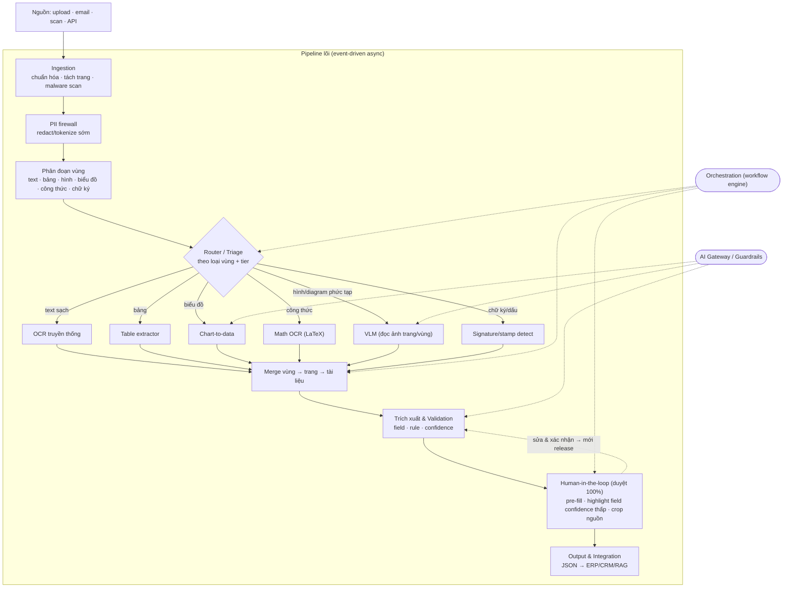
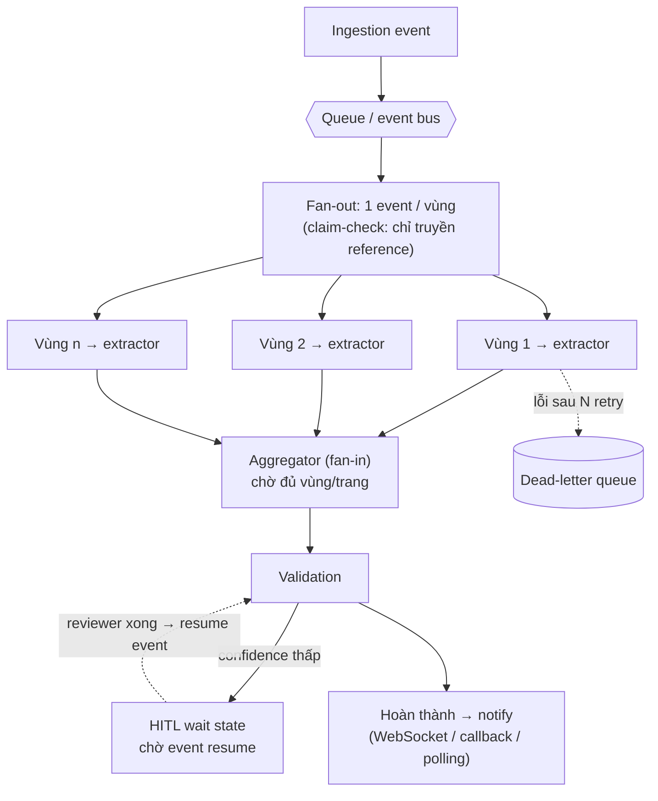
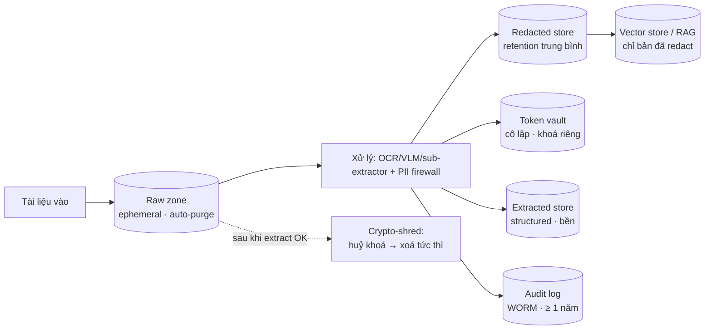

# Khung Kiến trúc Hệ thống IDP (Intelligent Document Processing)

> **Phiên bản:** v1.2 (luồng deterministic đơn — bỏ chọn model động/load-aware; full HITL duyệt 100%; saga mức tài liệu + checkpoint/resumable + completeness policy; tinh chỉnh idempotency theo loại lỗi)
> **Thay thế:** v1.1
> **Loại tài liệu:** Software/System Architecture Document
> **Phạm vi:** Kiến trúc tham chiếu cho hệ thống trích xuất & hiểu tài liệu, kết hợp OCR truyền thống và mô hình thị giác–ngôn ngữ (VLM), chạy theo mô hình event-driven asynchronous, có khả năng agentic và đáp ứng yêu cầu bảo mật/tuân thủ cho dữ liệu nhạy cảm.
> **Ghi chú nguồn:** Các khung tuân thủ (ISO 27001, PCI DSS, GDPR/PDPA, SBV) dựa trên yêu cầu bảo mật đã cung cấp. Các pattern thiết kế (File Proxy, mô hình tier, PII firewall, AI Gateway, ZDR, crypto-shredding, claim-check, orchestration) là khuyến nghị kiến trúc, cần rà soát theo ràng buộc thực tế của tổ chức.

---

## Mục lục

1. Giới thiệu
2. Nguyên tắc & động lực kiến trúc
3. Kiến trúc khái niệm (conceptual)
4. Kiến trúc logic — các thành phần
5. Mẫu xử lý & quyết định thiết kế
6. Mô hình thực thi & messaging
7. Kiến trúc dữ liệu & storage
8. Kiến trúc bảo mật
9. Kiến trúc triển khai
10. Yêu cầu phi chức năng (NFR)
11. Ánh xạ mối đe doạ → biện pháp
12. Tham chiếu triển khai các hãng
13. Lộ trình
14. Phụ lục: ADR & thuật ngữ

---

## 1. Giới thiệu

### 1.1 Mục đích

Cung cấp một khung kiến trúc thống nhất cho hệ thống IDP: tiếp nhận → phân loại → phân đoạn → trích xuất → kiểm tra → tích hợp dữ liệu từ tài liệu có cấu trúc, bán cấu trúc và phi cấu trúc, biến nội dung phi cấu trúc thành dữ liệu sẵn sàng cho nghiệp vụ và AI, đồng thời đáp ứng các yêu cầu bảo mật/tuân thủ nghiêm ngặt.

### 1.2 Đối tượng

Kiến trúc sư hệ thống, kỹ sư nền tảng/dữ liệu, đội bảo mật & tuân thủ, và lãnh đạo kỹ thuật ra quyết định triển khai.

### 1.3 Bối cảnh & xu hướng

Kiến trúc IDP đã trải qua ba thế hệ: (1) OCR + template cố định, dễ vỡ; (2) LLM/VLM-powered, hiểu ngữ cảnh không cần template; (3) agentic, có suy luận nhiều bước, tự sửa lỗi và định tuyến động. Tài liệu này áp dụng thế hệ 2–3.

### 1.4 Mục tiêu & phi mục tiêu

**Mục tiêu kiến trúc**

- Độ chính xác cao trên cả tài liệu sạch lẫn tài liệu khó (scan mờ, chữ viết tay, layout phức tạp, hình/biểu đồ/sơ đồ).
- Hành vi tất định & dễ kiểm toán: một luồng xử lý đơn, cố định; dispatch theo *loại vùng* (bảng/biểu đồ/công thức/chữ ký) — KHÔNG chọn model động theo confidence/tải.
- Bảo mật & tuân thủ theo thiết kế.
- Xử lý bất đồng bộ, mở rộng theo tải, chịu lỗi.
- Khả năng kiểm toán đầu-cuối.
- Thành phần có thể thay thế, cấu hình được lúc runtime.

**Phi mục tiêu**

- Không quy định nhà cung cấp hạ tầng cụ thể (xem mục 12).
- Không đặc tả chi tiết từng connector nghiệp vụ.
- (Giai đoạn đầu) Không tối ưu chi phí bằng định tuyến động theo confidence/tải — ưu tiên tính tất định & khả năng audit; nới sau khi tích luỹ đủ golden data (xem mục 13).

---

## 2. Nguyên tắc & động lực kiến trúc

### 2.1 Nguyên tắc

| # | Nguyên tắc | Diễn giải |
|---|---|---|
| P1 | Hybrid OCR + VLM + sub-extractor | OCR rẻ/nhanh cho text; VLM cho tài liệu khó; sub-extractor chuyên biệt cho bảng/biểu đồ/công thức/chữ ký. |
| P2 | Dispatch cố định theo loại vùng | Mỗi *loại vùng* (text/bảng/biểu đồ/công thức/chữ ký) đi tới một extractor cố định — dispatch tất định theo nội dung, KHÔNG phải chọn model động theo confidence/tải. |
| P3 | Composable / modular | Mỗi tầng là khối thay thế độc lập, đổi được lúc runtime. |
| P4 | Full HITL trước khi release | Mọi output đều phải người duyệt xác nhận trước khi save & trả file (không auto-release). Confidence chỉ dùng để *highlight/ưu tiên* field trong review, không dùng để gate. |
| P5 | Tier-aware | Mức nhạy cảm dữ liệu chi phối định tuyến, lưu trữ và vị trí triển khai. |
| P6 | Defense in depth + Zero Trust | Bảo mật nhiều lớp; không tin mặc định giữa các thành phần. |
| P7 | Data minimization | Lưu ít nhất có thể, xoá sớm nhất có thể. |
| P8 | Auditable & traceable | Mọi event truy vết được; log không chứa dữ liệu thô. |
| P9 | Tài liệu là dữ liệu, không phải chỉ thị | Nội dung tài liệu không bao giờ được diễn giải thành lệnh cho model. |
| P10 | Event-driven async + idempotent | Tách rời qua messaging; mọi consumer idempotent. |

### 2.2 Động lực (quality attributes)

Bảo mật & tuân thủ > Độ chính xác/toàn vẹn > Khả năng kiểm toán > Chi phí > Độ trễ. Thứ tự điều chỉnh theo use case (eKYC ưu tiên tuân thủ & độ trễ thấp; số hoá nội bộ ưu tiên throughput/chi phí).

### 2.3 Ràng buộc

Tuân thủ ISO/IEC 27001, PCI DSS (nếu xử lý thẻ), GDPR/PDPA, và quy định SBV (eKYC, Thông tư 16/2020/TT-NHNN) về liveness, mã hoá và lưu log truy cập ≥ 1 năm.

---

## 3. Kiến trúc khái niệm

### 3.1 Sơ đồ pipeline tổng thể

### 3.2 Các năng lực chính (capability map)

Ingestion & chuẩn hoá · Bảo vệ PII sớm · **Phân đoạn vùng** · Định tuyến thông minh · Nhận dạng (OCR + VLM) · **Các sub-extractor chuyên biệt** · **Merge/aggregation** · Trích xuất & kiểm tra · Con người trong vòng (HITL) · Tích hợp & phân phối · Điều phối agentic · Kiểm soát AI (Gateway/guardrails) · **Messaging & execution (event-driven)** · Quản trị dữ liệu & lưu trữ · Bảo mật & tuân thủ · Quan sát & kiểm toán.

---

## 4. Kiến trúc logic — các thành phần

### 4.1 Ingestion

Tiếp nhận đa nguồn, chuẩn hoá định dạng, khử nghiêng/khử nhiễu, tách trang, kiểm tra định dạng an toàn (PDF/JPG/PNG), giới hạn kích thước (ví dụ ≤ 5MB), quét mã độc. File chờ scan nằm ở quarantine zone tách biệt.
**Output event:** trang đã chuẩn hoá (claim-check: reference tới storage) + metadata (nguồn, tier, correlation ID).

### 4.2 PII firewall

Phát hiện và redact/băm/tokenize PII *trước khi* dữ liệu đi vào VLM/LLM hay lưu trữ dài hạn (Presidio text+image, hoặc dịch vụ cloud). Giảm PII chạm model bên thứ ba ngay từ đầu.

### 4.3 Phân đoạn vùng (Layout & region segmentation) — MỚI

**Trách nhiệm:** thay vì coi cả trang là một khối, chia mỗi trang thành các vùng theo *loại nội dung*: text block, bảng, hình ảnh, biểu đồ, công thức, chữ ký/con dấu. Phân tích reading order và bố cục đa cột.
**Vì sao cần:** content phức tạp (biểu đồ, sơ đồ tư duy, bảng lồng nhau) cần extractor khác nhau; phân đoạn cho phép *định tuyến mức vùng* và tránh dùng VLM đắt cho phần text vốn OCR xử lý được.
**Kỹ thuật:** object detection định vị vùng → gắn nhãn loại → phát event cho từng vùng.
**Output event:** danh sách vùng + bounding box + loại + reference ảnh crop.

### 4.4 Dispatcher theo loại vùng + tier (luồng tất định)

Dispatch mỗi *vùng* tới extractor cố định theo **loại vùng** (từ 4.3) và **tier bảo mật** (chặn cứng đường VLM-API bên thứ ba cho tier cao). Đây là *dispatch tất định theo loại nội dung*, KHÔNG phải chọn model động theo confidence hay theo tải.

**Không load-aware degradation:** cố tình bỏ cơ chế "khi tải cao thì nâng ngưỡng, đẩy nhiều hơn sang OCR rẻ". Đánh đổi: mất một phần tối ưu chi phí khi route doc dễ sang OCR-only; được lại tính nhất quán/tất định — cùng input luôn cho cùng đường xử lý, dễ test & audit. Hệ quả tốt: mâu thuẫn "load-aware degradation vs tier accuracy" biến mất vì không còn nâng-ngưỡng-động. Nút thắt VLM khi tải cao xử lý bằng queue/backpressure/rate-limit/cache (xem 6.6), không bằng hạ cấp chất lượng.

### 4.5 Đường OCR truyền thống

Trích text + layout + bounding box + confidence theo token. Engine: Textract / Google Document AI / Azure Document Intelligence / self-hosted (PaddleOCR, Tesseract). Rẻ, nhanh, audit tốt, hợp khối lượng lớn.

### 4.6 Đường VLM

Đọc thẳng ảnh trang/vùng, xuất JSON/Markdown có cấu trúc. Xử lý scan mờ, chữ tay, hình và diagram phức tạp. Với sơ đồ tư duy/diagram quan hệ, prompt VLM xuất **biểu diễn có cấu trúc (node + edge / JSON phân cấp)**, không phải plain text, để không mất quan hệ. Mọi lời gọi đi qua AI Gateway (mục 8.5).

### 4.7 Các sub-extractor chuyên biệt — MỚI

Cắm vào như plugin, được Router/Orchestrator dispatch theo loại vùng:

- **Table extractor:** nhận dạng cấu trúc bảng (kể cả lồng nhau, tràn trang).
- **Chart-to-data:** trích chuỗi số liệu nền của biểu đồ, không chỉ đọc chữ.
- **Math OCR:** xuất công thức dạng LaTeX.
- **Signature/stamp detection:** phát hiện chữ ký, con dấu theo pixel.

Loại có độ bất định cao (diagram, mind map) đặt confidence thấp mặc định và ưu tiên đẩy HITL.

### 4.8 Merge / Aggregation — MỚI

Ráp kết quả của các vùng → trang → tài liệu, giữ đúng reading order. Đây là điểm **fan-in**: chờ đủ các vùng/trang của một tài liệu xong (kể cả xử lý partial failure: vùng nào lỗi thì đánh dấu, không chặn cả tài liệu).

Để biết "đủ" là bao nhiêu, aggregator dựa trên **manifest / expected-count** do bước phân đoạn vùng (4.3) phát ra — số phần kỳ vọng của tài liệu. Hai cơ chế tách bạch quyết định ở đây:

- **Flag continue (resume):** vùng nào đã xong được lưu lại; vùng lỗi/dở được đánh dấu `continue`. Khi retry, aggregator đọc lại phần đã xong (qua result cache, xem 6.8) và chỉ xử lý tiếp phần còn thiếu — không làm lại từ đầu (checkpointing/resumable, xem 6.7).
- **Completeness policy (release-gating):** quyết định *nghiệp vụ* về việc có được release hay chưa. Với eKYC, tài liệu thiếu phần **bắt buộc** thì KHÔNG release — giữ ở trạng thái flag continue + cảnh báo, không cho xuống file cuối. (Flag continue lo phần resume; completeness policy lo phần được phép release.)

### 4.9 Trích xuất & Validation

Áp business rule, chuẩn hoá định dạng (ngày, tiền tệ), schema validation, chấm confidence. Với đường OCR, LLM trích field từ text (bounding box cho grounding & audit).

### 4.10 Full HITL — duyệt 100% trước khi release

**Giai đoạn đầu: mọi output đều phải người duyệt xác nhận trước khi save & trả file.** Không có gì auto-release → không có lỗi lọt. Đây là lựa chọn an toàn nhất và đúng điểm khởi đầu cho eKYC. Dashboard HITL bắt buộc MFA. Vai trò kép: nâng accuracy + hàng rào toàn vẹn (bắt hallucination và output bị injection thao túng). HITL là **trạng thái chờ bất đồng bộ** (xem 6.4).

Hai hệ quả phải chấp nhận và thiết kế theo:

- **Reviewer là nút thắt cho 100% volume** (không phải 8–10%). Bắt buộc thiết kế UI duyệt nhanh để 100%-review khả thi về throughput: *pre-fill* kết quả, *highlight* field confidence thấp, *hiện crop nguồn* để đối chiếu. Confidence ở đây dùng để **ưu tiên/điều hướng sự chú ý** của reviewer, KHÔNG dùng để tự động gate.
- **Vòng đức hạnh → golden data:** chính các xác nhận của con người trong giai đoạn full-HITL trở thành *golden data* để đánh giá VLM. Lộ trình tự nhiên: full-HITL bây giờ → tích luỹ dữ liệu nhãn → về sau mới có cơ sở nới sang **confidence-gating** cho phần đã chứng minh đủ tin (xem 13). Cần thời gian collect data trước khi nới.

> *VLM-as-verifier và confidence-gating tự động là mục tiêu giai đoạn sau (sau khi có golden data), không bật trong luồng full-HITL ban đầu.*

### 4.11 Output & Integration

Xuất JSON/Markdown sạch vào ERP/CRM, hoặc index (bản đã redact) vào vector store cho RAG. Output đa phương thức: biểu đồ → data series; diagram → graph; ảnh → caption + embedding + bounding box. Có thể mở lớp MCP cho ứng dụng ngoài, qua gateway kiểm soát.

### 4.12 Orchestration (agentic)

Điều phối toàn pipeline, quản lý vòng tự sửa, tool calling, quay ngược bước trước. Cấm tự động thực thi tool dựa trên chỉ thị suy ra từ nội dung tài liệu (chống second-order injection). Chi tiết choreography vs orchestration ở mục 6.3.

---

## 5. Mẫu xử lý & quyết định thiết kế

### 5.1 OCR-first vs OCR-free

Tradeoff cấu hình ở **cấp luồng** (chọn một lần, cố định), không quyết định động theo từng tài liệu. OCR-first rẻ/audit tốt; OCR-free (VLM đọc ảnh) linh hoạt với tài liệu khó nhưng đắt. Trong một luồng tất định, lựa chọn này gắn vào dispatch theo *loại vùng* (4.4), không phải chọn model động theo confidence/tải.

### 5.2 OCR như tool vs VLM-native

OCR như tool được trigger (output là observation để reasoning, có vòng tự sửa) phù hợp khối lượng lớn; VLM-native hấp thụ khả năng "đọc" vào model; hệ trưởng thành làm cả hai.

### 5.3 VLM-as-verifier (giai đoạn sau)

OCR trích nhanh trước; field confidence thấp mới gọi VLM "nhìn pixel" để đối chiếu. Đây là pattern **confidence-gated**, nên thuộc giai đoạn sau khi đã nới khỏi full-HITL (xem 4.10, 13) — không bật trong luồng full-HITL tất định ban đầu, nơi con người là người verify.

### 5.4 Dispatch theo loại vùng (không phải chọn model động)

Phân biệt rạch ròi hai thứ thường bị gộp:

- **Dispatch cố định theo loại vùng (DÙNG):** trong một trang, vùng text đi OCR, vùng bảng đi table extractor, vùng công thức đi math OCR, vùng biểu đồ đi chart-to-data. Đây là dispatch tất định theo *loại nội dung* — vẫn nằm trong luồng deterministic, vẫn cho throughput/độ chính xác đúng-công-cụ.
- **Chọn model động theo confidence/tải (KHÔNG dùng giai đoạn đầu):** ví dụ "28/30 trang đi OCR, 2 trang khó đẩy VLM" dựa trên đánh giá độ khó/độ tin cậy/tải — đây mới là cái bị loại để giữ tính tất định (xem 4.4). Tối ưu chi phí kiểu này để dành cho giai đoạn sau.

---

## 6. Mô hình thực thi & messaging — MỚI

### 6.1 Tổng quan

Hệ thống chạy theo mô hình **event-driven asynchronous**: các tầng tách rời qua message queue / event bus (Kafka, Kinesis, SQS, Pub/Sub). Mỗi tài liệu/trang/vùng là một event. Cùng một backbone phục vụ cả batch (đẩy nhiều event một lúc) lẫn streaming (event chảy liên tục).

**Lý do phù hợp:** thời gian xử lý biến thiên rất lớn (form sạch ~200ms vs trang phức tạp + HITL hàng giờ); VLM là nút thắt cần đệm; HITL vốn bất đồng bộ; vòng tự sửa = re-emit event; song song hoá mức trang/vùng tự nhiên.

### 6.2 Sơ đồ event flow (fan-out / fan-in / HITL)

### 6.3 Choreography vs Orchestration

Với pipeline có nhánh (OCR/VLM/sub-extractor), vòng lặp (re-check), chờ người (HITL) và bù trừ khi lỗi, **không dùng choreography thuần** (mỗi service tự phản ứng event — dễ thành mớ bòng bong, khó biết tài liệu đang ở đâu). Khuyến nghị **orchestration (hoặc hybrid)** bằng workflow engine (Temporal, AWS Step Functions, Camunda) ngồi trên nền event: vẫn async, nhưng có "nhạc trưởng" để thấy trạng thái, đặt timeout, và compensation.

### 6.4 Các pattern bắt buộc

- **Claim-check:** event mang *reference + metadata + tier*, không mang ảnh/PII/nội dung. Phần nặng/nhạy cảm nằm ở storage (qua File Proxy). Khớp ZDR; bus chỉ thấy con trỏ.
- **Idempotency:** delivery thường at-least-once → mọi consumer có side-effect phải idempotent (đặc biệt gọi VLM tốn tiền và detokenize PII). Dedup theo event/correlation ID. **Chỉ cache kết quả khi thao tác đạt kết cục xác định** — không bao giờ đóng băng lỗi transient/hạ tầng thành terminal (state machine chi tiết ở 6.8).
- **Aggregation/fan-in:** chờ đủ vùng/trang theo **manifest/expected-count** (4.8), xử lý out-of-order và partial failure (28/30 xong, 2 lỗi); release tuân **completeness policy** (4.8, 6.7).
- **DLQ + circuit breaker:** message lỗi/poison sau N retry đẩy DLQ, không chặn dòng chính.
- **Backpressure:** giám sát độ sâu queue; ingestion nhận nhanh (202 Accepted), processing autoscale theo queue depth.

### 6.5 Hai lane: real-time và bulk

- **Priority lane (real-time):** use case có người chờ (eKYC). Async + kênh thông báo hoàn thành (WebSocket/SSE/callback), SLA chặt, ưu tiên hơn bulk.
- **Bulk lane (throughput):** số hoá hàng loạt; dùng batch API rẻ của provider, chấp nhận eventual.

Router/Orchestrator phân lane theo tier và SLA.

### 6.6 Tải lớn & nút thắt VLM

VLM là tài nguyên khan hiếm nhất (đắt, chậm, rate-limit). Cơ chế (giữ tính tất định, KHÔNG hạ cấp chất lượng động): queue hấp thụ spike; backpressure theo queue depth + autoscale; rate limit/quota tập trung tại AI Gateway (xử lý 429 + exponential backoff); cache theo hash tài liệu; sharding theo tenant + multi-region. **Không** dùng load-aware degradation (nâng ngưỡng đẩy sang OCR khi tải cao) — đã loại ở 4.4 để cùng input luôn cho cùng đường xử lý.

### 6.7 Saga mức tài liệu — checkpoint & resumable

Mỗi tài liệu là một **saga** với state được persist và checkpoint: event-driven nhưng *đồng bộ ở mức tài liệu* — một tài liệu được coi là một đơn vị nghiệp vụ hoàn chỉnh, có trạng thái rõ ràng. Partial/lỗi thì save phần đã xong + gán flag continue.

- **Checkpointing / resumable processing:** mỗi vùng/trang xong được lưu (qua result cache, 6.8) và đánh dấu. Khi có lỗi/dở, gán **flag continue**. Lúc retry, hệ đọc lại phần đã xong và chỉ xử lý tiếp phần còn thiếu/lỗi — không chạy lại từ đầu.
- **Manifest/expected-count:** bước phân đoạn (4.3) phát ra số phần kỳ vọng để aggregator (4.8) biết khi nào "đủ".
- **Completeness policy (release-gating):** quyết định nghiệp vụ về việc được release hay chưa. eKYC thiếu phần bắt buộc → không release, giữ flag continue + cảnh báo. Tách bạch: *flag continue* lo phần resume; *completeness policy* lo phần được phép release.

Cơ chế "đọc lại phần đã xong khi continue" chính là **result cache** ở 6.8.

### 6.8 Idempotency record & result cache — chỉ đóng băng kết cục xác định

Bẫy cần tránh: nếu cache cả lỗi transient, server lỗi lúc đó rồi recover, user hỏi lại vẫn báo failed. Bẫy này **chỉ xảy ra nếu cache sai cách**. Nguyên tắc: *không bao giờ cache lỗi transient/hạ tầng như kết quả cuối cùng.* Phải phân biệt hai loại "failed":

| Loại lỗi | Ví dụ | Cache? |
|---|---|---|
| **Nghiệp vụ tất định** | document sai định dạng, validation fail | **Có** — hỏi lại cũng fail y vậy; cache đúng & có ích |
| **Transient / hạ tầng** | server down, timeout, 503, mất kết nối | **KHÔNG** — chưa đạt kết cục xác định; phải cho retry sau khi recover |

**Hiện thực — idempotency record có trạng thái tường minh** (`in-progress` / `succeeded` kèm kết quả cache / `failed-terminal`) cộng một **lock/lease có timeout**:

- Thấy `succeeded` → trả cache.
- Thấy `in-progress` nhưng **lease đã hết hạn** (server chết giữa chừng) → chạy lại.
- Không thấy record → chạy.

Server chết trước khi ghi được kết cục terminal → record hoặc không tồn tại, hoặc kẹt `in-progress` quá hạn → đằng nào cũng re-execute. Kịch bản "đóng băng failed" không xảy ra.

> Đây đúng cách **Stripe** làm: chỉ lưu kết quả *sau khi* endpoint bắt đầu thực thi; nếu tham số fail validation hoặc request xung đột với một request đang chạy đồng thời thì không lưu kết quả idempotent, và các request đó được phép retry. Lỗi quanh-vùng-thực-thi (chưa commit kết quả) không bị đóng băng thành terminal.

**Áp vào result cache của VLM (gắn với 6.7):** chỉ ghi cache **khi gọi VLM thành công**. VLM lỗi/timeout → không ghi cache → continue/retry sẽ gọi lại. Cache chỉ phục vụ idempotency cho các phần *đã hoàn thành đúng*, không đóng băng phần lỗi.

---

## 7. Kiến trúc dữ liệu & storage

### 7.1 Nguyên tắc

Tách thành các kho riêng theo độ nhạy cảm; **mỗi kho có khoá mã hoá riêng, retention riêng, access policy riêng**. Không gộp raw, redacted, vault, extracted.

### 7.2 Sơ đồ các zone dữ liệu

### 7.3 Bảng đặc tả từng zone

| Tiêu chí | Raw | Redacted | Token vault | Extracted | Audit log |
|---|---|---|---|---|---|
| Kho | Object storage | Object/text store | Vault cô lập | Structured DB / warehouse | Append-only / WORM |
| Vòng đời | Ephemeral, auto-purge | Trung bình | Theo extracted | Bền (theo nghiệp vụ) | ≥ 1 năm (eKYC) |
| Khoá | Riêng, lý tưởng per-doc | Riêng | Riêng, chặt nhất | Field-level encryption | Riêng |
| Access | Chỉ File Proxy, hẹp nhất | RBAC rộng hơn | Hẹp nhất, detokenize theo role | RLS theo tenant/phòng ban | Chỉ security/audit |
| Vào RAG? | Không | Có | Không | Field không nhạy cảm | Không |

### 7.4 Raw data

Lưu ngắn nhất có thể; AES-256 + CMK; TTL ngắn + auto-purge sau extract; truy cập chỉ qua File Proxy + presigned URL ngắn. Cẩn thận bẫy versioning (delete marker không xoá thật).

### 7.5 Sau PII — tách redacted khỏi vault

Redacted store an toàn cho analytics/RAG; token vault (mapping token→giá trị thật) cô lập, khoá riêng, access chặt nhất. Chỉ embed bản redacted vào RAG (chống embedding inversion — OWASP LLM08).

### 7.6 Sau extraction

Structured DB; mã hoá field nhạy cảm; **không lưu CVV, mask PAN**; field nhạy cảm vào vault-backed store; RLS theo tenant. Lineage: lưu hash + reference + thumbnail đã redact (vì raw đã purge). Output đa phương thức (data series/graph/embedding) lưu kèm crop và reference.

### 7.7 Hai kỹ thuật then chốt

- **Crypto-shredding:** mã hoá mỗi tài liệu/tenant bằng khoá riêng; "xoá" = huỷ khoá → tức thì, chứng minh được.
- **Lifecycle automation tier-aware:** mỗi zone có policy tự động; vị trí vật lý theo tier (Tier 0/3/4 → on-prem/sovereign).

### 7.8 Hoà giải mâu thuẫn retention

Tách rạch ròi cái bị purge (raw) khỏi cái được giữ (extracted + audit + hash bản gốc).

---

## 8. Kiến trúc bảo mật

> Khoảng trống lớn nhất là **VLM biến tài liệu không tin cậy thành prompt thực thi được** — cần lớp kiểm soát mới ở tầng nội dung và tầng định tuyến/gateway.

### 8.1 Ánh xạ tuân thủ

| Khung | Yêu cầu chính | Biện pháp |
|---|---|---|
| ISO/IEC 27001 | ISMS, đánh giá rủi ro, mã hoá, access control | Tier model, KMS, RBAC/Zero Trust, audit |
| PCI DSS | Không lưu CVV, mask PAN | Field-level masking; PII firewall |
| GDPR / PDPA | Data minimization, quyền được lãng quên, đồng ý | Raw auto-purge, crypto-shredding, consent ở ingestion |
| SBV (Thông tư 16) | Liveness, mã hoá, log ≥ 1 năm | Liveness ở eKYC, AES-256, audit WORM ≥ 1 năm |

### 8.2 Mô hình tier (khuyến nghị)

| Tier | Đặc tính | VLM API bên thứ ba? | Vị trí |
|---|---|---|---|
| Tier 0 | Air-gapped, không rời nội bộ | Không (self-hosted) | On-prem |
| Tier 1 | Tiêu chuẩn | Có (theo policy) | Cloud/hybrid |
| Tier 2 | Nhạy cảm vừa | Có, giám sát egress | Cloud/hybrid |
| Tier 3 | Zero-retention | Không (self-hosted) | Private |
| Tier 4 | Isolated network, e2e encryption | Không (self-hosted) | Sovereign/on-prem |

### 8.3 Định danh & truy cập (Zero Trust)

File Proxy là thành phần duy nhất giữ storage credentials; worker chỉ có access_key giới hạn; cấm vượt cấp; ACL mọi truy cập. RBAC cho raw data; MFA qua SSO cho HITL; workload identity thay khoá dài hạn; micro-segmentation + mTLS giữa các tầng; access theo thuộc tính (NIST SP 800-207).

### 8.4 Bảo vệ PII

Auto-redaction/hash tại tiền xử lý; tokenization + vault tách biệt; dynamic data masking khi đọc; TLS 1.2/1.3 in-transit; AES-256 at-rest; external KMS cho residency.

### 8.5 AI Gateway / Guardrails (control plane)

Mọi lời gọi model qua một gateway áp một chính sách cho mọi provider. Bốn nhóm kiểm soát: an toàn nội dung; bảo mật (prompt injection, jailbreak); bảo vệ dữ liệu (PII, secret); tuân thủ. Sinh audit trail; đổi model giữ nguyên posture.

### 8.6 Mối đe doạ đặc thù LLM/VLM

Prompt injection qua tài liệu (kể cả cross-modal) → coi nội dung là dữ liệu, tách system prompt, context isolation, strip text ẩn; tier-aware routing (Tier 0/3/4 không ra VLM-API ngoài); cấm auto-execute tool từ tài liệu; egress control.

### 8.7 Toàn vẹn output (hallucination)

Schema validation + business rule + confidence gate + HITL cho field quan trọng.

### 8.8 Zero Data Retention (ZDR)

Tokenize trước khi gửi (LLM không thấy giá trị gốc); proxy stateless chỉ log metadata; RAG nạp context vào bộ nhớ tạm và xả sau tác vụ.

### 8.9 Confidential computing & quản lý khoá

Secure enclave giữ dữ liệu mã hoá khi inference; external key manager ngoài ranh giới provider; log + cảnh báo thao tác khoá bất thường.

### 8.10 Kiểm toán "redact-by-design"

Log tối thiểu (hash before/after, không nội dung thô); correlation ID per event + distributed tracing. Neo OWASP Top 10 cho LLM 2025, OWASP Top 10 cho Agentic Apps (12/2025), NIST AI RMF.

---

## 9. Kiến trúc triển khai

- **Hybrid theo tier:** Tier 0/3/4 on-prem/sovereign, model self-hosted; Tier 1/2 cloud + VLM-API qua gateway, giám sát egress.
- **Serverless/microservice cho pipeline lõi**, song song mức trang/vùng.
- **Hai lane** real-time (priority + notification) và bulk (batch API).
- **Tách mạng:** quarantine, processing, storage zones trên các segment khác nhau, mTLS giữa các segment.
- **Event bus** được mã hoá, ACL topic theo tier.
- Đẩy ảnh PII ra OCR/VLM public chỉ khi có BAA/DPA và đúng tier cho phép.

---

## 10. Yêu cầu phi chức năng (NFR)

| Thuộc tính | Mục tiêu/biện pháp |
|---|---|
| Khả năng mở rộng | Event-driven, xử lý theo vùng/trang, autoscale theo queue depth |
| Độ tin cậy | Retry + backoff, DLQ, idempotency (state machine 6.8), circuit breaker, compensation, checkpoint/resumable (6.7) |
| Độ trễ | Hai lane; real-time có SLA + notification; bulk eventual |
| Quan sát được | Metrics/tầng (latency, cost/page, %VLM, %HITL, queue depth), distributed tracing |
| Chi phí | Giám sát tỷ lệ vùng đi VLM; cache theo hash; (giai đoạn đầu không dùng ngưỡng confidence động — ưu tiên tính tất định) |
| Cấu hình runtime | Chuyển OCR/VLM/sub-extractor không phải build lại |
| Bảo mật & tuân thủ | Xuyên suốt (mục 8), audit sẵn sàng |

---

## 11. Ánh xạ mối đe doạ → biện pháp

| Mối đe doạ (OWASP LLM 2025) | Biện pháp |
|---|---|
| LLM01 Prompt injection (cross-modal) | Tài liệu = dữ liệu; gateway guardrail; tier-aware routing; strip text ẩn |
| LLM02 Sensitive info disclosure | PII firewall, tokenization, ZDR, egress control, claim-check |
| LLM06 Excessive agency | Least-privilege agent, cấm auto-execute tool từ tài liệu |
| LLM08 Vector/embedding weakness | Chỉ embed bản redacted; access control vector store |
| Hallucination/insecure output | Schema validation, business rule, confidence gate, HITL |
| Rò rỉ raw data | Auto-purge, crypto-shredding, File Proxy, presigned URL ngắn |
| Lạm dụng truy cập | RBAC, MFA, Zero Trust, audit redact-by-design |
| Poison message / DoS qua tải | DLQ, circuit breaker, backpressure, rate limit gateway |

---

## 12. Tham chiếu triển khai các hãng

- **AWS:** GenAI IDP Accelerator (chuyển đổi runtime BDA ↔ Pipeline mode); Bedrock AgentCore điều phối đa-agent; Textract OCR; BDA cung cấp confidence/bounding box/blueprint; SQS/Step Functions cho event flow; MCP.
- **Azure:** Document Intelligence v4.0 (Foundry) gộp OCR + VLM; durable functions điều phối; AI Search cho RAG; Azure Document PII Redaction; Service Bus/Event Grid.
- **Google Cloud:** Document AI + Gemini; Pub/Sub.
- **AI-native:** LlamaParse, Reducto, Extend (VLM-first).
- **Orchestration/messaging:** Temporal, Camunda, Kafka/Kinesis.
- **Bảo mật chuyên dụng:** Presidio (PII), AI gateway/guardrail runtime, nền tảng guardrail sovereign.

---

## 13. Lộ trình

1. **Giai đoạn 1 — Nền tất định + full HITL + event backbone:** pipeline OCR-first trong **một luồng deterministic** (không chọn model động); **full HITL duyệt 100%** với UI pre-fill/highlight/crop; storage 4 zone; File Proxy; tier; audit; messaging + idempotency (state machine 6.8) + DLQ; saga mức tài liệu + checkpoint/resumable + completeness policy.
2. **Giai đoạn 2 — Hybrid VLM + phân đoạn vùng (vẫn tất định):** đường VLM + sub-extractor; region segmentation; **dispatch cố định theo loại vùng + tier** (không load-aware degradation); PII firewall. Vẫn giữ full HITL.
3. **Giai đoạn 3 — Golden data → nới confidence-gating + Hardening AI:** dùng xác nhận HITL tích luỹ làm **golden data** đánh giá VLM; chứng minh đủ tin thì **nới full-HITL sang confidence-gating** cho phần đã kiểm chứng (HITL còn lại cho field confidence thấp); VLM-as-verifier; AI Gateway/guardrails; ZDR + tokenization vault; confidential computing.
4. **Giai đoạn 4 — Agentic + orchestration:** workflow engine; vòng tự sửa; tool calling least-privilege; hai lane real-time/bulk; MCP; ánh xạ đầy đủ OWASP/NIST.

---

## 14. Phụ lục

### 14.1 Architecture Decision Records (tóm tắt)

| ID | Quyết định | Lý do | Đánh đổi |
|---|---|---|---|
| ADR-1 | Hybrid OCR + VLM, **dispatch cố định theo loại vùng** | Cân bằng chi phí/độ chính xác mà vẫn tất định | Mất tối ưu chi phí của routing động |
| ADR-2 | PII firewall đặt trước model | Giảm PII chạm model bên thứ ba | Thêm độ trễ tiền xử lý |
| ADR-3 | Tách 4 zone storage, khoá riêng | Cô lập rủi ro, retention độc lập | Vận hành nhiều kho |
| ADR-4 | Crypto-shredding để xoá | Xoá tức thì, chứng minh được | Quản lý khoá per-doc |
| ADR-5 | AI Gateway tập trung | Một policy cho mọi provider | Điểm tập trung cần HA |
| ADR-6 | ZDR + tokenization | Loại bỏ hidden cache | Chi phí vault & detokenize |
| ADR-7 | Tier-aware routing & placement | Tuân thủ residency/sovereignty | Giảm linh hoạt tier cao |
| ADR-8 | Event-driven async + orchestration (không choreography thuần) | Hợp thời gian xử lý biến thiên, HITL, vòng tự sửa; vẫn quản lý được trạng thái | Cần workflow engine + tracing kỷ luật |
| ADR-9 | Phân đoạn vùng + sub-extractor chuyên biệt | Xử lý đúng bảng/biểu đồ/diagram thay vì ép một extractor | Thêm bước segmentation + nhiều extractor |
| ADR-10 | Luồng deterministic đơn — không chọn model động/load-aware | Dễ test/audit/chứng minh hành vi cho eKYC; xoá mâu thuẫn load-aware vs tier accuracy | Mất tối ưu chi phí route doc dễ sang OCR-only |
| ADR-11 | Full HITL duyệt 100% trước khi release (giai đoạn đầu) | Không lỗi lọt; xác nhận của người = golden data nuôi đánh giá VLM | Reviewer là nút thắt 100% volume → cần UI duyệt nhanh |
| ADR-12 | Saga mức tài liệu + checkpoint/resumable + completeness policy | Resume chỉ phần dở; release tuân chính sách đủ-phần (eKYC) | Cần persist state + manifest/expected-count |
| ADR-13 | Idempotency record state machine; chỉ cache kết cục xác định | Không đóng băng lỗi transient thành terminal (lối Stripe) | Cần lease/timeout + phân loại lỗi |

### 14.2 Thuật ngữ

- **IDP** — Intelligent Document Processing.
- **VLM** — Vision-Language Model.
- **HITL** — Human-in-the-loop.
- **OCR-free** — VLM đọc thẳng ảnh, không có bước OCR riêng.
- **Phân đoạn vùng (region segmentation)** — chia trang thành các vùng theo loại nội dung để định tuyến riêng.
- **Sub-extractor** — extractor chuyên biệt cho một loại nội dung (bảng, biểu đồ, công thức, chữ ký).
- **PII firewall** — lớp phát hiện/redact PII đặt trước model/lưu trữ.
- **AI Gateway / Guardrails** — control plane runtime kiểm soát mọi lời gọi model.
- **Choreography vs Orchestration** — các service tự phản ứng event vs có workflow engine điều phối.
- **Claim-check** — event mang reference thay vì dữ liệu thô.
- **Fan-out / fan-in** — tách một tài liệu thành nhiều event xử lý song song rồi ráp lại.
- **DLQ** — Dead-letter queue cho message lỗi.
- **Idempotency** — xử lý lại cùng event không gây tác dụng phụ trùng lặp.
- **Luồng deterministic (luồng đơn)** — một đường xử lý cố định; dispatch theo loại vùng, không chọn model động theo confidence/tải.
- **Full HITL** — mọi output đều phải người duyệt xác nhận trước khi save & trả file.
- **Confidence-gating** — chỉ đẩy field độ tin cậy thấp cho người duyệt (giai đoạn sau, sau khi có golden data).
- **Golden data** — dữ liệu nhãn từ xác nhận của con người ở giai đoạn full-HITL, dùng đánh giá VLM.
- **Checkpointing / resumable** — lưu phần đã xong + flag continue để retry chỉ xử lý phần còn thiếu, không làm lại từ đầu.
- **Manifest / expected-count** — số phần kỳ vọng của tài liệu (từ phân đoạn) để aggregator biết khi nào "đủ".
- **Completeness policy** — chính sách nghiệp vụ quyết định tài liệu được release hay phải giữ lại (eKYC thiếu phần bắt buộc → không release).
- **Result cache** — kho kết quả phần đã hoàn thành đúng, phục vụ resume & idempotency; chỉ ghi khi thành công.
- **Idempotency record / lease** — bản ghi trạng thái (in-progress/succeeded/failed-terminal) + lock có timeout để retry an toàn.
- **ZDR** — Zero Data Retention.
- **Crypto-shredding** — xoá dữ liệu bằng cách huỷ khoá mã hoá.
- **Token vault** — kho cô lập giữ ánh xạ token → giá trị thật.
- **Tier-aware routing** — định tuyến có nhận thức về mức nhạy cảm dữ liệu.
- **Prompt injection** — nhúng chỉ thị độc hại vào input để chiếm quyền điều khiển model.llk